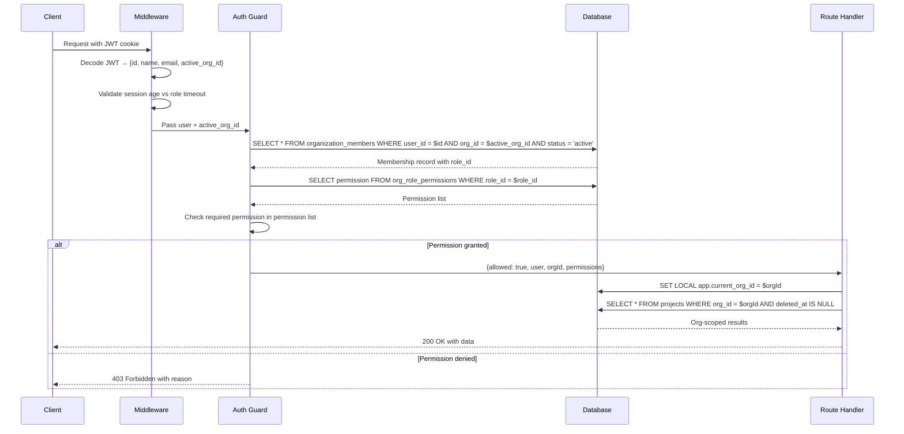
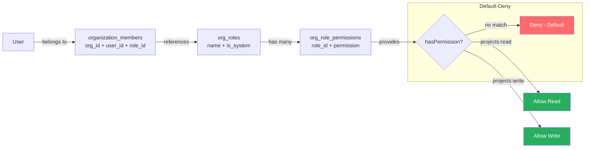
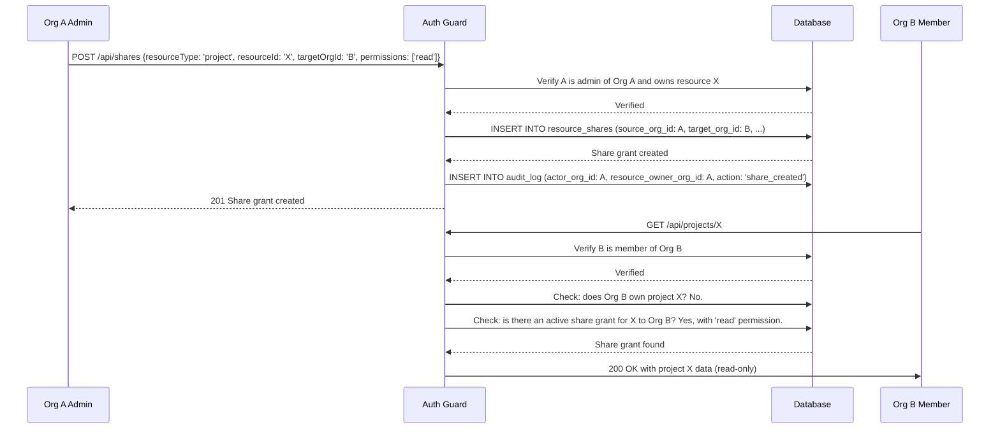

# Enterprise Multi-Tenant Authority — Phase 0 Architecture Design

> **Document type:** Proposed future-state architecture (read-only, no implementation)
> **Branch:** `dev` (commit `fedb27ac`)
> **Status:** SOC 2 readiness in progress — not certified. Security controls aligned with ISO 27001 principles.
> **Scope:** Proposed multi-tenant authority architecture addressing all gaps identified in the current-state audit
> **Date:** 2025

---

## 0. Design Principles

The proposed architecture is guided by the following principles, each of which addresses specific findings from the current-state audit:

### P-01: Default-Deny
Every request is denied unless explicitly authorized. No route is accessible without an explicit permission check. This addresses F-07 (no resource-level authorization) and T-01 (IDOR). The centralized authorization guard returns "deny" by default and requires positive evidence of permission to return "allow."

### P-02: Organization as the Tenant Boundary
The organization (not the user) is the primary tenant boundary. All business resources are owned by an organization, not by an individual user. Users are members of organizations and access resources through their org membership. This addresses F-03 (organizations barely wired), F-06 (admin access is global), and T-02 (admin route global exposure).

### P-03: Server-Side Tenant Resolution
The active organization is resolved on the server for every request, not trusted from the client. The middleware extracts the user's org membership from the JWT or database, resolves the active org context, and passes it to all downstream handlers. The client cannot spoof the tenant context. This addresses F-20 (no active company context) and T-17 (no server-side tenant resolution).

### P-04: Centralized Authorization Guard
A single authorization function mediates all resource access. Every API route, every database query, and every file access must pass through this guard. The guard checks: (a) is the user authenticated? (b) is the user a member of the resource's org? (c) does the user have the required permission for this action? This addresses F-07 (no resource-level authorization), T-01 (IDOR), and T-03 (no RLS).

### P-05: Permission-First Roles
Roles are collections of permissions, not hardcoded strings. Instead of checking `if (role === 'admin')`, the system checks `if (hasPermission('projects:delete'))`. Permissions are fine-grained (e.g., `projects:read`, `projects:write`, `projects:delete`, `members:invite`, `billing:manage`). Roles are named bundles of permissions that can be customized per organization. This addresses F-17 (role constraint conflict) and T-10 (role constraint conflict).

### P-06: Tenant-Scoped Storage
All file storage paths include the organization ID as a prefix: `orgs/{orgId}/surveys/{projectId}/...`. Files are accessed via signed, time-limited URLs or auth-gated download endpoints, not public URLs. This addresses F-08 (storage paths have no org prefix) and T-07 (public blob URLs).

### P-07: Tenant-Aware Audit
Every audit log entry records the actor's organization and the resource owner's organization at the time of the event. This enables per-org audit queries for SOC 2 and ISO 27001 compliance. This addresses F-09 (audit log has no org context) and T-08 (audit log compliance gap).

### P-08: Explicit Cross-Tenant Collaboration
Cross-tenant data sharing is never implicit. If Organization A wants to share a project with Organization B, an explicit share grant must be created, with a defined scope (which resources, which permissions, which expiry). The share grant is audit-logged and revocable. This addresses the need for cross-company collaboration without compromising isolation.

### P-09: No Silent Orphaning
When an organization is deleted, a member is removed, or a user is deactivated, the system explicitly handles the affected resources. Resources are migrated, archived, or explicitly deleted — never silently orphaned. This addresses F-25 (ON DELETE SET NULL orphans users) and T-13 (SET NULL orphans).

### P-10: Scoped Admin Access
Customer admin access is scoped to the admin's organization. A customer admin can manage their org's members, resources, and settings but cannot access other orgs' data. A platform-level super_admin role (SolarPro staff) retains global access for support and operations, with enhanced audit logging and step-up MFA. This addresses F-06 (admin access is global), T-02 (admin route global exposure), and T-05 (impersonation cross-tenant).

---

## 1. Canonical Organization Model

### 1.1 The Organization Entity

**[PROPOSED]** The `organizations` table becomes the central tenant entity. The proposed schema extends the current table:

```
organizations:
  id              UUID PRIMARY KEY
  name            TEXT NOT NULL
  slug            TEXT NOT NULL UNIQUE          -- URL-friendly identifier
  owner_id        UUID NOT NULL REFERENCES users(id)
  plan            TEXT NOT NULL DEFAULT 'contractor'
  status          TEXT NOT NULL DEFAULT 'active' -- active|suspended|deleted
  billing_email   TEXT                           -- separate from owner email
  created_at      TIMESTAMPTZ
  updated_at      TIMESTAMPTZ
  deleted_at      TIMESTAMPTZ                     -- soft delete for orgs
```

**[OPEN-DECISION]** Should the `slug` be auto-generated from the org name or user-chosen? If user-chosen, what are the uniqueness and format rules?

**[OPEN-DECISION]** Should `status` include a `trial` state, or is trial managed at the billing/subscription level?

### 1.2 Organization Status Lifecycle

**[PROPOSED]** The organization has an explicit status lifecycle: `active` → `suspended` (billing failure) → `deleted` (soft delete). A suspended org's members retain read access but cannot create or modify resources. A deleted org's data is retained for a configurable period before hard deletion.

### 1.3 Resolving the Dual "Company" Concept

**[PROPOSED]** The free-text `users.company` field is deprecated in favor of the structured `organizations` table. During migration, each user's `company` free-text value is used to either match an existing organization or create a new one. After migration, the `company` field is display-only (used for branding) and is synchronized from the organization's `name`.

**[OPEN-DECISION]** For users with `company = 'Acme Solar'` and no `org_id`, should the migration auto-create an organization named "Acme Solar" with the user as owner? Or should it leave them as a solo user (no org) and require explicit org creation?

---

## 2. Membership Model

### 2.1 Organization Memberships

**[PROPOSED]** A new `organization_members` junction table replaces the denormalized `users.org_id` / `users.org_role`:

```
organization_members:
  id              UUID PRIMARY KEY
  org_id          UUID NOT NULL REFERENCES organizations(id)
  user_id         UUID NOT NULL REFERENCES users(id)
  role_id         UUID NOT NULL REFERENCES org_roles(id)  -- references a role definition
  status          TEXT NOT NULL DEFAULT 'active'           -- active|invited|removed|suspended
  joined_at       TIMESTAMPTZ
  removed_at      TIMESTAMPTZ
  removed_by      UUID REFERENCES users(id)
  created_at      TIMESTAMPTZ
  UNIQUE(org_id, user_id)
```

**[PROPOSED]** This junction table supports a user belonging to multiple organizations (many-to-many). The `status` column tracks the membership lifecycle. The `removed_at` and `removed_by` columns provide an audit trail for member removal (addressing T-12 and T-18).

### 2.2 Active Organization Context

**[PROPOSED]** Because a user can belong to multiple organizations, an "active organization" concept is needed. The active org is stored in the JWT as `active_org_id` and is also persisted in a `user_preferences` table (so the choice survives across sessions). The middleware extracts `active_org_id` from the JWT and passes it as the tenant context to all handlers.

**[OPEN-DECISION]** Should the active org be stored in the JWT (requiring token refresh on org switch) or resolved server-side from a `user_preferences` table (no token refresh but an extra DB query per request)?

### 2.3 Invite Lifecycle

**[PROPOSED]** The `org_invites` table is extended with a `role_id` column so the inviter can specify the role for the invitee. The invite flow: owner creates invite with role → invitee receives email → invitee accepts → `organization_members` row created with the specified role. Expired and rejected invites are retained for audit purposes.

---

## 3. Roles and Permissions

### 3.1 Permission Definitions

**[PROPOSED]** Permissions are fine-grained strings following the pattern `{resource}:{action}`:

```
projects:read       -- view projects in own org
projects:write      -- create/modify projects in own org
projects:delete     -- delete projects in own org
clients:read        -- view clients in own org
clients:write       -- create/modify clients in own org
clients:delete      -- delete clients in own org
members:read        -- view org members
members:invite      -- invite new members
members:remove      -- remove members
members:manage_roles -- change member roles
billing:read        -- view billing info
billing:manage      -- modify subscription, add/remove seats
org:read            -- view org settings
org:manage          -- modify org settings
proposals:read      -- view proposals
proposals:write     -- create/modify proposals
proposals:send      -- send proposals to clients
proposals:sign      -- sign proposals
surveys:read        -- view survey data
surveys:write       -- upload/modify survey data
engineering:read    -- view engineering data
engineering:write   -- modify engineering data
storage:read        -- download files
storage:write       -- upload files
audit:read          -- view org audit log
```

### 3.2 Role Definitions

**[PROPOSED]** Roles are named bundles of permissions, stored in an `org_roles` table:

```
org_roles:
  id              UUID PRIMARY KEY
  org_id          UUID REFERENCES organizations(id)  -- NULL for system-defined roles
  name            TEXT NOT NULL                        -- 'owner', 'admin', 'member', 'viewer'
  description     TEXT
  is_system       BOOLEAN DEFAULT FALSE                -- system roles cannot be deleted
  created_at      TIMESTAMPTZ
```

**[PROPOSED]** Role-permission mappings are stored in `org_role_permissions`:

```
org_role_permissions:
  role_id         UUID REFERENCES org_roles(id)
  permission      TEXT NOT NULL
  PRIMARY KEY(role_id, permission)
```

### 3.3 Default Roles

**[PROPOSED]** Four system-defined roles per organization:

| Role | Key Permissions | Description |
|------|-----------------|-------------|
| **Owner** | All permissions + `billing:manage` + `members:remove` + `org:manage` | Full control, including billing and member management |
| **Admin** | All permissions except `billing:manage` | Full operational control, no billing changes |
| **Member** | `projects:*`, `clients:*`, `proposals:*`, `surveys:*`, `engineering:*`, `storage:*` | Standard user — create and manage resources |
| **Viewer** | `*:read` permissions only | Read-only access |

**[OPEN-DECISION]** Should organizations be able to create custom roles, or are the four system roles sufficient for the initial release?

### 3.4 Platform Super Admin

**[PROPOSED]** The platform super_admin role (SolarPro staff) is separate from org roles. It is stored as `users.role = 'super_admin'` and grants global access across all organizations for support and operations. Platform super_admin actions are audit-logged with enhanced detail and require step-up MFA. Cross-org impersonation by platform super_admin is allowed but logged with a dedicated `category = 'security'` audit entry.

---

## 4. Resource Ownership Model

### 4.1 Organization-Scoped Resources

**[PROPOSED]** All business resource tables gain an `org_id` column:

```
ALTER TABLE projects ADD COLUMN org_id UUID REFERENCES organizations(id);
ALTER TABLE clients ADD COLUMN org_id UUID REFERENCES organizations(id);
ALTER TABLE layouts ADD COLUMN org_id UUID REFERENCES organizations(id);
-- ... and all other business resource tables
```

**[PROPOSED]** The `org_id` is populated on resource creation from the creating user's active org. It is immutable after creation (a resource cannot be moved between orgs without an explicit migration process). Every query on business resources includes `WHERE org_id = $activeOrgId`.

### 4.2 Ownership Hierarchy

**[PROPOSED]** The ownership hierarchy is: Organization → User (creator) → Resource. The `org_id` on the resource identifies the owning org. The `user_id` on the resource identifies the creating user (for attribution and "created by" displays). Access is determined by org membership, not by `user_id` — any org member with the appropriate permission can access the resource, regardless of which user created it.

### 4.3 Backfilling org_id

**[PROPOSED]** During migration, `org_id` is backfilled on all existing resources by joining to the creating user's `org_id`:

```sql
UPDATE projects p
SET org_id = u.org_id
FROM users u
WHERE p.user_id = u.id AND p.org_id IS NULL;
```

**[OPEN-DECISION]** What happens to resources created by users with `org_id = NULL` (solo users with no org)? Options: (a) create a solo org for each such user, (b) leave `org_id` NULL and treat them as un-scoped, (c) assign to a default "solo" org.

---

## 5. API Authorization

### 5.1 Centralized Authorization Guard

**[PROPOSED]** A single `authorize()` function mediates all resource access:

```typescript
async function authorize(
  request: Request,
  options: {
    permission: string;          // e.g., 'projects:read'
    resourceType?: string;       // e.g., 'project'
    resourceId?: string;         // UUID of the resource
  }
): Promise<{ allowed: boolean; user: User; orgId: string; reason?: string }>
```

**[PROPOSED]** The guard performs these checks in order:
1. **Authentication** — extract user from JWT (or deny)
2. **Tenant resolution** — resolve active org from JWT or database (or deny)
3. **Membership check** — verify user is an active member of the active org (or deny)
4. **Permission check** — verify user's role includes the required permission (or deny)
5. **Resource ownership** (if `resourceId` provided) — verify the resource belongs to the active org (or deny)
6. **Return** — allowed, user, orgId

**[PROPOSED]** Every API route calls `authorize()` at the top of the handler. If `authorize()` returns `allowed: false`, the route returns 403 with the reason. No route accesses resources without passing through the guard.

### 5.2 Route Classification

**[PROPOSED]** All 280 API routes are classified and annotated with their required permission:

| Route Class | Example | Permission | Tenant Scope |
|-------------|---------|------------|--------------|
| Org-scoped resource | `/api/projects` | `projects:read` | Active org |
| Org-scoped admin | `/api/admin/projects` | `projects:read` | Active org (not global) |
| Org management | `/api/organizations` | `org:manage` | Active org |
| Member management | `/api/organizations/members` | `members:invite` | Active org |
| Billing | `/api/billing` | `billing:manage` | Active org |
| Platform admin | `/api/platform/*` | Platform super_admin | All orgs (platform staff only) |
| Public | `/api/intake/*` | None (public) | No tenant context |
| Auth | `/api/auth/*` | None (auth flow) | No tenant context |
| Webhook | `/api/webhooks/*` | Signature verification | Tenant resolved from payload |

---

## 6. Database Isolation (Hybrid App + RLS)

### 6.1 Application-Level Isolation (Primary)

**[PROPOSED]** The primary isolation layer is the application. Every query includes `WHERE org_id = $activeOrgId`. The centralized authorization guard ensures the `activeOrgId` is validated before any query runs.

### 6.2 Row Level Security (Defense-in-Depth)

**[PROPOSED]** RLS policies are added to all business resource tables as a defense-in-depth layer. Even if the application misses a `WHERE org_id` filter, the database blocks cross-tenant rows:

```sql
ALTER TABLE projects ENABLE ROW LEVEL SECURITY;
ALTER TABLE projects FORCE ROW LEVEL SECURITY;

CREATE POLICY tenant_isolation ON projects
  USING (org_id = current_setting('app.current_org_id')::uuid);
```

**[PROPOSED]** The application sets `app.current_org_id` at the start of each request using a Neon connection-scoped setting:

```sql
SET LOCAL app.current_org_id = 'uuid-of-active-org';
```

**[OPEN-DECISION]** Neon serverless uses connection pooling. Can `SET LOCAL` be reliably used with the serverless driver's connection pooling? If not, RLS may need to use a different mechanism (e.g., a custom function that reads from a session variable or a request-scoped context).

**[OPEN-DECISION]** The background worker uses a shared `DATABASE_URL` without per-request context. RLS policies would block the worker from accessing any data (no `app.current_org_id` set). The worker may need a special `app.worker_mode = true` setting that bypasses RLS, or per-job org context setting.

### 6.3 Database Roles

**[OPEN-DECISION]** Should per-tenant database roles be created? This would provide the strongest isolation but is operationally complex with Neon serverless (which uses connection pooling). The recommended approach is: a single application role with RLS policies, and a separate worker role with selective RLS bypass.

---

## 7. Cross-Organization Collaboration

### 7.1 Share Grants

**[PROPOSED]** Cross-tenant collaboration is enabled via explicit share grants. A share grant allows Organization A to share a resource with Organization B:

```
resource_shares:
  id              UUID PRIMARY KEY
  resource_type   TEXT NOT NULL          -- 'project', 'client', 'proposal'
  resource_id     UUID NOT NULL          -- UUID of the shared resource
  source_org_id   UUID NOT NULL REFERENCES organizations(id)
  target_org_id   UUID NOT NULL REFERENCES organizations(id)
  permissions     TEXT[] NOT NULL        -- ['read', 'write'] or ['read']
  granted_by      UUID NOT NULL REFERENCES users(id)
  expires_at      TIMESTAMPTZ            -- NULL = no expiry
  revoked_at      TIMESTAMPTZ
  revoked_by      UUID REFERENCES users(id)
  created_at      TIMESTAMPTZ
```

### 7.2 Share Grant Lifecycle

**[PROPOSED]** The share grant lifecycle: (1) Owner/admin in Org A creates a share grant for a resource with Org B, specifying permissions and expiry. (2) Members of Org B can now access the shared resource through the authorization guard (the guard checks both org membership and active share grants). (3) The grant can be revoked at any time by Org A. (4) Expired and revoked grants are retained for audit purposes.

### 7.3 Authorization Guard with Share Grants

**[PROPOSED]** The authorization guard checks share grants as a secondary access path:

1. Check if the user's org owns the resource (primary path).
2. If not, check if there is an active share grant for this resource to the user's org (secondary path).
3. If a share grant exists, verify the requested permission is within the grant's `permissions` array.
4. If neither path grants access, deny.

---

## 8. Controlled Information Exchange

### 8.1 Information Exchange Principles

**[PROPOSED]** Cross-tenant information exchange is controlled and auditable. The principles are: (a) no implicit exchange — all exchange requires an explicit share grant or a public-facing endpoint. (b) Minimum necessary — share grants specify the minimum permissions needed. (c) Auditable — all cross-tenant access is logged in the audit log with both source and target org IDs. (d) Revocable — all share grants can be revoked at any time.

### 8.2 Public-Facing Endpoints

**[PROPOSED]** Public-facing endpoints (intake funnels, proposal viewing via share token, homeowner portal) are explicitly marked as public and do not require org membership. They use their own scoped authentication (portal OTP, share token, etc.) and are tenant-resolved from the resource being accessed (e.g., the proposal's org).

### 8.3 Marketplace (Network Opportunities)

**[PROPOSED]** The network opportunities marketplace is a cross-tenant system by design. Opportunities are shared until claimed. When claimed, the claim creates an `org_id`-scoped resource (the claimed lead becomes part of the claiming org's data). The marketplace itself remains a shared system with its own access controls.

---

## 9. Files and Revisions

### 9.1 Tenant-Scoped Storage

**[PROPOSED]** All file storage paths include the org ID prefix:

```
orgs/{orgId}/surveys/{projectId}/{jti}/{category}/{timestamp}.{ext}
orgs/{orgId}/intake/utility-bills/{funnel}/{eventId}/{timestamp}-{uuid}-{name}.{ext}
orgs/{orgId}/proposals/{proposalId}/{version}/{timestamp}.pdf
orgs/{orgId}/engineering/{projectId}/{type}/{timestamp}.{ext}
```

### 9.2 Access Control on Files

**[PROPOSED]** Files are accessed via signed, time-limited URLs (not public URLs). The signed URL includes an expiry (e.g., 15 minutes) and is generated by the application after the authorization guard verifies `storage:read` permission. Alternatively, files are accessed via an auth-gated download endpoint (`/api/files/{fileId}`) that calls the authorization guard before streaming the file.

**[OPEN-DECISION]** Signed URLs (Vercel Blob supports time-limited access) vs. auth-gated download endpoint? Signed URLs are simpler but require careful expiry management. Auth-gated endpoints are more secure but add a server round-trip.

### 9.3 File Revisions

**[PROPOSED]** A `file_revisions` table tracks file versions:

```
file_revisions:
  id              UUID PRIMARY KEY
  org_id          UUID NOT NULL REFERENCES organizations(id)
  resource_type   TEXT NOT NULL
  resource_id     UUID NOT NULL
  file_path       TEXT NOT NULL          -- blob storage path
  version         INTEGER NOT NULL
  uploaded_by     UUID REFERENCES users(id)
  created_at      TIMESTAMPTZ
  UNIQUE(resource_type, resource_id, version)
```

---

## 10. Messaging and Discussions

### 10.1 Project Discussions

**[PROPOSED]** Project discussions (comments, messages) are org-scoped:

```
project_discussions:
  id              UUID PRIMARY KEY
  org_id          UUID NOT NULL REFERENCES organizations(id)
  project_id      UUID NOT NULL REFERENCES projects(id)
  author_id       UUID NOT NULL REFERENCES users(id)
  message         TEXT NOT NULL
  created_at      TIMESTAMPTZ
```

**[PROPOSED]** The authorization guard checks `projects:read` permission (which implies discussion read) and `projects:write` (which implies discussion write). Cross-org discussions on shared projects use the share grant mechanism.

### 10.2 Notifications

**[PROPOSED]** Notifications are org-scoped. The notification system routes notifications to users based on their org membership and the resource's org. Cross-org notifications (e.g., "Org A shared a project with your Org B") are sent with explicit cross-org context in the notification metadata.

---

## 11. Approval Workflows

### 11.1 Approval Model

**[PROPOSED]** Approval workflows (e.g., proposal approval, engineering review) are org-scoped:

```
approval_requests:
  id              UUID PRIMARY KEY
  org_id          UUID NOT NULL REFERENCES organizations(id)
  resource_type   TEXT NOT NULL
  resource_id     UUID NOT NULL
  requested_by    UUID NOT NULL REFERENCES users(id)
  approver_role   TEXT NOT NULL           -- role required to approve
  status          TEXT NOT NULL DEFAULT 'pending' -- pending|approved|rejected
  decided_by      UUID REFERENCES users(id)
  decided_at      TIMESTAMPTZ
  created_at      TIMESTAMPTZ
```

**[PROPOSED]** The authorization guard checks that the approver has the required `approver_role` permission before allowing approval/rejection. Cross-org approvals (e.g., a shared project requiring approval from both orgs) use the share grant mechanism with a specific `approvals:approve` permission.

---

## 12. Auditability

### 12.1 Tenant-Aware Audit Log

**[PROPOSED]** The `audit_log` table is extended with org context:

```sql
ALTER TABLE audit_log ADD COLUMN actor_organization_id UUID;
ALTER TABLE audit_log ADD COLUMN resource_owner_organization_id UUID;
```

**[PROPOSED]** Every audit entry is populated with `actor_organization_id` (the actor's active org at the time of the event) and `resource_owner_organization_id` (the org that owns the affected resource). This enables per-org audit queries:

```sql
SELECT * FROM audit_log
WHERE actor_organization_id = $orgId
ORDER BY timestamp DESC;
```

### 12.2 Hash Chain Integrity

**[PROPOSED]** The existing hash chain (`prev_hash` / `entry_hash`) is preserved. The new columns (`actor_organization_id`, `resource_owner_organization_id`) are included in the hash computation for new entries. Existing entries retain their original hashes (the new columns are NULL for historical entries).

**[OPEN-DECISION]** Should historical audit entries be backfilled with org context via a JOIN to the users table? This would provide org context for old entries but would be approximate (the user's current org may differ from their org at the time of the event).

### 12.3 Audit Log Access

**[PROPOSED]** Org admins can query their org's audit log via `GET /api/audit?org_id={activeOrgId}` with `audit:read` permission. Platform super_admin can query the global audit log. The query is scoped by the authorization guard to ensure org admins only see their own org's events.

---

## 13. Billing and Usage Authority

### 13.1 Per-Org Billing

**[PROPOSED]** Billing migrates from per-user to per-org. The organization holds the Stripe subscription (not the individual user):

```
ALTER TABLE organizations ADD COLUMN stripe_customer_id TEXT;
ALTER TABLE organizations ADD COLUMN stripe_subscription_id TEXT;
```

**[PROPOSED]** The org owner manages billing. Members inherit access from the org's subscription. Seat billing is based on active member count (synced via `syncSeatsForOrg()`).

### 13.2 Usage Limits

**[PROPOSED]** Usage limits (project count, storage, API calls) are enforced at the org level, not the user level. The authorization guard checks usage limits before allowing resource creation:

```typescript
if (permission === 'projects:write' && action === 'create') {
  const projectCount = await countOrgProjects(orgId);
  const limit = getOrgPlanLimit(orgId, 'max_projects');
  if (projectCount >= limit) {
    return { allowed: false, reason: 'plan_limit_exceeded' };
  }
}
```

### 13.3 Per-Org Pricing

**[OPEN-DECISION]** Should per-org pricing be supported (custom contracts, negotiated rates)? This is a business decision, not a security requirement. The architecture supports it via a `pricing_overrides` table keyed by org_id, but the initial release may use global pricing.

---

## 14. Architecture Diagrams

### 14.1 Overall Authority Architecture

```mermaid
graph TB
    Client[Client Request]
    Middleware[Middleware<br/>Session Validation]
    TenantRes[Tenant Resolution<br/>Extract active_org_id from JWT]
    AuthGuard[Authorization Guard<br/>authorize]
    RouteHandler[Route Handler]
    QueryExec[Query Execution<br/>WHERE org_id = activeOrgId]
    DB[(Neon PostgreSQL<br/>RLS: org_id = current_setting)]
    Storage[Vercel Blob<br/>orgs/{orgId}/...]
    AuditLog[Audit Log<br/>actor_org_id + resource_org_id]
    Worker[Background Worker<br/>Job carries org_id]

    Client --> Middleware
    Middleware --> TenantRes
    TenantRes --> AuthGuard
    AuthGuard -->|allowed| RouteHandler
    AuthGuard -->|denied| Deny403[403 Forbidden]
    RouteHandler --> QueryExec
    QueryExec --> DB
    RouteHandler --> Storage
    RouteHandler --> AuditLog
    Worker --> DB

    subgraph "Defense-in-Depth"
        AuthGuard
        QueryExec
        DB
    end

    style AuthGuard fill:#4ecdc4,color:#fff
    style DB fill:#3498db,color:#fff
    style Deny403 fill:#ff6b6b,color:#fff
```

### 14.2 Tenant Context Resolution Flow



### 14.3 Permission Resolution Model



### 14.4 Cross-Org Share Grant Flow



### 14.5 Multi-Tenant Storage Namespace

```mermaid
graph TB
    subgraph "Vercel Blob Storage"
        Root[/Blob Root/]

        subgraph "Org A - uuid-aaa"
            OrgA[orgs/uuid-aaa/]
            OrgA_Survey[orgs/uuid-aaa/surveys/{projectId}/...]
            OrgA_Proposals[orgs/uuid-aaa/proposals/{proposalId}/...]
            OrgA_Engineering[orgs/uuid-aaa/engineering/{projectId}/...]
        end

        subgraph "Org B - uuid-bbb"
            OrgB[orgs/uuid-bbb/]
            OrgB_Survey[orgs/uuid-bbb/surveys/{projectId}/...]
            OrgB_Proposals[orgs/uuid-bbb/proposals/{proposalId}/...]
        end

        Root --> OrgA
        Root --> OrgB
        OrgA --> OrgA_Survey
        OrgA --> OrgA_Proposals
        OrgA --> OrgA_Engineering
        OrgB --> OrgB_Survey
        OrgB --> OrgB_Proposals
    end

    subgraph "Access Control"
        Guard{Authorization Guard}
        Guard-->|storage:read + org match| SignedURL[Signed URL<br/>15-min expiry]
        Guard-->|no permission| Deny403[403 Forbidden]
    end

    OrgA_Survey -.->|via| Guard
    OrgB_Survey -.->|via| Guard

    style Guard fill:#4ecdc4,color:#fff
    style SignedURL fill:#27ae60,color:#fff
    style Deny403 fill:#ff6b6b,color:#fff
```

---

## 15. Open Design Decisions

The following design decisions require stakeholder input before implementation:

| ID | Decision | Options | Impact |
|----|----------|---------|--------|
| D-01 | Active org in JWT vs. server-side resolution | (a) In JWT (requires token refresh on switch) (b) Server-side from user_preferences (extra DB query) | Auth pipeline design |
| D-02 | Backfill strategy for solo users (no org_id) | (a) Auto-create solo org (b) Leave NULL (c) Default "solo" org | Migration plan |
| D-03 | RLS with Neon serverless connection pooling | (a) SET LOCAL works with pooling (b) Custom function mechanism (c) App-only, no RLS | Database isolation |
| D-04 | Background worker with RLS | (a) Worker bypass mode (b) Per-job org context (c) Worker-specific role | Worker isolation |
| D-05 | Custom org roles in initial release | (a) Four system roles only (b) Custom roles allowed | Role model complexity |
| D-06 | File access: signed URLs vs. auth-gated endpoint | (a) Signed URLs (15-min expiry) (b) Auth-gated download endpoint | Storage access pattern |
| D-07 | Historical audit log backfill with org context | (a) Backfill via JOIN (approximate) (b) Leave NULL (historical entries untagged) | Compliance reporting |
| D-08 | Per-org pricing in initial release | (a) Global pricing only (b) Per-org pricing overrides | Billing model |
| D-09 | SSO/SAML/OIDC support timeline | (a) Not in initial release (b) Include in initial release | Enterprise adoption |
| D-10 | Session invalidation on org removal | (a) Token revocation list (b) Short JWT TTL (c) Server-side session check per request | Security vs. performance |

---

*End of Architecture Design document. This document is read-only and proposes no code changes. All proposals are grounded in the gaps identified in the current-state audit and data inventory.*
