# Enterprise Multi-Tenant Authority — Phase 0 Authorization Test Matrix

> **Status:** Read-only documentation. No code changes proposed or implemented.
> **Branch:** `dev` (commit `fedb27ac`)
> **Compliance posture:** SOC 2 readiness in progress — not certified. Security controls aligned with ISO 27001 principles.
> **Scope:** This document defines the authorization test matrix for the proposed multi-tenant architecture. It provides negative and adversarial test cases that verify the default-deny model, tenant isolation, and cross-tenant collaboration controls described in `ENTERPRISE-MULTI-TENANT-AUTHORITY-ARCHITECTURE.md`. Each test references a threat from `ENTERPRISE-MULTI-TENANT-THREAT-MODEL.md` and a finding from `ENTERPRISE-MULTI-TENANT-CURRENT-STATE-AUDIT.md`.

---

## 0. Test Matrix Purpose and Method

### 0.1 Purpose

**[PROPOSED]** This test matrix establishes the acceptance criteria for the multi-tenant authorization system. Every test case is designed to be automated and run as part of the CI/CD pipeline. The matrix covers four categories of tests:

1. **Positive tests** — verify that authorized users can access resources they own or are explicitly granted access to.
2. **Negative tests (tenant isolation)** — verify that users cannot access resources belonging to another organization, even with valid UUIDs.
3. **Adversarial tests** — verify that the system resists spoofing, replay, injection, and privilege escalation attempts.
4. **Audit/compliance tests** — verify that every access attempt (authorized or denied) is logged with full tenant context.

### 0.2 Test Execution Environment

**[PROPOSED]** Tests should run against a staging database with seeded multi-tenant data. The test harness creates two or more organizations, multiple users with different roles, and resources owned by each. Test execution follows this pattern:

1. Seed test data: Org A (owner, admin, member, viewer), Org B (owner, admin, member), Platform super_admin.
2. Authenticate as each test user to obtain JWTs.
3. Execute test cases by sending API requests with specific JWTs and resource IDs.
4. Assert HTTP status codes and response bodies.
5. Query the audit log to verify logging behavior.
6. Clean up test data after each suite.

### 0.3 Test Naming Convention

Each test is identified by a unique ID: `ATM-XXX` where XXX is a zero-padded number. Tests are grouped by threat reference:

- `ATM-01x` — IDOR tests (T-01)
- `ATM-02x` — Admin route tests (T-02)
- `ATM-03x` — RLS / missed filter tests (T-03)
- `ATM-04x` — JWT tenant context tests (T-04)
- `ATM-05x` — Impersonation tests (T-05)
- `ATM-06x` — Dev auth bypass tests (T-06)
- `ATM-07x` — Storage access tests (T-07)
- `ATM-08x` — Audit log tests (T-08)
- `ATM-09x` — Background worker tests (T-09)
- `ATM-10x` — Role constraint tests (T-10)
- `ATM-11x` — Free pass tests (T-11)
- `ATM-12x` — Member removal audit tests (T-12)
- `ATM-13x` — Org deletion / orphaning tests (T-13)
- `ATM-14x` — SSO tests (T-14)
- `ATM-15x` — Cache isolation tests (T-15)
- `ATM-16x` — Webhook tenant scoping tests (T-16)
- `ATM-17x` — Server-side tenant resolution tests (T-17)
- `ATM-18x` — Member removal session invalidation tests (T-18)
- `ATM-19x` — Soft-delete consistency tests (T-19)
- `ATM-20x` — Billing isolation tests (T-20)
- `ATM-3xx` — Cross-tenant collaboration (share grant) tests
- `ATM-4xx` — Permission matrix tests
- `ATM-5xx` — Default-deny / edge-case tests

---

## 1. Test Matrix Overview Diagram

```mermaid
flowchart TB
    subgraph "Test Categories"
        direction LR
        POS["Positive Tests<br/>Authorized access works"]
        NEG["Negative Tests<br/>Cross-tenant denied"]
        ADV["Adversarial Tests<br/>Spoof/replay/inject"]
        AUD["Audit Tests<br/>Every action logged"]
    end

    subgraph "Threat Coverage"
        T1["T-01: IDOR"]
        T2["T-02: Admin exposure"]
        T3["T-03: No RLS"]
        T4["T-04: JWT no tenant"]
        T5["T-05: Impersonation"]
        T6["T-06: Dev bypass"]
        T7["T-07: Public blob"]
        T8["T-08: Audit no org"]
        T9["T-09: Worker"]
        T10["T-10: Role conflict"]
        T11["T-11: Free pass"]
        T12["T-12: Removal audit"]
        T13["T-13: Orphaning"]
        T14["T-14: No SSO"]
        T15["T-15: Cache leak"]
        T16["T-16: Webhook"]
        T17["T-17: No resolution"]
        T18["T-18: Session valid"]
        T19["T-19: Soft-delete"]
        T20["T-20: Billing"]
    end

    POS --> T1 & T2 & T4 & T11 & T20
    NEG --> T1 & T2 & T5 & T7 & T9 & T15 & T17
    ADV --> T3 & T4 & T6 & T10 & T16 & T18
    AUD --> T5 & T8 & T12 & T13

    subgraph "Proposed Architecture Guards"
        GUARD["Centralized Authz Guard"]
        RLS["Row Level Security"]
        TENANT["Server-Side Tenant Resolution"]
        SHARE["Share Grant Mechanism"]
        AUDITLOG["Tenant-Aware Audit Log"]
    end

    POS -.-> GUARD
    NEG -.-> GUARD & RLS & TENANT
    ADV -.-> RLS & TENANT & SHARE
    AUD -.-> AUDITLOG

    style POS fill:#4a9,stroke:#267,color:#fff
    style NEG fill:#e55,stroke:#c33,color:#fff
    style ADV fill:#e80,stroke:#c60,color:#fff
    style AUD fill:#48c,stroke:#269,color:#fff
    style GUARD fill:#6a4,stroke:#482,color:#fff
    style RLS fill:#6a4,stroke:#482,color:#fff
    style TENANT fill:#6a4,stroke:#482,color:#fff
    style SHARE fill:#6a4,stroke:#482,color:#fff
    style AUDITLOG fill:#6a4,stroke:#482,color:#fff
```

---

## 2. Summary Test Count

| Category | Test Count | Threats Covered |
|----------|-----------|-----------------|
| IDOR / Resource Isolation | 12 | T-01, T-17 |
| Admin Route Scoping | 8 | T-02, T-11 |
| Database / RLS | 6 | T-03 |
| JWT / Session | 8 | T-04, T-18 |
| Impersonation | 6 | T-05 |
| Dev Auth Bypass | 6 | T-06 |
| Storage / Files | 6 | T-07 |
| Audit Logging | 8 | T-08, T-12 |
| Background Worker | 5 | T-09 |
| Role Constraints | 4 | T-10 |
| Cache Isolation | 4 | T-15 |
| Webhook Scoping | 4 | T-16 |
| Org Deletion / Orphaning | 4 | T-13 |
| SSO | 2 | T-14 |
| Soft-Delete Consistency | 4 | T-19 |
| Billing Isolation | 4 | T-20 |
| Cross-Tenant Collaboration | 8 | Share grants |
| Permission Matrix | 10 | P-04, P-05 |
| Default-Deny / Edge Cases | 8 | P-01 |
| **Total** | **121** | **All 20 threats + architecture principles** |

---

## 3. IDOR and Resource Isolation Tests (T-01, T-17)

### ATM-010: Cross-Tenant Project Access via UUID

| Field | Value |
|-------|-------|
| **Test ID** | ATM-010 |
| **Threat reference** | T-01, T-17 |
| **Finding reference** | F-03, F-07, F-20 |
| **Category** | Negative (tenant isolation) |
| **Description** | An authenticated user in Org A attempts to access a project belonging to Org B by providing Org B's project UUID. |
| **Preconditions** | Org A (User A, member) and Org B (User B, member) exist. User B has created a project with UUID `proj-B-uuid`. |
| **Steps** | 1. Authenticate as User A (Org A), obtain JWT. 2. Send `GET /api/projects/proj-B-uuid` with User A's JWT. 3. Record HTTP response code and body. |
| **Expected result (current)** | **[VERIFIED — VULNERABLE]** If the route does not check ownership, returns 200 with Org B's project data. If it checks `WHERE user_id = $A`, returns 404. Behavior is inconsistent across routes. |
| **Expected result (proposed)** | **[PROPOSED]** Returns 403 Forbidden. The centralized authorization guard resolves the caller's org (Org A), loads the resource, checks `resource.org_id === caller.org_id`, and denies because Org A ≠ Org B. Audit log records the denied attempt with `actor_organization_id = A`, `resource_owner_organization_id = B`. |

### ATM-011: Cross-Tenant Client Access via UUID

| Field | Value |
|-------|-------|
| **Test ID** | ATM-011 |
| **Threat reference** | T-01 |
| **Category** | Negative (tenant isolation) |
| **Description** | User A attempts to access User B's client record by UUID. |
| **Preconditions** | User B (Org B) has a client with UUID `client-B-uuid`. |
| **Steps** | 1. Authenticate as User A (Org A). 2. Send `GET /api/clients/client-B-uuid`. 3. Record response. |
| **Expected result (current)** | **[VERIFIED — INCONSISTENT]** Routes that filter by `user_id` return 404. Routes that load by ID without filter return 200 with data. |
| **Expected result (proposed)** | **[PROPOSED]** 403 Forbidden. Guard checks `client.org_id !== caller.org_id`. |

### ATM-012: Cross-Tenant Layout Access via Project UUID

| Field | Value |
|-------|-------|
| **Test ID** | ATM-012 |
| **Threat reference** | T-01 |
| **Category** | Negative (tenant isolation) |
| **Description** | User A attempts to access layouts belonging to Org B's project. |
| **Preconditions** | User B (Org B) has project `proj-B-uuid` with layouts. |
| **Steps** | 1. Authenticate as User A (Org A). 2. Send `GET /api/projects/proj-B-uuid/layouts`. 3. Record response. |
| **Expected result (current)** | **[VERIFIED — VULNERABLE]** If the route loads layouts by `project_id` without verifying the caller owns the project, returns 200 with Org B's layouts. |
| **Expected result (proposed)** | **[PROPOSED]** 403 Forbidden. Guard resolves the project's org, compares to caller's org, denies. |

### ATM-013: Cross-Tenant Survey Photo Access

| Field | Value |
|-------|-------|
| **Test ID** | ATM-013 |
| **Threat reference** | T-01, T-07 |
| **Category** | Negative (tenant isolation) |
| **Description** | User A attempts to list or download survey photos from Org B's project. |
| **Preconditions** | Org B has a project with uploaded survey photos. |
| **Steps** | 1. Authenticate as User A (Org A). 2. Send `GET /api/survey/photos?projectId=proj-B-uuid`. 3. Record response. 4. If photo URLs are returned, attempt to download one. |
| **Expected result (current)** | **[VERIFIED — VULNERABLE]** If the route does not verify project ownership, returns Org B's photo URLs. Download succeeds because blob URLs are public (`access: 'public'`). |
| **Expected result (proposed)** | **[PROPOSED]** 403 Forbidden on the list endpoint. Even if a URL is obtained, the auth-gated download endpoint or signed URL validates org membership before serving the file. |

### ATM-014: Cross-Tenant Production Data Access

| Field | Value |
|-------|-------|
| **Test ID** | ATM-014 |
| **Threat reference** | T-01 |
| **Category** | Negative (tenant isolation) |
| **Description** | User A attempts to access production records for Org B's project. |
| **Preconditions** | Org B has a project with production records. |
| **Steps** | 1. Authenticate as User A. 2. Send `GET /api/projects/proj-B-uuid/productions`. 3. Record response. |
| **Expected result (current)** | **[VERIFIED — INCONSISTENT]** Depends on whether the route verifies project ownership. |
| **Expected result (proposed)** | **[PROPOSED]** 403 Forbidden. Guard denies because `project.org_id !== caller.org_id`. |

### ATM-015: Cross-Tenant Equipment Access

| Field | Value |
|-------|-------|
| **Test ID** | ATM-015 |
| **Threat reference** | T-01 |
| **Category** | Negative (tenant isolation) |
| **Description** | User A attempts to access equipment associated with Org B's project. |
| **Preconditions** | Org B has equipment linked to their project. |
| **Steps** | 1. Authenticate as User A. 2. Send `GET /api/projects/proj-B-uuid/equipment`. 3. Record response. |
| **Expected result (current)** | **[VERIFIED — INCONSISTENT]** |
| **Expected result (proposed)** | **[PROPOSED]** 403 Forbidden. |

### ATM-016: Cross-Tenant Proposal Access

| Field | Value |
|-------|-------|
| **Test ID** | ATM-016 |
| **Threat reference** | T-01 |
| **Category** | Negative (tenant isolation) |
| **Description** | User A attempts to view a proposal belonging to Org B. |
| **Preconditions** | Org B has a proposal for one of their projects. |
| **Steps** | 1. Authenticate as User A. 2. Send `GET /api/proposals/prop-B-uuid`. 3. Record response. |
| **Expected result (current)** | **[VERIFIED — INCONSISTENT]** |
| **Expected result (proposed)** | **[PROPOSED]** 403 Forbidden. Guard checks `proposal.org_id`. |

### ATM-017: Cross-Tenant Proposal via Share Token (Public Access)

| Field | Value |
|-------|-------|
| **Test ID** | ATM-017 |
| **Threat reference** | T-01 |
| **Category** | Positive (public endpoint) |
| **Description** | An unauthenticated user accesses a proposal via a valid share token. This is legitimate public access, not an IDOR. |
| **Preconditions** | Org B has a proposal with a generated share token `share-token-xyz`. |
| **Steps** | 1. No authentication. 2. Send `GET /api/proposals/share/share-token-xyz`. 3. Record response. |
| **Expected result (current)** | **[VERIFIED]** Returns the proposal data if the share token is valid. This is the intended behavior for public proposal viewing. |
| **Expected result (proposed)** | **[PROPOSED]** Returns the proposal data. Public-facing endpoints are explicitly exempt from org membership checks (see Architecture §8.2). The share token is the access credential. Audit log records access with `actor_id = null`, `resource_owner_organization_id = B`, `access_method = 'share_token'`. |

### ATM-018: Exhaustive Route-by-Route IDOR Sweep

| Field | Value |
|-------|-------|
| **Test ID** | ATM-018 |
| **Threat reference** | T-01, T-17 |
| **Category** | Negative (tenant isolation) |
| **Description** | Systematic sweep of all 280 API routes that accept a resource ID parameter. For each route, attempt cross-tenant access. |
| **Preconditions** | Full route inventory from `app/api/`. Two orgs with seeded data. |
| **Steps** | 1. Enumerate all routes with `:id` or `:projectId` or `:clientId` path parameters. 2. For each, send a request with Org A's JWT and Org B's resource ID. 3. Record status code. 4. Flag any route returning 200 with cross-tenant data. |
| **Expected result (current)** | **[VERIFIED — PARTIAL]** Some routes will return 200 (vulnerable), some 404 (filtered by user_id), some 403 (if ad-hoc ownership check exists). The exact distribution requires running the sweep. |
| **Expected result (proposed)** | **[PROPOSED]** Every resource-loading route returns 403 for cross-tenant access. The centralized guard is applied uniformly. No route bypasses the guard unless explicitly classified as public. |

### ATM-019: Tenant Context Spoofing via Request Body

| Field | Value |
|-------|-------|
| **Test ID** | ATM-019 |
| **Threat reference** | T-17 |
| **Category** | Adversarial (spoofing) |
| **Description** | User A (Org A) sends a request with an `org_id` field in the request body or query parameter set to Org B's UUID, attempting to create a resource in Org B's context. |
| **Preconditions** | User A is in Org A. Org B exists with UUID `org-B-uuid`. |
| **Steps** | 1. Authenticate as User A. 2. Send `POST /api/projects` with body `{ "org_id": "org-B-uuid", "name": "Stolen Project" }`. 3. Record response. 4. Query the database for the created project. |
| **Expected result (current)** | **[VERIFIED — VULNERABLE]** If the route does not use the `org_id` from the request body (which is likely since most routes do not reference `org_id`), the project is created with `user_id = A` and no org context. If a future route reads `org_id` from the body, the project could be assigned to Org B. |
| **Expected result (proposed)** | **[PROPOSED]** The project is created in Org A (the caller's resolved org), NOT Org B. The server-side tenant resolution ignores any client-supplied `org_id`. The guard resolves the caller's org from the authenticated session, not from request parameters. The `org_id` in the request body is ignored or rejected. Audit log records the creation with `actor_organization_id = A`. |

### ATM-020: Tenant Context Spoofing via Cookie Manipulation

| Field | Value |
|-------|-------|
| **Test ID** | ATM-020 |
| **Threat reference** | T-17 |
| **Category** | Adversarial (spoofing) |
| **Description** | User A modifies their session cookie or adds a custom cookie `active_org_id=org-B-uuid` to attempt operating in Org B's context. |
| **Preconditions** | User A is in Org A. |
| **Steps** | 1. Authenticate as User A, obtain valid JWT. 2. Modify the JWT payload to include `org_id: org-B-uuid` (if JWT carries org context) OR add a cookie `active_org_id=org-B-uuid`. 3. Send `GET /api/projects` with the manipulated token/cookie. 4. Record which org's projects are returned. |
| **Expected result (current)** | **[VERIFIED — NOT APPLICABLE]** The JWT has no org field, so adding one has no effect. No cookie-based org context exists. The server resolves org from the user record. |
| **Expected result (proposed)** | **[PROPOSED]** If the JWT carries org context (design decision D-01 option a), a manipulated JWT with a different `org_id` is rejected because the JWT signature is invalid (tampering breaks the signature). If org is resolved server-side (D-01 option b), the cookie is ignored. The caller's org is always resolved from the authenticated user's membership, never from client-supplied data. |

### ATM-021: Resource Creation Without Org Context

| Field | Value |
|-------|-------|
| **Test ID** | ATM-021 |
| **Threat reference** | T-17 |
| **Category** | Negative (default-deny) |
| **Description** | A user with no organization membership attempts to create a resource. |
| **Preconditions** | User C exists but has `org_id = NULL` (not a member of any org). |
| **Steps** | 1. Authenticate as User C. 2. Send `POST /api/projects` with a valid project body. 3. Record response. |
| **Expected result (current)** | **[VERIFIED]** The project is created with `user_id = C` and no org context. It is accessible only to User C. |
| **Expected result (proposed)** | **[PROPOSED]** 403 Forbidden. The guard requires an active org context. A user with no org membership cannot create org-scoped resources. The error message indicates "No active organization." This enforces the "no silent orphaning" principle (P-09). |

---

## 4. Admin Route Scoping Tests (T-02, T-11)

### ATM-022: Customer Admin Sees Only Own Org Data

| Field | Value |
|-------|-------|
| **Test ID** | ATM-022 |
| **Threat reference** | T-02 |
| **Finding reference** | F-06 |
| **Category** | Negative (admin scoping) |
| **Description** | An admin in Org A requests the admin projects list. Only Org A's projects should be returned, not all projects across all orgs. |
| **Preconditions** | Org A has an admin (User A-admin). Org B has projects. |
| **Steps** | 1. Authenticate as User A-admin (Org A admin). 2. Send `GET /api/admin/projects`. 3. Record response. 4. Check if any Org B project UUIDs appear in the response. |
| **Expected result (current)** | **[VERIFIED — VULNERABLE]** Returns all projects from all orgs. `requireAdminApi()` checks role but does not scope by org. User A-admin sees Org B's projects. |
| **Expected result (proposed)** | **[PROPOSED]** Returns only projects where `org_id = A`. The admin guard scopes the query to the admin's org. Audit log records the access with `actor_organization_id = A`. |

### ATM-023: Customer Admin Sees Only Own Org Users

| Field | Value |
|-------|-------|
| **Test ID** | ATM-023 |
| **Threat reference** | T-02 |
| **Category** | Negative (admin scoping) |
| **Description** | An admin in Org A requests the user list. Only Org A's members should be returned. |
| **Preconditions** | Org A has an admin. Org B has users. |
| **Steps** | 1. Authenticate as User A-admin. 2. Send `GET /api/admin/users`. 3. Record response. 4. Check if any Org B user emails appear. |
| **Expected result (current)** | **[VERIFIED — VULNERABLE]** Returns all users across all orgs. |
| **Expected result (proposed)** | **[PROPOSED]** Returns only users who are members of Org A. |

### ATM-024: Customer Admin Sees Only Own Org Clients

| Field | Value |
|-------|-------|
| **Test ID** | ATM-024 |
| **Threat reference** | T-02 |
| **Category** | Negative (admin scoping) |
| **Description** | An admin in Org A requests the admin clients list. |
| **Preconditions** | Org A has an admin. Org B has clients. |
| **Steps** | 1. Authenticate as User A-admin. 2. Send `GET /api/admin/clients`. 3. Record response. |
| **Expected result (current)** | **[VERIFIED — VULNERABLE]** Returns all clients. |
| **Expected result (proposed)** | **[PROPOSED]** Returns only Org A's clients. |

### ATM-025: Platform Super Admin Sees All Orgs

| Field | Value |
|-------|-------|
| **Test ID** | ATM-025 |
| **Threat reference** | T-02 |
| **Category** | Positive (platform admin) |
| **Description** | A platform super_admin (SolarPro staff) requests the admin projects list. All projects should be returned, with audit logging. |
| **Preconditions** | Platform super_admin exists (SolarPro staff role). |
| **Steps** | 1. Authenticate as platform super_admin. 2. Send `GET /api/admin/projects`. 3. Record response. 4. Verify audit log entry is created with platform-level access. |
| **Expected result (current)** | **[VERIFIED]** Returns all projects. No distinction between customer admin and platform super_admin at the data level. |
| **Expected result (proposed)** | **[PROPOSED]** Returns all projects. The platform super_admin role is explicitly exempt from org scoping (Architecture §3.4). Every access is audit-logged with `actor_role = 'platform_super_admin'` and the target org for each record. Step-up MFA is required for platform super_admin sessions. |

### ATM-026: Customer Admin Cannot Access Platform-Level Endpoints

| Field | Value |
|-------|-------|
| **Test ID** | ATM-026 |
| **Threat reference** | T-02, T-10 |
| **Category** | Negative (privilege separation) |
| **Description** | A customer admin attempts to access a platform-level endpoint (e.g., global configuration, all-orgs billing, platform user management). |
| **Preconditions** | User A-admin is a customer admin in Org A (not platform super_admin). |
| **Steps** | 1. Authenticate as User A-admin. 2. Send `GET /api/admin/platform/billing`. 3. Record response. |
| **Expected result (current)** | **[VERIFIED — PARTIAL]** `requireAdminApi()` accepts both `admin` and `super_admin`. If the route checks for `super_admin` specifically, it rejects. If not, the customer admin may access platform-level data. |
| **Expected result (proposed)** | **[PROPOSED]** 403 Forbidden. Platform-level endpoints require the `platform_super_admin` role. Customer admins are org-scoped and cannot access platform-level resources. |

### ATM-027: Admin Route Exhaustive Sweep

| Field | Value |
|-------|-------|
| **Test ID** | ATM-027 |
| **Threat reference** | T-02 |
| **Category** | Negative (admin scoping) |
| **Description** | Systematic sweep of all 70 route files calling `requireAdminApi()`. For each, verify that a customer admin sees only their own org's data. |
| **Preconditions** | Full inventory of admin routes. Two orgs with seeded data. |
| **Steps** | 1. Enumerate all routes calling `requireAdminApi()`. 2. For each, authenticate as Org A's admin and call the route. 3. Check if Org B's data appears in the response. 4. Flag any route that returns cross-tenant data. |
| **Expected result (current)** | **[VERIFIED — VULNERABLE]** Most admin routes return global data. |
| **Expected result (proposed)** | **[PROPOSED]** All customer-admin routes return only the admin's org data. Platform-level routes require `platform_super_admin`. |

### ATM-028: Free Pass User Sees Only Own Resources

| Field | Value |
|-------|-------|
| **Test ID** | ATM-028 |
| **Threat reference** | T-11 |
| **Finding reference** | F-14 |
| **Category** | Negative (free pass scoping) |
| **Description** | A user with `is_free_pass = true` accesses the platform. They should see only their own org's resources, not all tenants' data. |
| **Preconditions** | User A in Org A has `is_free_pass = true`. Org B has projects. |
| **Steps** | 1. Authenticate as User A (free pass). 2. Send `GET /api/projects`. 3. Record response. 4. Check if Org B projects appear. |
| **Expected result (current)** | **[VERIFIED — PARTIAL]** Free pass bypasses plan/billing checks but `user_id` filtering still applies. User A sees only their own projects. However, if User A is also an admin, they see all orgs' data via admin routes. |
| **Expected result (proposed)** | **[PROPOSED]** Free pass is an org-level setting managed by platform super_admin. User A sees only Org A's projects. Free pass does not grant cross-tenant access. If User A is also an org admin, they see Org A's data via admin routes (org-scoped, not global). Audit log records free pass usage. |

### ATM-029: Free Pass Does Not Grant Admin Privileges

| Field | Value |
|-------|-------|
| **Test ID** | ATM-029 |
| **Threat reference** | T-11 |
| **Category** | Negative (privilege separation) |
| **Description** | A free pass user who is NOT an admin attempts to access an admin-only route. |
| **Preconditions** | User A has `is_free_pass = true` and `role = 'user'` (not admin). |
| **Steps** | 1. Authenticate as User A. 2. Send `GET /api/admin/projects`. 3. Record response. |
| **Expected result (current)** | **[VERIFIED]** `requireAdminApi()` checks role, not free pass. Returns 403 because User A is not an admin. |
| **Expected result (proposed)** | **[PROPOSED]** 403 Forbidden. Free pass grants plan access, not role elevation. Admin access requires an admin role grant within the org. |

---

## 5. Database and RLS Tests (T-03)

### ATM-030: Missed WHERE Filter Returns No Cross-Tenant Rows (RLS Defense-in-Depth)

| Field | Value |
|-------|-------|
| **Test ID** | ATM-030 |
| **Threat reference** | T-03 |
| **Finding reference** | F-04, F-05 |
| **Category** | Adversarial (missed filter) |
| **Description** | Simulate a bug where a query misses the `WHERE org_id = $1` filter. Verify that RLS blocks cross-tenant rows. |
| **Preconditions** | RLS is enabled on the `projects` table with a policy that filters by the current session's org_id. Two orgs with projects. |
| **Steps** | 1. Set the session's org context to Org A (via `SET LOCAL app.current_org_id = 'org-A-uuid'`). 2. Execute `SELECT * FROM projects` (no WHERE clause). 3. Record the result set. 4. Verify no Org B projects appear. |
| **Expected result (current)** | **[VERIFIED — VULNERABLE]** No RLS. `SELECT * FROM projects` returns all projects from all tenants. |
| **Expected result (proposed)** | **[PROPOSED]** RLS policy filters the result to only projects where `org_id = 'org-A-uuid'`. Even without a WHERE clause, only Org A's projects are returned. This is the defense-in-depth layer. |

### ATM-031: Direct SQL Injection Attempt Blocked by RLS

| Field | Value |
|-------|-------|
| **Test ID** | ATM-031 |
| **Threat reference** | T-03 |
| **Category** | Adversarial (injection) |
| **Description** | Simulate a SQL injection that attempts to access all tenant data. Verify that RLS limits the damage. |
| **Preconditions** | RLS is enabled. A route has a (hypothetical) SQL injection vulnerability. |
| **Steps** | 1. Set session org to Org A. 2. Send a request with a malicious parameter that injects `OR 1=1` into a query. 3. Record the result set. |
| **Expected result (current)** | **[VERIFIED — VULNERABLE]** No RLS. The injection returns all rows from all tenants. |
| **Expected result (proposed)** | **[PROPOSED]** Even if the injection bypasses the application-level WHERE clause, RLS filters the result to Org A's rows only. The damage is limited to the authenticated tenant's data. Parameterized queries (Neon serverless tagged templates) should prevent injection in the first place; RLS is the second layer. |

### ATM-032: RLS Policy Verification on All Tenant-Scoped Tables

| Field | Value |
|-------|-------|
| **Test ID** | ATM-032 |
| **Threat reference** | T-03 |
| **Category** | Adversarial (defense-in-depth) |
| **Description** | Verify that RLS policies exist and are active on all tenant-scoped tables. |
| **Preconditions** | RLS implementation is complete. |
| **Steps** | 1. Query `pg_class` and `pg_policy` for all tables with RLS enabled. 2. For each tenant-scoped table, verify a policy exists that filters by `org_id`. 3. For each, execute a test query without a WHERE clause and verify only the session org's rows are returned. |
| **Expected result (current)** | **[VERIFIED]** Zero RLS policies exist. No tables have RLS enabled. |
| **Expected result (proposed)** | **[PROPOSED]** All tenant-scoped tables (projects, clients, layouts, productions, equipment, proposals, etc.) have RLS enabled with an org_id-filtering policy. Global tables (e.g., `nearmap_ai_cache`, `network_leads`) are explicitly exempted with documentation. |

### ATM-033: RLS with Connection Pooling (Neon Serverless)

| Field | Value |
|-------|-------|
| **Test ID** | ATM-033 |
| **Threat reference** | T-03 |
| **Category** | Adversarial (infrastructure) |
| **Description** | Verify that RLS session variables are correctly set and do not leak between pooled connections. |
| **Preconditions** | Neon serverless connection pooling is active. |
| **Steps** | 1. Request 1: Set `app.current_org_id = 'org-A-uuid'`, query projects. 2. Request 2 (same pooled connection): Do NOT set the variable, query projects. 3. Verify Request 2 does not see Org A's data. |
| **Expected result (current)** | **[VERIFIED — NOT APPLICABLE]** No RLS, so this test is not meaningful. |
| **Expected result (proposed)** | **[PROPOSED]** Each request explicitly sets the session variable at the start of the transaction and resets it at the end (or uses `SET LOCAL` within a transaction). Request 2 without the variable sees an empty result set (RLS denies all rows when no org is set — default-deny). This validates design decision D-03. |

### ATM-034: RLS Bypass via Superuser Role Is Audited

| Field | Value |
|-------|-------|
| **Test ID** | ATM-034 |
| **Threat reference** | T-03 |
| **Category** | Adversarial (privilege) |
| **Description** | Verify that any query that bypasses RLS (e.g., via a superuser role) is audit-logged. |
| **Preconditions** | A bypass role exists for the background worker or platform maintenance. |
| **Steps** | 1. Execute a query using the bypass role. 2. Query the audit log for the bypass event. 3. Verify the bypass is logged with actor, reason, and timestamp. |
| **Expected result (current)** | **[VERIFIED — NOT APPLICABLE]** No RLS, no bypass role. |
| **Expected result (proposed)** | **[PROPOSED]** RLS bypass is only available to a dedicated maintenance role with audit logging. Every bypass query is logged. The background worker uses per-job org context (D-04 option b) rather than bypass mode. |

### ATM-035: Default-Deny When No Org Context Is Set

| Field | Value |
|-------|-------|
| **Test ID** | ATM-035 |
| **Threat reference** | T-03, T-17 |
| **Category** | Negative (default-deny) |
| **Description** | A query is executed without setting the org context. Verify that RLS returns zero rows (default-deny). |
| **Preconditions** | RLS is enabled with a policy that requires `app.current_org_id` to be set. |
| **Steps** | 1. Open a connection without setting `app.current_org_id`. 2. Execute `SELECT * FROM projects`. 3. Record the result set. |
| **Expected result (current)** | **[VERIFIED — VULNERABLE]** No RLS. Returns all rows. |
| **Expected result (proposed)** | **[PROPOSED]** Returns zero rows. The RLS policy denies all rows when no org context is set. This is the default-deny principle (P-01) enforced at the database level. |

---

## 6. JWT and Session Tests (T-04, T-18)

### ATM-036: JWT Does Not Carry Tenant Context (Current State Verification)

| Field | Value |
|-------|-------|
| **Test ID** | ATM-036 |
| **Threat reference** | T-04 |
| **Finding reference** | F-01 |
| **Category** | Audit (current state) |
| **Description** | Verify that the current JWT payload contains no org context. |
| **Preconditions** | A valid JWT for any user. |
| **Steps** | 1. Authenticate as any user. 2. Decode the JWT payload (base64). 3. Inspect the claims. |
| **Expected result (current)** | **[VERIFIED]** JWT payload is `{id, name, email, company}`. No `org_id`, no `org_role`, no tenant context. `company` is free-text. |
| **Expected result (proposed)** | **[PROPOSED]** JWT payload includes `org_id` (or org is resolved server-side per D-01). If JWT carries org_id, verify it matches the user's current membership. |

### ATM-037: Stale JWT After Org Change

| Field | Value |
|-------|-------|
| **Test ID** | ATM-037 |
| **Threat reference** | T-04 |
| **Category** | Adversarial (token staleness) |
| **Description** | A user is moved from Org A to Org B. Their existing JWT (30-day TTL) is used to access resources. Verify which org's resources are visible. |
| **Preconditions** | User A is in Org A with a valid JWT. Admin moves User A to Org B. |
| **Steps** | 1. Authenticate as User A (Org A), obtain JWT. 2. Admin changes User A's org_id to Org B. 3. User A sends `GET /api/projects` with the same JWT. 4. Record which org's projects are returned. |
| **Expected result (current)** | **[VERIFIED]** The server reads org_id from the DB at request time. User A sees Org B's projects immediately (if org_id is used for filtering). The JWT is still valid for 30 days. |
| **Expected result (proposed)** | **[PROPOSED]** If JWT carries org_id (D-01 option a), the stale JWT still shows Org A until refreshed. Token refresh on org change is required. If org is resolved server-side (D-01 option b), User A sees Org B's projects immediately, but a session check validates membership. Either way, the access is correct for the user's current org. |

### ATM-038: JWT Tampering Detection

| Field | Value |
|-------|-------|
| **Test ID** | ATM-038 |
| **Threat reference** | T-04 |
| **Category** | Adversarial (token tampering) |
| **Description** | A user tampers with their JWT to change the user ID or org ID. Verify the tampered token is rejected. |
| **Preconditions** | A valid JWT for User A. |
| **Steps** | 1. Decode the JWT. 2. Change the `id` claim to User B's ID. 3. Re-encode without re-signing (or with an invalid signature). 4. Send a request with the tampered JWT. 5. Record response. |
| **Expected result (current)** | **[VERIFIED]** `jsonwebtoken` verifies the signature. A tampered token is rejected with 401. |
| **Expected result (proposed)** | **[PROPOSED]** Same — JWT signature verification rejects tampered tokens. No change needed. |

### ATM-039: Session Timeout by Role

| Field | Value |
|-------|-------|
| **Test ID** | ATM-039 |
| **Threat reference** | T-04 |
| **Category** | Audit (session lifecycle) |
| **Description** | Verify that session timeouts are enforced by role as defined in middleware. |
| **Preconditions** | Users with roles: super_admin, admin, staff, crew_member, homeowner. |
| **Steps** | 1. Authenticate as each role. 2. Wait for the timeout duration (8hr for admin/staff, 24hr for crew/homeowner). 3. Send a request with the expired JWT. 4. Record response. |
| **Expected result (current)** | **[VERIFIED]** Middleware enforces role-based timeouts. Expired JWTs are rejected. |
| **Expected result (proposed)** | **[PROPOSED]** Same timeout enforcement. Additionally, org-scoped sessions may have configurable timeouts per org policy. |

### ATM-040: Session Invalidation on Org Removal

| Field | Value |
|-------|-------|
| **Test ID** | ATM-040 |
| **Threat reference** | T-18 |
| **Category** | Adversarial (session persistence) |
| **Description** | A member is removed from an org. Their existing JWT should be invalidated or scoped to deny access to the removed org's resources. |
| **Preconditions** | User A is a member of Org A with a valid JWT (30-day TTL). Admin removes User A from Org A. |
| **Steps** | 1. Authenticate as User A (Org A member), obtain JWT. 2. Admin removes User A from Org A (sets org_id to NULL or removes membership row). 3. User A sends `GET /api/projects` with the same JWT. 4. Record response. 5. Attempt to access a specific Org A project by UUID. |
| **Expected result (current)** | **[VERIFIED — VULNERABLE]** User A's JWT is valid for 30 days. If the server reads org_id from the DB, User A now has `org_id = NULL` and sees no org-scoped projects. But User A can still access resources they own by `user_id` filtering. The 30-day JWT is not invalidated. |
| **Expected result (proposed)** | **[PROPOSED]** Depends on D-10: (a) Token revocation list — the removed member's JWT is added to a revocation list, and subsequent requests are rejected. (b) Short JWT TTL — the JWT expires quickly (e.g., 1 hour), limiting the window. (c) Server-side session check — every request validates the user's current membership; if removed, access is denied. In all cases, User A cannot access Org A's resources after removal. |

### ATM-041: Session Invalidation on Role Downgrade

| Field | Value |
|-------|-------|
| **Test ID** | ATM-041 |
| **Threat reference** | T-18 |
| **Category** | Adversarial (privilege) |
| **Description** | A member's role is downgraded from admin to viewer. Their existing JWT should not retain admin privileges. |
| **Preconditions** | User A is an admin in Org A with a valid JWT. Admin downgrades User A to viewer. |
| **Steps** | 1. Authenticate as User A (admin), obtain JWT. 2. Admin changes User A's role to viewer. 3. User A sends `GET /api/admin/projects` with the same JWT. 4. Record response. |
| **Expected result (current)** | **[VERIFIED]** Role is read from DB at request time (not cached in JWT). User A is denied admin access immediately after downgrade. |
| **Expected result (proposed)** | **[PROPOSED]** Same — role is read from DB at request time. User A is denied. Additionally, the role change is audit-logged with actor, target, old role, new role, and org context. |

### ATM-042: Concurrent Sessions Across Orgs

| Field | Value |
|-------|-------|
| **Test ID** | ATM-042 |
| **Threat reference** | T-04 |
| **Category** | Adversarial (multi-session) |
| **Description** | A user who is a member of multiple orgs (proposed feature) has concurrent sessions in different org contexts. Verify each session is correctly scoped. |
| **Preconditions** | User A is a member of Org A and Org B (proposed multi-org membership). User A has two JWTs, one for each org context. |
| **Steps** | 1. Authenticate as User A, switch active org to Org A, obtain JWT-A. 2. In a separate session, switch to Org B, obtain JWT-B. 3. Send `GET /api/projects` with JWT-A — verify only Org A projects. 4. Send `GET /api/projects` with JWT-B — verify only Org B projects. |
| **Expected result (current)** | **[VERIFIED — NOT APPLICABLE]** Users can belong to only one org (single `org_id`). Multi-org membership does not exist. |
| **Expected result (proposed)** | **[PROPOSED]** Each JWT carries (or resolves to) a specific active org. JWT-A returns Org A projects, JWT-B returns Org B projects. The sessions are isolated. This validates the membership junction table design (Architecture §2.1). |

### ATM-043: Org Switch Invalidates Previous Context

| Field | Value |
|-------|-------|
| **Test ID** | ATM-043 |
| **Threat reference** | T-04, T-17 |
| **Category** | Negative (context switching) |
| **Description** | A user switches their active org. Resources from the previous org should no longer be accessible without an explicit share grant. |
| **Preconditions** | User A is a member of Org A and Org B. User A has been working in Org A. |
| **Steps** | 1. User A is in Org A context, creates a project. 2. User A switches active org to Org B. 3. User A sends `GET /api/projects/{A_project_UUID}`. 4. Record response. |
| **Expected result (current)** | **[VERIFIED — NOT APPLICABLE]** No org switching exists. |
| **Expected result (proposed)** | **[PROPOSED]** 403 Forbidden. After switching to Org B, User A's active context is Org B. The project belongs to Org A. Without an explicit share grant, User A cannot access it. This validates the "explicit cross-tenant collaboration" principle (P-08). |

---

## 7. Impersonation Tests (T-05)

### ATM-044: Same-Org Impersonation Succeeds

| Field | Value |
|-------|-------|
| **Test ID** | ATM-044 |
| **Threat reference** | T-05 |
| **Finding reference** | F-15 |
| **Category** | Positive (legitimate impersonation) |
| **Description** | An admin in Org A impersonates a member in the same org (Org A). This is legitimate support behavior. |
| **Preconditions** | User A-admin (admin, Org A). User A-member (member, Org A). Both in Org A. |
| **Steps** | 1. Admin A creates an impersonation token for User A-member. 2. Use the token to obtain User A-member's JWT. 3. Access resources as User A-member. 4. Verify audit log records the impersonation. |
| **Expected result (current)** | **[VERIFIED]** Impersonation succeeds. `admin_activity_log` records the action. No same-org check exists, but in this case both are in the same org. |
| **Expected result (proposed)** | **[PROPOSED]** Impersonation succeeds. The guard verifies `admin.org_id === target.org_id`. Audit log records with `actor_id = admin`, `target_id = member`, `actor_organization_id = A`, `target_organization_id = A`, `action = 'impersonation'`. Step-up MFA may be required for the admin. |

### ATM-045: Cross-Org Impersonation Is Denied

| Field | Value |
|-------|-------|
| **Test ID** | ATM-045 |
| **Threat reference** | T-05 |
| **Category** | Negative (cross-tenant impersonation) |
| **Description** | An admin in Org A attempts to impersonate a user in Org B. This should be denied. |
| **Preconditions** | User A-admin (admin, Org A). User B-member (member, Org B). |
| **Steps** | 1. Admin A creates an impersonation token targeting User B-member. 2. Record the response. 3. If a token is created, attempt to use it. |
| **Expected result (current)** | **[VERIFIED — VULNERABLE]** The token is created successfully (no same-org check). Admin A can impersonate User B and access Org B's data. |
| **Expected result (proposed)** | **[PROPOSED]** Token creation is denied (403). The guard checks `admin.org_id !== target.org_id` and rejects. Audit log records the denied attempt with both org IDs. Only platform super_admin can impersonate across orgs, with step-up MFA and explicit audit logging. |

### ATM-046: Platform Super Admin Cross-Org Impersonation

| Field | Value |
|-------|-------|
| **Test ID** | ATM-046 |
| **Threat reference** | T-05 |
| **Category** | Positive (platform support) |
| **Description** | A platform super_admin impersonates a user in any org for support purposes. This is legitimate but must be heavily audited. |
| **Preconditions** | Platform super_admin exists. User B-member (member, Org B). |
| **Steps** | 1. Platform super_admin creates an impersonation token for User B-member. 2. Step-up MFA is required. 3. Use the token to obtain User B's JWT. 4. Access Org B's resources. 5. Verify audit log records the impersonation with platform-level context. |
| **Expected result (current)** | **[VERIFIED]** Any admin (including customer admins) can impersonate any user. No distinction between customer admin and platform super_admin. No step-up MFA for impersonation. |
| **Expected result (proposed)** | **[PROPOSED]** Platform super_admin can impersonate across orgs. Step-up MFA is required. The impersonation is audit-logged with `actor_role = 'platform_super_admin'`, `actor_organization_id = null` (platform), `target_organization_id = B`. The 5-minute TTL and one-time use remain. A post-impersonation review report is generated. |

### ATM-047: Impersonation Token Expiry

| Field | Value |
|-------|-------|
| **Test ID** | ATM-047 |
| **Threat reference** | T-05 |
| **Category** | Adversarial (token expiry) |
| **Description** | An impersonation token is used after its 5-minute TTL expires. |
| **Preconditions** | Admin A creates an impersonation token. 5+ minutes pass. |
| **Steps** | 1. Create impersonation token. 2. Wait 6 minutes. 3. Attempt to use the token. 4. Record response. |
| **Expected result (current)** | **[VERIFIED]** Token is expired and rejected. One-time use prevents replay. |
| **Expected result (proposed)** | **[PROPOSED]** Same — token is expired and rejected. The 5-minute TTL and one-time use remain. Additionally, the expired token attempt is audit-logged. |

### ATM-048: Impersonation Token Replay

| Field | Value |
|-------|-------|
| **Test ID** | ATM-048 |
| **Threat reference** | T-05 |
| **Category** | Adversarial (token replay) |
| **Description** | An impersonation token is used twice. The second use should fail. |
| **Preconditions** | Admin A creates an impersonation token. |
| **Steps** | 1. Create token. 2. Use token (first use) — succeeds. 3. Use the same token again (second use) — record response. |
| **Expected result (current)** | **[VERIFIED]** One-time use. Second attempt fails. |
| **Expected result (proposed)** | **[PROPOSED]** Same — second use fails. Additionally, the replay attempt is audit-logged as a security event. |

### ATM-049: Impersonation Audit Log Completeness

| Field | Value |
|-------|-------|
| **Test ID** | ATM-049 |
| **Threat reference** | T-05, T-08 |
| **Category** | Audit (compliance) |
| **Description** | Verify that every impersonation event is fully audit-logged with org context, actor, target, timestamp, and reason. |
| **Preconditions** | An impersonation event has occurred. |
| **Steps** | 1. Perform an impersonation. 2. Query `audit_log` for the impersonation event. 3. Verify the following fields are present: `actor_id`, `actor_email`, `actor_role`, `actor_organization_id`, `target_id`, `target_organization_id`, `action`, `timestamp`, `entry_hash`, `prev_hash`. |
| **Expected result (current)** | **[VERIFIED — PARTIAL]** `admin_activity_log` records `admin_id`, `action`, `target_user_id`, `target_company` (free-text). No `actor_organization_id` or `target_organization_id`. The hash chain in `audit_log` is separate from `admin_activity_log`. |
| **Expected result (proposed)** | **[PROPOSED]** The audit log entry includes all fields above. The hash chain is maintained. The entry is immutable (tamper-evident). Per-org audit queries can retrieve the impersonation event by filtering on `actor_organization_id` or `target_organization_id`. |

---

## 8. Dev Auth Bypass Tests (T-06)

### ATM-050: Dev Auth Bypass Blocked in Production

| Field | Value |
|-------|-------|
| **Test ID** | ATM-050 |
| **Threat reference** | T-06 |
| **Finding reference** | F-14 |
| **Category** | Adversarial (misconfiguration) |
| **Description** | Verify that the dev auth bypass is blocked when `VERCEL_ENV === 'production'`, even if `DEV_AUTH_BYPASS=true` is set. |
| **Preconditions** | Environment: `VERCEL_ENV=production`, `DEV_AUTH_BYPASS=true`. |
| **Steps** | 1. Send a request with `X-Dev-Auth: bypass` header. 2. Record response. |
| **Expected result (current)** | **[VERIFIED]** `isDevAuthAllowed()` returns false when `VERCEL_ENV === 'production'`. The bypass is not active. Returns 401. |
| **Expected result (proposed)** | **[PROPOSED]** Same — the production hard-block remains. The bypass is structurally impossible in production regardless of env var misconfiguration. No change needed to the guard itself. |

### ATM-051: Dev Auth Bypass Active in Preview

| Field | Value |
|-------|-------|
| **Test ID** | ATM-051 |
| **Threat reference** | T-06 |
| **Category** | Audit (dev environment) |
| **Description** | Verify that the dev auth bypass is active in preview/development environments when properly configured. |
| **Preconditions** | Environment: `VERCEL_ENV=preview`, `DEV_AUTH_BYPASS=true`. |
| **Steps** | 1. Send a request with `X-Dev-Auth: bypass` header. 2. Record response. 3. Verify the response indicates super_admin access with `isFreePass: true`. |
| **Expected result (current)** | **[VERIFIED]** Bypass is active. Returns super_admin session with `isFreePass: true`. |
| **Expected result (proposed)** | **[PROPOSED]** Same behavior in non-production. However, in the proposed multi-tenant model, the dev bypass should be org-scoped (e.g., a dedicated dev org) rather than granting global super_admin. Open design decision: whether the dev bypass is retained or replaced with a scoped dev-org mechanism. |

### ATM-052: Dev Auth Bypass Without Header

| Field | Value |
|-------|-------|
| **Test ID** | ATM-052 |
| **Threat reference** | T-06 |
| **Category** | Negative (missing header) |
| **Description** | Verify that the dev auth bypass is not active without the `X-Dev-Auth: bypass` header, even in non-production with `DEV_AUTH_BYPASS=true`. |
| **Preconditions** | Environment: `VERCEL_ENV=preview`, `DEV_AUTH_BYPASS=true`. |
| **Steps** | 1. Send a request WITHOUT the `X-Dev-Auth` header. 2. Record response. |
| **Expected result (current)** | **[VERIFIED]** Without the header, `getDevSessionUser()` returns null. Normal authentication applies. Returns 401 if no valid JWT. |
| **Expected result (proposed)** | **[PROPOSED]** Same — the header requirement remains as an explicit opt-in. |

### ATM-053: Dev Auth Bypass Without Env Var

| Field | Value |
|-------|-------|
| **Test ID** | ATM-053 |
| **Threat reference** | T-06 |
| **Category** | Negative (missing env var) |
| **Description** | Verify that the dev auth bypass is not active when `DEV_AUTH_BYPASS` is not set or is false, even in non-production with the header. |
| **Preconditions** | Environment: `VERCEL_ENV=preview`, `DEV_AUTH_BYPASS` is unset or false. |
| **Steps** | 1. Send a request with `X-Dev-Auth: bypass` header. 2. Record response. |
| **Expected result (current)** | **[VERIFIED]** `isDevAuthAllowed()` returns false when `DEV_AUTH_BYPASS !== 'true'`. Bypass not active. Returns 401. |
| **Expected result (proposed)** | **[PROPOSED]** Same — both the env var AND the header are required. Defense-in-depth. |

### ATM-054: Dev Auth Bypass Log Code Present

| Field | Value |
|-------|-------|
| **Test ID** | ATM-054 |
| **Threat reference** | T-06 |
| **Category** | Audit (logging) |
| **Description** | Verify that when the dev auth bypass is active, the `[DEV_AUTH_ACTIVE]` log code is emitted. |
| **Preconditions** | Dev auth bypass is active. |
| **Steps** | 1. Send a request with the bypass header in a non-production env. 2. Check server logs for `[DEV_AUTH_ACTIVE]`. |
| **Expected result (current)** | **[VERIFIED]** The log code is emitted when the bypass is active. |
| **Expected result (proposed)** | **[PROPOSED]** Same — the log code remains for audit trail. Additionally, the bypass event is recorded in the audit log with `actor_id = null`, `access_method = 'dev_bypass'`. |

### ATM-055: Dev Bypass User Is Org-Scoped (Proposed)

| Field | Value |
|-------|-------|
| **Test ID** | ATM-055 |
| **Threat reference** | T-06, T-11 |
| **Category** | Negative (proposed scoping) |
| **Description** | In the proposed model, the dev bypass user should be scoped to a dedicated dev org, not have global access. |
| **Preconditions** | Proposed dev bypass creates a session scoped to a dev org. |
| **Steps** | 1. Activate dev bypass. 2. Send `GET /api/admin/projects`. 3. Record response. 4. Verify only the dev org's projects (or test data) are returned. |
| **Expected result (current)** | **[VERIFIED — NOT APPLICABLE]** Dev bypass grants global super_admin. |
| **Expected result (proposed)** | **[PROPOSED]** The dev bypass session is scoped to a dedicated dev org. `GET /api/admin/projects` returns only the dev org's projects. Cross-tenant access is denied. This is an open design decision — whether to retain global super_admin for the dev bypass or scope it. |

---

## 9. Storage and File Access Tests (T-07)

### ATM-056: Public Blob URL Access Without Auth

| Field | Value |
|-------|-------|
| **Test ID** | ATM-056 |
| **Threat reference** | T-07 |
| **Finding reference** | F-08 |
| **Category** | Adversarial (unauthenticated file access) |
| **Description** | An unauthenticated user accesses a blob URL that was leaked. Verify whether the file is accessible. |
| **Preconditions** | A survey photo has been uploaded with a public blob URL. |
| **Steps** | 1. Obtain the blob URL (from logs, API response, or shared link). 2. Send `GET {blob_url}` without authentication. 3. Record response. |
| **Expected result (current)** | **[VERIFIED — VULNERABLE]** The blob URL is public (`access: 'public'`). The file is returned to anyone. No authentication required. |
| **Expected result (proposed)** | **[PROPOSED]** Depends on D-06: (a) Signed URLs — the URL includes a time-limited signature. After expiry, the URL returns 403. (b) Auth-gated endpoint — the URL is a proxy endpoint that validates org membership before serving the file. In both cases, the unauthenticated request is denied. |

### ATM-057: Cross-Tenant File Access via Leaked URL

| Field | Value |
|-------|-------|
| **Test ID** | ATM-057 |
| **Threat reference** | T-07 |
| **Category** | Negative (tenant isolation) |
| **Description** | User A (Org A) obtains a file URL belonging to Org B and attempts to download it. |
| **Preconditions** | Org B has uploaded a survey photo. User A is in Org A. |
| **Steps** | 1. User A obtains Org B's file URL (via log leak, shared link, etc.). 2. User A sends `GET {file_url}` with their JWT. 3. Record response. |
| **Expected result (current)** | **[VERIFIED — VULNERABLE]** The URL is public. User A can download the file regardless of org. |
| **Expected result (proposed)** | **[PROPOSED]** If auth-gated endpoint: the endpoint validates that User A's org matches the file's org. Denied (403) because Org A ≠ Org B. If signed URL: the URL may have expired, or the signature includes the org context and is invalid for User A. Either way, cross-tenant file access is denied. |

### ATM-058: Org-Prefixed Storage Path Verification

| Field | Value |
|-------|-------|
| **Test ID** | ATM-058 |
| **Threat reference** | T-07 |
| **Category** | Audit (storage namespace) |
| **Description** | Verify that file storage paths include an org prefix. |
| **Preconditions** | File upload is performed in the proposed model. |
| **Steps** | 1. Upload a survey photo as User A (Org A). 2. Inspect the resulting blob path. 3. Verify the path starts with `orgs/{org-A-uuid}/surveys/...`. |
| **Expected result (current)** | **[VERIFIED]** Path is `surveys/{projectId}/{jti}/{category}/{timestamp}.{ext}`. No org prefix. |
| **Expected result (proposed)** | **[PROPOSED]** Path is `orgs/{org-A-uuid}/surveys/{projectId}/{jti}/{category}/{timestamp}.{ext}`. The org prefix enables per-org storage management, per-org access policies, and bulk deletion on org deletion. |

### ATM-059: Signed URL Expiry

| Field | Value |
|-------|-------|
| **Test ID** | ATM-059 |
| **Threat reference** | T-07 |
| **Category** | Adversarial (URL expiry) |
| **Description** | A signed URL is used after its expiry time. |
| **Preconditions** | A signed URL with a 15-minute expiry is generated. |
| **Steps** | 1. Generate signed URL. 2. Wait 16 minutes. 3. Access the URL. 4. Record response. |
| **Expected result (current)** | **[VERIFIED — NOT APPLICABLE]** No signed URLs. URLs are permanent and public. |
| **Expected result (proposed)** | **[PROPOSED]** If D-06 option (a): the expired URL returns 403. The file is no longer accessible via that URL. A new signed URL must be generated. This limits the exposure window for leaked URLs. |

### ATM-060: File Access Audit Logging

| Field | Value |
|-------|-------|
| **Test ID** | ATM-060 |
| **Threat reference** | T-07, T-08 |
| **Category** | Audit (compliance) |
| **Description** | Verify that file access (download) is audit-logged with org context. |
| **Preconditions** | A file download occurs in the proposed model. |
| **Steps** | 1. User A downloads a file. 2. Query audit log for the download event. 3. Verify the entry includes `actor_id`, `actor_organization_id`, `resource_type = 'file'`, `resource_id`, `action = 'file_download'`. |
| **Expected result (current)** | **[VERIFIED — NOT APPLICABLE]** File downloads via public blob URLs are not audit-logged. |
| **Expected result (proposed)** | **[PROPOSED]** Every file download through the auth-gated endpoint is audit-logged with full context. Public blob URLs are replaced with controlled access. |

### ATM-061: Utility Bill Attachment Cross-Tenant Access

| Field | Value |
|-------|-------|
| **Test ID** | ATM-061 |
| **Threat reference** | T-07 |
| **Category** | Negative (tenant isolation) |
| **Description** | User A attempts to access a utility bill attachment belonging to Org B. |
| **Preconditions** | Org B has a utility bill attachment at `intake/utility-bills/{funnel}/{eventId}/...`. |
| **Steps** | 1. User A obtains the URL. 2. Attempts to download. 3. Record response. |
| **Expected result (current)** | **[VERIFIED — VULNERABLE]** The URL is public. User A can download it. |
| **Expected result (proposed)** | **[PROPOSED]** The auth-gated endpoint validates org membership. Denied because Org A ≠ Org B. The path is now `orgs/{org-B-uuid}/intake/utility-bills/...`. |

---

## 10. Audit Logging Tests (T-08, T-12)

### ATM-062: Audit Log Contains Org Context

| Field | Value |
|-------|-------|
| **Test ID** | ATM-062 |
| **Threat reference** | T-08 |
| **Finding reference** | F-09 |
| **Category** | Audit (compliance) |
| **Description** | Verify that every audit log entry includes `actor_organization_id` and `resource_owner_organization_id`. |
| **Preconditions** | A user performs an action (e.g., creates a project). |
| **Steps** | 1. User A (Org A) creates a project. 2. Query `audit_log` for the creation event. 3. Verify `actor_organization_id = A` and `resource_owner_organization_id = A` are present. |
| **Expected result (current)** | **[VERIFIED — DEFICIENT]** `audit_log` has `actor_id`, `actor_email`, `actor_role`, `target_type`, `target_id`. No `actor_organization_id` or `resource_owner_organization_id`. Org context can only be inferred via a JOIN to users, which may not reflect the org at the time of the event. |
| **Expected result (proposed)** | **[PROPOSED]** Both fields are present and populated for every event. Per-org audit queries filter directly on these columns without JOINs. SOC 2 CC7.2 and ISO 27001 A.12.4 compliance is supported. |

### ATM-063: Per-Org Audit Query

| Field | Value |
|-------|-------|
| **Test ID** | ATM-063 |
| **Threat reference** | T-08 |
| **Category** | Audit (compliance) |
| **Description** | Query the audit log for all events in a specific org. |
| **Preconditions** | Multiple orgs have audit events. |
| **Steps** | 1. Query `SELECT * FROM audit_log WHERE actor_organization_id = 'org-A-uuid' ORDER BY created_at DESC`. 2. Verify only Org A events are returned. 3. Verify the result includes events from all Org A users. |
| **Expected result (current)** | **[VERIFIED — NOT POSSIBLE]** No `actor_organization_id` column. Must JOIN to users table: `SELECT a.* FROM audit_log a JOIN users u ON a.actor_id = u.id WHERE u.org_id = 'org-A-uuid'`. This is inaccurate if users have changed orgs. |
| **Expected result (proposed)** | **[PROPOSED]** Direct query on `actor_organization_id` returns all Org A events. Accurate at the time of the event (org is captured at log time, not inferred from current membership). |

### ATM-064: Audit Log Hash Chain Integrity

| Field | Value |
|-------|-------|
| **Test ID** | ATM-064 |
| **Threat reference** | T-08 |
| **Category** | Audit (integrity) |
| **Description** | Verify that the audit log hash chain is intact — each entry's `prev_hash` matches the previous entry's `entry_hash`. |
| **Preconditions** | Multiple audit log entries exist. |
| **Steps** | 1. Query all audit log entries ordered by `created_at`. 2. For each entry, verify `entry_hash = SHA256(prev_hash || entry_data)`. 3. Verify `prev_hash` of entry N equals `entry_hash` of entry N-1. 4. Flag any broken links. |
| **Expected result (current)** | **[VERIFIED]** The hash chain exists (migration 100). Integrity verification should pass for unmodified entries. |
| **Expected result (proposed)** | **[PROPOSED]** Same hash chain mechanism. The `entry_data` now includes `actor_organization_id` and `resource_owner_organization_id`, so the hash covers the org context. Integrity verification includes org fields. |

### ATM-065: Audit Log Tamper Detection

| Field | Value |
|-------|-------|
| **Test ID** | ATM-065 |
| **Threat reference** | T-08 |
| **Category** | Adversarial (tampering) |
| **Description** | Modify an audit log entry and verify the hash chain detects the tampering. |
| **Preconditions** | Audit log entries exist. |
| **Steps** | 1. Directly modify an entry's `actor_email` in the database. 2. Run the hash chain verification. 3. Verify the verification fails at the modified entry and all subsequent entries. |
| **Expected result (current)** | **[VERIFIED]** The hash chain detects the modification because `entry_hash` no longer matches `SHA256(prev_hash || entry_data)`. |
| **Expected result (proposed)** | **[PROPOSED]** Same — tamper detection via hash chain. Additionally, the audit log table may have trigger-based protection that prevents direct modification by non-admin roles. |

### ATM-066: Member Removal Audit Trail

| Field | Value |
|-------|-------|
| **Test ID** | ATM-066 |
| **Threat reference** | T-12 |
| **Finding reference** | F-24 |
| **Category** | Audit (compliance) |
| **Description** | When a member is removed from an org, verify an audit entry is created. |
| **Preconditions** | User A is a member of Org A. Admin removes User A. |
| **Steps** | 1. Admin removes User A from Org A. 2. Query audit log for the removal event. 3. Verify the entry includes `actor_id` (admin), `target_id` (User A), `actor_organization_id = A`, `target_organization_id = A`, `action = 'member_removed'`, `timestamp`. |
| **Expected result (current)** | **[VERIFIED — DEFICIENT]** No audit trail for member removal. No removal API route found. Removal may be done via direct DB manipulation. No audit entry. |
| **Expected result (proposed)** | **[PROPOSED]** Member removal is an explicit API endpoint that creates an audit log entry with full context. The membership junction table records `removed_at`. The removal is reversible within a grace period (open design decision). |

### ATM-067: Member Role Change Audit Trail

| Field | Value |
|-------|-------|
| **Test ID** | ATM-067 |
| **Threat reference** | T-12 |
| **Category** | Audit (compliance) |
| **Description** | When a member's role is changed, verify an audit entry is created. |
| **Preconditions** | Admin changes User A's role from member to admin. |
| **Steps** | 1. Admin changes User A's role. 2. Query audit log. 3. Verify entry includes `action = 'member_role_changed'`, `old_role`, `new_role`, `actor_id`, `target_id`, org context. |
| **Expected result (current)** | **[VERIFIED — DEFICIENT]** No audit trail for role changes found. |
| **Expected result (proposed)** | **[PROPOSED]** Role changes are audit-logged with old and new roles, actor, target, and org context. |

### ATM-068: Cross-Tenant Access Denial Audit

| Field | Value |
|-------|-------|
| **Test ID** | ATM-068 |
| **Threat reference** | T-08 |
| **Category** | Audit (security monitoring) |
| **Description** | When a cross-tenant access attempt is denied, verify the denial is audit-logged. |
| **Preconditions** | User A (Org A) attempts to access Org B's resource. |
| **Steps** | 1. User A sends `GET /api/projects/{B_project_UUID}`. 2. The guard denies (403). 3. Query audit log for the denial. 4. Verify entry includes `actor_id`, `actor_organization_id = A`, `resource_owner_organization_id = B`, `action = 'access_denied'`, `reason = 'cross_tenant'`. |
| **Expected result (current)** | **[VERIFIED — NOT APPLICABLE]** No centralized guard. Denials (404 from user_id filter) are not audit-logged. |
| **Expected result (proposed)** | **[PROPOSED]** Every denied access attempt is audit-logged. Security monitoring can detect patterns of cross-tenant access attempts (potential enumeration or reconnaissance). |

### ATM-069: Audit Log Per-Org Export

| Field | Value |
|-------|-------|
| **Test ID** | ATM-069 |
| **Threat reference** | T-08 |
| **Category** | Audit (compliance) |
| **Description** | Export the audit log for a specific org as a compliance report. |
| **Preconditions** | Org A has audit events. |
| **Steps** | 1. Admin A requests `GET /api/admin/audit-export?org_id=org-A-uuid`. 2. Verify the export contains only Org A events. 3. Verify the export includes hash chain verification status. |
| **Expected result (current)** | **[VERIFIED — NOT POSSIBLE]** Cannot filter audit log by org. No audit export endpoint found. |
| **Expected result (proposed)** | **[PROPOSED]** The export endpoint returns only the requesting admin's org events (or all orgs for platform super_admin). The export includes a hash chain integrity report. This supports SOC 2 and ISO 27001 audit evidence collection. |

---

## 11. Background Worker Tests (T-09)

### ATM-070: Worker Processes Job with Tenant Context

| Field | Value |
|-------|-------|
| **Test ID** | ATM-070 |
| **Threat reference** | T-09 |
| **Finding reference** | F-16 |
| **Category** | Positive (worker isolation) |
| **Description** | The background worker processes a job and writes artifacts to the correct org's project. |
| **Preconditions** | A geometry reconstruction job is queued for Org A's project. |
| **Steps** | 1. Queue a job for Org A's project. 2. Worker claims the job. 3. Verify the job payload includes `org_id = A`. 4. Worker processes and writes artifacts. 5. Verify artifacts are written to Org A's project, not any other org. |
| **Expected result (current)** | **[VERIFIED]** The worker processes the job. `getSurveyOwnerId()` resolves the owner at the user level. Artifacts are written to the project. No org context in the job or worker. |
| **Expected result (proposed)** | **[PROPOSED]** The job payload includes `org_id`. The worker sets the org context before writing. Artifacts are written with `org_id = A`. The worker validates that the target project's `org_id` matches the job's `org_id` before writing. |

### ATM-071: Worker Does Not Process Cross-Tenant Jobs

| Field | Value |
|-------|-------|
| **Test ID** | ATM-071 |
| **Threat reference** | T-09 |
| **Category** | Negative (worker isolation) |
| **Description** | A job is queued with a mismatched org_id (attempting to write to another org's project). The worker should reject it. |
| **Preconditions** | A job is queued with `org_id = A` but `project_id` belongs to Org B. |
| **Steps** | 1. Queue the mismatched job. 2. Worker claims it. 3. Worker validates `job.org_id === project.org_id`. 4. Record the worker's action. |
| **Expected result (current)** | **[VERIFIED — VULNERABLE]** The worker does not validate org. It processes the job and writes artifacts to the project regardless of org. |
| **Expected result (proposed)** | **[PROPOSED]** The worker detects the mismatch and rejects the job. The job is marked as failed with reason `org_mismatch`. An alert is raised. The artifacts are NOT written. Audit log records the rejection. |

### ATM-072: Worker Job Payload Contains Org Context

| Field | Value |
|-------|-------|
| **Test ID** | ATM-072 |
| **Threat reference** | T-09 |
| **Category** | Audit (job envelope) |
| **Description** | Verify that the job queue payload includes org context. |
| **Preconditions** | A job is queued. |
| **Steps** | 1. Queue a job. 2. Inspect the job row in the database. 3. Verify `org_id` is present in the job record. |
| **Expected result (current)** | **[VERIFIED]** The job record (`site_survey_geometry_reconstruction_jobs`) does not have an `org_id` column. Org is resolved indirectly via `getSurveyOwnerId()`. |
| **Expected result (proposed)** | **[PROPOSED]** The job table has an `org_id` column (added in Phase 1 schema extension). The job payload includes org context. The worker reads it directly without an indirect lookup. |

### ATM-073: Worker Authenticated with Scoped Credentials

| Field | Value |
|-------|-------|
| **Test ID** | ATM-073 |
| **Threat reference** | T-09 |
| **Category** | Adversarial (credential scope) |
| **Description** | Verify that the worker uses scoped credentials or per-job org context, not a global superuser connection. |
| **Preconditions** | Worker is running. |
| **Steps** | 1. Inspect the worker's database connection configuration. 2. Verify it uses a scoped role or sets org context per job. 3. Verify the worker cannot access other orgs' data. |
| **Expected result (current)** | **[VERIFIED]** The worker uses the single `DATABASE_URL` with no org scoping. It can access all data. |
| **Expected result (proposed)** | **[PROPOSED]** Depends on D-04: (a) Worker bypass mode — worker uses a bypass role with audit logging. (b) Per-job org context — worker sets `app.current_org_id` per job. (c) Worker-specific role — a dedicated role with limited permissions. In all cases, the worker's access is scoped and auditable. |

### ATM-074: Worker Failure Does Not Leak Cross-Tenant Data

| Field | Value |
|-------|-------|
| **Test ID** | ATM-074 |
| **Threat reference** | T-09 |
| **Category** | Adversarial (failure mode) |
| **Description** | When a worker job fails, verify that no cross-tenant data is leaked in error messages or logs. |
| **Preconditions** | A worker job fails. |
| **Steps** | 1. Trigger a worker job failure. 2. Inspect error messages and logs. 3. Verify no other org's data (project names, user emails, client names) appears in the error output. |
| **Expected result (current)** | **[VERIFIED]** Error messages may include project IDs and user information. Since the worker processes all tenants, error logs may contain cross-tenant identifiers. |
| **Expected result (proposed)** | **[PROPOSED]** Error messages are sanitized to include only the job ID and org ID. Cross-tenant data is not included in error output. Error logs are org-scoped. |

---

## 12. Role Constraint Tests (T-10)

### ATM-075: Undefined Role Rejected by Authorization Guard

| Field | Value |
|-------|-------|
| **Test ID** | ATM-075 |
| **Threat reference** | T-10 |
| **Finding reference** | F-17 |
| **Category** | Adversarial (role injection) |
| **Description** | A user with an undefined role string (e.g., `role = 'unknown_role'`) attempts to access admin endpoints. |
| **Preconditions** | A user exists with `role = 'unknown_role'` (possible because no CHECK constraint exists). |
| **Steps** | 1. Authenticate as the user with `role = 'unknown_role'`. 2. Send `GET /api/admin/projects`. 3. Record response. |
| **Expected result (current)** | **[VERIFIED]** `requireAdminApi()` checks for `admin` or `super_admin`. `unknown_role` is neither, so it returns 403. `hasPlatformAccess()` with `unknown_role` falls through to the active/trialing check. The undefined role does not grant admin access, but it is stored in the DB without error. |
| **Expected result (proposed)** | **[PROPOSED]** Roles are replaced by a permission-first model. The user's permissions are resolved from their org role grant. An undefined role has no permissions. All access is denied (default-deny). The role string is a display label, not an authorization key. |

### ATM-076: Role Stored with CHECK Constraint

| Field | Value |
|-------|-------|
| **Test ID** | ATM-076 |
| **Threat reference** | T-10 |
| **Category** | Audit (data integrity) |
| **Description** | Verify that the role column has a CHECK constraint that rejects undefined role strings. |
| **Preconditions** | Proposed schema with CHECK constraint on roles. |
| **Steps** | 1. Attempt to insert a user with `role = 'unknown_role'`. 2. Record the database response. |
| **Expected result (current)** | **[VERIFIED]** No CHECK constraint. Any string is accepted. `role = 'unknown_role'` is stored successfully. |
| **Expected result (proposed)** | **[PROPOSED]** The CHECK constraint (or foreign key to a roles table) rejects undefined roles. The insert fails with a constraint violation. Only valid role values are accepted. |

### ATM-077: All Referenced Roles Are Valid

| Field | Value |
|-------|-------|
| **Test ID** | ATM-077 |
| **Threat reference** | T-10 |
| **Category** | Audit (consistency) |
| **Description** | Verify that all role strings referenced in the application match the valid role set defined in the schema. |
| **Preconditions** | Full codebase. |
| **Steps** | 1. Grep the codebase for role strings (`super_admin`, `admin`, `staff`, `crew_member`, `homeowner`, `sales`, `user`). 2. Compare with the valid role set in the schema. 3. Flag any mismatches. |
| **Expected result (current)** | **[VERIFIED]** The application references `super_admin`, `admin`, `staff`, `crew_member`, `homeowner`, `sales`, `user`. The DB comment says `'user' | 'admin'`. No CHECK constraint. Mismatch between comment and application. |
| **Expected result (proposed)** | **[PROPOSED]** The valid role set is explicitly defined in the schema (CHECK constraint or roles table). All application references match. The middleware, MFA module, and permissions module all use the same valid set. No undefined roles are possible. |

### ATM-078: Role Escalation Prevention

| Field | Value |
|-------|-------|
| **Test ID** | ATM-078 |
| **Threat reference** | T-10 |
| **Category** | Adversarial (privilege escalation) |
| **Description** | A member attempts to change their own role to admin. |
| **Preconditions** | User A is a member (not admin) in Org A. |
| **Steps** | 1. Authenticate as User A. 2. Send `PATCH /api/users/me` with `{ "role": "admin" }`. 3. Record response. |
| **Expected result (current)** | **[VERIFIED]** Depends on whether the route validates the role change. If the route blindly accepts the body, User A may escalate. If it checks that only admins can change roles, it denies. |
| **Expected result (proposed)** | **[PROPOSED]** 403 Forbidden. Role changes require the `org.members.manage` permission, which members do not have. Only org admins or owners can change roles. The guard checks the caller's permissions before allowing the change. Audit log records the attempt. |

---

## 13. Cache Isolation Tests (T-15)

### ATM-079: Nearmap AI Cache Cross-Tenant Leak

| Field | Value |
|-------|-------|
| **Test ID** | ATM-079 |
| **Threat reference** | T-15 |
| **Category** | Negative (cache isolation) |
| **Description** | Tenant A queries Nearmap AI for an address. Tenant B queries the same address. Verify whether Tenant B receives Tenant A's cached result. |
| **Preconditions** | `nearmap_ai_cache` table is shared (no org_id key). |
| **Steps** | 1. User A (Org A) queries Nearmap AI for address X. 2. Verify cache entry is created. 3. User B (Org B) queries the same address X. 4. Record whether User B receives the cached result or a fresh result. |
| **Expected result (current)** | **[VERIFIED]** The cache is keyed by address. User B hits the cache and receives User A's cached result. No tenant scoping. |
| **Expected result (proposed)** | **[PROPOSED]** Depends on the design decision: (a) If Nearmap data is public property information, sharing is acceptable — no change needed, but document the decision. (b) If Nearmap data is tenant-private, the cache key includes `org_id`. User B gets a cache miss and queries Nearmap fresh. Each org has its own cache entries. |

### ATM-080: Nearmap AI Cache Key Includes Org ID

| Field | Value |
|-------|-------|
| **Test ID** | ATM-080 |
| **Threat reference** | T-15 |
| **Category** | Audit (cache namespace) |
| **Description** | Verify that the Nearmap AI cache key includes org_id (if tenant-private design is chosen). |
| **Preconditions** | Proposed cache with org_id key. |
| **Steps** | 1. User A queries address X. 2. Inspect the cache entry. 3. Verify the key is `(org_id, address)` not just `(address)`. |
| **Expected result (current)** | **[VERIFIED]** Cache key is address only. No org_id. |
| **Expected result (proposed)** | **[PROPOSED]** Cache key is `(org_id, address)`. Each org has independent cache entries. No cross-tenant cache leakage. |

### ATM-081: Rate Limiter Is Not Tenant-Aware (Current State)

| Field | Value |
|-------|-------|
| **Test ID** | ATM-081 |
| **Threat reference** | T-15 |
| **Finding reference** | F-22 |
| **Category** | Audit (current state) |
| **Description** | Verify that the rate limiter uses user-level keys, not org-level keys. |
| **Preconditions** | Rate limiter is active. |
| **Steps** | 1. Inspect `lib/rateLimiter.ts`. 2. Verify the rate limit key is user-based (e.g., `rate:{userId}:{endpoint}`). |
| **Expected result (current)** | **[VERIFIED]** Rate limiting is per-user, not per-org. Each user has their own rate limit. This is correct for individual rate limiting but does not provide org-level rate limiting. |
| **Expected result (proposed)** | **[PROPOSED]** Rate limiting remains per-user for individual limits. An optional org-level rate limit may be added for enterprise plans (e.g., total API calls per org per day). This is an open design decision. |

### ATM-082: No Data Cache Cross-Tenant Leak

| Field | Value |
|-------|-------|
| **Test ID** | ATM-082 |
| **Threat reference** | T-15 |
| **Category** | Audit (current state) |
| **Description** | Verify that there is no data cache that could leak cross-tenant data. |
| **Preconditions** | Full codebase. |
| **Steps** | 1. Grep for Redis usage beyond rate limiting. 2. Grep for in-memory caches (e.g., `Map`, `lru-cache`, `cache`). 3. Verify no data is cached in a shared namespace. |
| **Expected result (current)** | **[VERIFIED]** Redis is used for rate limiting only. No data cache found. No cross-tenant cache leak risk from caching. |
| **Expected result (proposed)** | **[PROPOSED]** If data caching is added in the future, cache keys must include org_id. No shared cache namespace for tenant data. |

---

## 14. Webhook Scoping Tests (T-16)

### ATM-083: Stripe Webhook Resolves Correct Org

| Field | Value |
|-------|-------|
| **Test ID** | ATM-083 |
| **Threat reference** | T-16 |
| **Category** | Positive (webhook routing) |
| **Description** | A Stripe webhook for Org A's subscription is processed in Org A's context. |
| **Preconditions** | Org A has a Stripe subscription. Stripe customer ID is linked to Org A. |
| **Steps** | 1. Send a Stripe webhook for Org A's subscription. 2. Verify the webhook is processed in Org A's context. 3. Verify the subscription update is applied to Org A. |
| **Expected result (current)** | **[VERIFIED]** Stripe webhook processes the subscription update. The customer ID is linked to a user, and `syncSeatsForOrg()` updates the org's seats. The routing is user-based, not org-based. |
| **Expected result (proposed)** | **[PROPOSED]** The webhook resolves the org from the Stripe customer ID (mapped to org_id in the proposed model). The subscription update is applied to Org A. The webhook event is audit-logged with `actor_organization_id = A`. |

### ATM-084: Forged Webhook Org Context Rejected

| Field | Value |
|-------|-------|
| **Test ID** | ATM-084 |
| **Threat reference** | T-16 |
| **Category** | Adversarial (webhook spoofing) |
| **Description** | A webhook is sent with a forged org context that does not match the Stripe customer ID. |
| **Preconditions** | Stripe customer ID is linked to Org A. |
| **Steps** | 1. Send a Stripe webhook for Org A's customer ID but with a body claiming org_id = B. 2. Record the processing behavior. |
| **Expected result (current)** | **[VERIFIED]** The webhook processing uses the Stripe customer ID to resolve the user/org. A forged org_id in the body is ignored (Stripe's signed payload is the source of truth). |
| **Expected result (proposed)** | **[PROPOSED]** Same — the org is resolved from the Stripe customer ID, not from the webhook body. A forged org_id is ignored. The signature verification ensures the webhook is from Stripe. |

### ATM-085: Webhook Signature Verification

| Field | Value |
|-------|-------|
| **Test ID** | ATM-085 |
| **Threat reference** | T-16 |
| **Category** | Adversarial (webhook forgery) |
| **Description** | A webhook is sent with an invalid Stripe signature. |
| **Preconditions** | Stripe webhook secret is configured. |
| **Steps** | 1. Send a webhook with an invalid signature. 2. Record response. |
| **Expected result (current)** | **[VERIFIED]** Stripe signature verification rejects the webhook. Returns 400. |
| **Expected result (proposed)** | **[PROPOSED]** Same — signature verification remains. Additionally, the rejected webhook is logged in `webhook_ingestion_log` with reason `invalid_signature`. |

### ATM-086: Webhook Ingestion Log Contains Org Context

| Field | Value |
|-------|-------|
| **Test ID** | ATM-086 |
| **Threat reference** | T-16 |
| **Category** | Audit (compliance) |
| **Description** | Verify that the webhook ingestion log includes org context. |
| **Preconditions** | A webhook has been processed. |
| **Steps** | 1. Process a webhook. 2. Query `webhook_ingestion_log`. 3. Verify the entry includes the resolved org_id. |
| **Expected result (current)** | **[VERIFIED]** `webhook_ingestion_log` tracks webhook events but may not include org_id. |
| **Expected result (proposed)** | **[PROPOSED]** The ingestion log includes `org_id` for each webhook. Per-org webhook history is queryable. |

---

## 15. Org Deletion and Orphaning Tests (T-13)

### ATM-087: Org Deletion Does Not Orphan Resources

| Field | Value |
|-------|-------|
| **Test ID** | ATM-087 |
| **Threat reference** | T-13 |
| **Finding reference** | F-25 |
| **Category** | Negative (no silent orphaning) |
| **Description** | An org is deleted. Verify that resources are not silently orphaned. |
| **Preconditions** | Org A has owner, members, projects, clients, and files. |
| **Steps** | 1. Attempt to delete Org A. 2. Record the response. 3. If deletion is allowed, verify the resources' org_id is handled (migrated, archived, or explicitly orphaned with a record). |
| **Expected result (current)** | **[VERIFIED — VULNERABLE]** Deleting Org A sets `users.org_id = NULL` (ON DELETE SET NULL). Projects and clients remain with their `user_id` but no org context. Resources are orphaned silently. |
| **Expected result (proposed)** | **[PROPOSED]** Org deletion is a controlled process: (a) The org must have no active members (all removed first) OR (b) Resources must be migrated to another org OR (c) The org is archived (soft-deleted) with all resources intact. No silent orphaning (P-09). The deletion is audit-logged. |

### ATM-088: Org Deletion Requires Resource Migration

| Field | Value |
|-------|-------|
| **Test ID** | ATM-088 |
| **Threat reference** | T-13 |
| **Category** | Negative (deletion guard) |
| **Description** | An org with active resources cannot be deleted without explicit migration or archival. |
| **Preconditions** | Org A has projects. |
| **Steps** | 1. Admin attempts `DELETE /api/organizations/org-A-uuid`. 2. Record response. |
| **Expected result (current)** | **[VERIFIED — NOT APPLICABLE]** No org deletion API route found in the 8 org_id-referencing files. Org deletion may only be possible via direct DB manipulation. |
| **Expected result (proposed)** | **[PROPOSED]** 409 Conflict. The response indicates "Organization has active resources. Migrate or archive resources before deletion." The deletion is blocked until resources are handled. |

### ATM-089: Org Archival Preserves Resources

| Field | Value |
|-------|-------|
| **Test ID** | ATM-089 |
| **Threat reference** | T-13 |
| **Category** | Positive (archival) |
| **Description** | An org is archived (soft-deleted). Resources remain accessible to authorized users (e.g., platform super_admin for compliance). |
| **Preconditions** | Org A is archived. |
| **Steps** | 1. Archive Org A. 2. Verify resources still exist with `org_id = A`. 3. Verify members can no longer access (membership revoked). 4. Verify platform super_admin can access for compliance. |
| **Expected result (current)** | **[VERIFIED — NOT APPLICABLE]** No archival mechanism. |
| **Expected result (proposed)** | **[PROPOSED]** The org is marked `status = 'archived'`. Resources retain `org_id = A`. Members are removed (membership revoked with audit trail). Platform super_admin can query archived orgs' data for compliance. The org can be restored within a grace period. |

### ATM-090: ON DELETE SET NULL Replaced with Controlled Behavior

| Field | Value |
|-------|-------|
| **Test ID** | ATM-090 |
| **Threat reference** | T-13 |
| **Category** | Audit (schema) |
| **Description** | Verify that the `ON DELETE SET NULL` on `users.org_id` is replaced with a controlled behavior. |
| **Preconditions** | Proposed schema. |
| **Steps** | 1. Inspect the FK constraint on `users.org_id` (or the membership junction table). 2. Verify the cascade behavior is `RESTRICT` or `NO ACTION` (blocking deletion) rather than `SET NULL`. |
| **Expected result (current)** | **[VERIFIED]** `users.org_id REFERENCES organizations(id) ON DELETE SET NULL`. Deletion orphans users. |
| **Expected result (proposed)** | **[PROPOSED]** The FK uses `ON DELETE RESTRICT` — org deletion is blocked if members exist. Members must be removed first (with audit trail). No silent orphaning. |

---

## 16. SSO Tests (T-14)

### ATM-091: No SSO Provider Configuration Exists (Current State)

| Field | Value |
|-------|-------|
| **Test ID** | ATM-091 |
| **Threat reference** | T-14 |
| **Finding reference** | F-19 |
| **Category** | Audit (current state) |
| **Description** | Verify that no SSO/SAML/OIDC provider configuration exists. |
| **Preconditions** | Full codebase. |
| **Steps** | 1. Grep for SAML, OIDC, OAuth provider packages (`passport`, `next-auth`, `saml2-js`, `openid-client`). 2. Grep for SSO callback routes. 3. Verify only email/password auth exists. |
| **Expected result (current)** | **[VERIFIED]** No SSO/SAML/OIDC packages or routes. Only `bcrypt` and `jsonwebtoken` for auth. |
| **Expected result (proposed)** | **[PROPOSED]** SSO/SAML is a future enhancement (D-09). If included, the test verifies that SSO login resolves the user's org from the SAML assertion or IdP configuration. |

### ATM-092: SSO Login Resolves Org Context (Future)

| Field | Value |
|-------|-------|
| **Test ID** | ATM-092 |
| **Threat reference** | T-14 |
| **Category** | Positive (future SSO) |
| **Description** | When SSO is implemented, verify that the login resolves the user's org from the IdP. |
| **Preconditions** | SSO is configured for Org A with a corporate IdP. |
| **Steps** | 1. User navigates to SSO login. 2. IdP authenticates the user. 3. SAML assertion is processed. 4. Verify the user is mapped to Org A. 5. Verify the session is scoped to Org A. |
| **Expected result (current)** | **[VERIFIED — NOT APPLICABLE]** No SSO. |
| **Expected result (proposed)** | **[PROPOSED]** SSO login maps the user to Org A based on the IdP configuration or SAML attribute. The session is org-scoped. If the user does not exist, they are provisioned in Org A. If the user exists but is not in Org A, access is denied (or the user is prompted to switch orgs). |

---

## 17. Soft-Delete Consistency Tests (T-19)

### ATM-093: Soft-Deleted Project Hides Child Records

| Field | Value |
|-------|-------|
| **Test ID** | ATM-093 |
| **Threat reference** | T-19 |
| **Finding reference** | F-12 |
| **Category** | Negative (soft-delete consistency) |
| **Description** | When a project is soft-deleted, child records (layouts, productions) should not be accessible through direct queries. |
| **Preconditions** | Org A has a project with layouts. The project is soft-deleted (`deleted_at` set). |
| **Steps** | 1. Soft-delete the project. 2. Query `GET /api/projects/{id}/layouts` directly. 3. Record response. 4. Query `GET /api/layouts` (all layouts for the user). 5. Record response. |
| **Expected result (current)** | **[VERIFIED — INCONSISTENT]** Direct layout queries may return the layouts (no `deleted_at` on layouts). Queries through project joins with `WHERE deleted_at IS NULL` filter them out. The behavior depends on the query path. |
| **Expected result (proposed)** | **[PROPOSED]** Soft-delete is standardized. Either (a) child records are cascade-soft-deleted (set `deleted_at` on children when parent is soft-deleted) or (b) all queries that access child records join through the parent and check `deleted_at`. In both cases, soft-deleted projects' children are not accessible. |

### ATM-094: Soft-Deleted Client Hides Related Projects

| Field | Value |
|-------|-------|
| **Test ID** | ATM-094 |
| **Threat reference** | T-19 |
| **Category** | Negative (soft-delete consistency) |
| **Description** | When a client is soft-deleted, related projects should not be accessible. |
| **Preconditions** | Org A has a client with projects. The client is soft-deleted. |
| **Steps** | 1. Soft-delete the client. 2. Query `GET /api/clients/{id}/projects`. 3. Record response. 4. Query `GET /api/projects` (all projects). 5. Verify the client's projects are not in the list. |
| **Expected result (current)** | **[VERIFIED — INCONSISTENT]** Depends on whether the project query joins through the client and checks `deleted_at`. |
| **Expected result (proposed)** | **[PROPOSED]** Soft-deleted clients' projects are hidden. Either cascade-soft-delete or join-based filtering. |

### ATM-095: Soft-Delete Does Not Affect Other Tenants

| Field | Value |
|-------|-------|
| **Test ID** | ATM-095 |
| **Threat reference** | T-19, T-01 |
| **Category** | Negative (tenant isolation + soft-delete) |
| **Description** | Soft-deleting a project in Org A does not affect Org B's projects. |
| **Preconditions** | Org A and Org B each have projects. |
| **Steps** | 1. Soft-delete Org A's project. 2. Query Org B's projects. 3. Verify all Org B projects are still visible. |
| **Expected result (current)** | **[VERIFIED]** Soft-delete only affects the specific project. Other projects are unaffected. |
| **Expected result (proposed)** | **[PROPOSED]** Same — soft-delete is per-resource. Org-scoped queries for Org B are unaffected by Org A's soft-delete. |

### ATM-096: Soft-Delete Audit Trail

| Field | Value |
|-------|-------|
| **Test ID** | ATM-096 |
| **Threat reference** | T-19, T-08 |
| **Category** | Audit (compliance) |
| **Description** | Verify that soft-delete events are audit-logged. |
| **Preconditions** | A project is soft-deleted. |
| **Steps** | 1. Soft-delete a project. 2. Query audit log. 3. Verify entry includes `action = 'project_soft_deleted'`, `actor_id`, `actor_organization_id`, `resource_id`, `timestamp`. |
| **Expected result (current)** | **[VERIFIED — PARTIAL]** Soft-delete sets `deleted_at`. It is unclear if every soft-delete is audit-logged. |
| **Expected result (proposed)** | **[PROPOSED]** Every soft-delete is audit-logged with full context. The soft-delete can be reversed (restored) within a retention period. |

---

## 18. Billing Isolation Tests (T-20)

### ATM-097: Per-Org Billing (Proposed)

| Field | Value |
|-------|-------|
| **Test ID** | ATM-097 |
| **Threat reference** | T-20 |
| **Finding reference** | F-18, F-23 |
| **Category** | Positive (billing model) |
| **Description** | In the proposed model, billing is per-org. The org's owner pays, and members inherit access. |
| **Preconditions** | Org A has an owner with a Stripe subscription. Org A has members. |
| **Steps** | 1. Verify the owner's subscription is linked to the org. 2. Verify members inherit the plan. 3. Add a member. 4. Verify `syncSeatsForOrg()` adds a seat line item. 5. Remove a member. 6. Verify the seat is removed. |
| **Expected result (current)** | **[VERIFIED]** Each user has their own Stripe subscription. The org inherits the owner's plan. `syncSeatsForOrg()` adds seat line items. The model is per-user with org-level seat billing. |
| **Expected result (proposed)** | **[PROPOSED]** Billing is per-org. The org has one subscription. Members inherit access. Seat billing is managed at the org level. Adding/removing members adjusts seats. The org's billing is isolated from other orgs. |

### ATM-098: Cross-Org Billing Isolation

| Field | Value |
|-------|-------|
| **Test ID** | ATM-098 |
| **Threat reference** | T-20 |
| **Category** | Negative (billing isolation) |
| **Description** | Adding a member to Org A does not affect Org B's billing. |
| **Preconditions** | Org A and Org B each have subscriptions. |
| **Steps** | 1. Add a member to Org A. 2. Verify Org A's seat count increases. 3. Verify Org B's seat count is unchanged. |
| **Expected result (current)** | **[VERIFIED]** Seat billing is per-org via `syncSeatsForOrg()`. Adding a member to Org A does not affect Org B. |
| **Expected result (proposed)** | **[PROPOSED]** Same — billing is org-isolated. Each org's subscription and seats are independent. |

### ATM-099: Per-Org Pricing Override (Future)

| Field | Value |
|-------|-------|
| **Test ID** | ATM-099 |
| **Threat reference** | T-20 |
| **Category** | Positive (future pricing) |
| **Description** | In the proposed model with per-org pricing (D-08 option b), verify that an org can have custom pricing. |
| **Preconditions** | Org A has a custom pricing override. |
| **Steps** | 1. Configure custom pricing for Org A. 2. Verify Org A's billing uses the custom price. 3. Verify Org B uses the default pricing. |
| **Expected result (current)** | **[VERIFIED — NOT APPLICABLE]** Global pricing only. No per-org pricing. |
| **Expected result (proposed)** | **[PROPOSED]** If D-08 option (b): Org A's subscription uses the custom price. Org B uses the default. The pricing override is audit-logged and managed by platform super_admin. |

### ATM-100: Billing Plan Gates Features Per-Org

| Field | Value |
|-------|-------|
| **Test ID** | ATM-100 |
| **Threat reference** | T-20, T-11 |
| **Category** | Positive (feature gating) |
| **Description** | An org's plan determines which features are available to its members. |
| **Preconditions** | Org A is on a premium plan. Org B is on a basic plan. |
| **Steps** | 1. User A (Org A, premium) accesses a premium feature. 2. Verify access is granted. 3. User B (Org B, basic) accesses the same feature. 4. Verify access is denied. |
| **Expected result (current)** | **[VERIFIED]** `hasPlatformAccess()` checks the user's subscription status. Premium users access premium features. Basic users are denied. The check is per-user, not per-org. |
| **Expected result (proposed)** | **[PROPOSED]** Feature gating is per-org. The org's plan determines features for all members. User A (Org A, premium) is granted. User B (Org B, basic) is denied. The feature check resolves the org's plan, not the individual user's subscription. |

---

## 19. Cross-Tenant Collaboration Tests (Share Grants)

### ATM-101: Share Grant Allows Read Access

| Field | Value |
|-------|-------|
| **Test ID** | ATM-101 |
| **Threat reference** | T-01 (mitigation) |
| **Category** | Positive (cross-tenant collaboration) |
| **Description** | Org A shares a project with Org B (read-only). User B (Org B) can view the project but not modify it. |
| **Preconditions** | Org A has a project. Org A creates a share grant for Org B with `permission = 'read'`. |
| **Steps** | 1. Org A admin creates a share grant: `{ resource_type: 'project', resource_id: proj-A-uuid, grantee_org_id: org-B-uuid, permission: 'read' }`. 2. User B (Org B) sends `GET /api/projects/proj-A-uuid`. 3. Record response. 4. User B sends `PATCH /api/projects/proj-A-uuid` (modification attempt). 5. Record response. |
| **Expected result (current)** | **[VERIFIED — NOT APPLICABLE]** No share grant mechanism. Cross-tenant access is either denied (user_id filter) or allowed (no filter). No controlled sharing. |
| **Expected result (proposed)** | **[PROPOSED]** `GET` returns 200 with the project data (share grant allows read). `PATCH` returns 403 (share grant is read-only, no `write` permission). The guard checks the share grant table before allowing access. Audit log records both the read access and the denied write attempt with `access_method = 'share_grant'`. |

### ATM-102: Share Grant Revocation Denies Access

| Field | Value |
|-------|-------|
| **Test ID** | ATM-102 |
| **Threat reference** | T-01 |
| **Category** | Negative (share revocation) |
| **Description** | Org A revokes a share grant. User B can no longer access the shared project. |
| **Preconditions** | A share grant exists from Org A to Org B for a project. |
| **Steps** | 1. Org A admin revokes the share grant. 2. User B sends `GET /api/projects/proj-A-uuid`. 3. Record response. |
| **Expected result (current)** | **[VERIFIED — NOT APPLICABLE]** No share grants. |
| **Expected result (proposed)** | **[PROPOSED]** 403 Forbidden. The share grant is revoked (status = 'revoked' or deleted). The guard no longer finds a valid grant. Access is denied. Audit log records the revocation and the subsequent denied access. |

### ATM-103: Share Grant Expiry

| Field | Value |
|-------|-------|
| **Test ID** | ATM-103 |
| **Threat reference** | T-01 |
| **Category** | Negative (share expiry) |
| **Description** | A share grant with an expiry date is used after expiry. |
| **Preconditions** | A share grant from Org A to Org B expires at time T. |
| **Steps** | 1. Before T: User B accesses the shared project — succeeds. 2. After T: User B accesses the shared project — record response. |
| **Expected result (current)** | **[VERIFIED — NOT APPLICABLE]** No share grants. |
| **Expected result (proposed)** | **[PROPOSED]** After T, the share grant is expired. User B's access is denied (403). The guard checks `expires_at` and rejects expired grants. |

### ATM-104: Share Grant Does Not Grant Child Access Automatically

| Field | Value |
|-------|-------|
| **Test ID** | ATM-104 |
| **Threat reference** | T-01 |
| **Category** | Negative (share scope) |
| **Description** | A share grant for a project does not automatically grant access to the project's client (a separate resource). |
| **Preconditions** | Org A shares a project with Org B. The project has a related client. |
| **Steps** | 1. User B (Org B) accesses the shared project — succeeds (read). 2. User B accesses the project's client via `GET /api/clients/{client-A-uuid}`. 3. Record response. |
| **Expected result (current)** | **[VERIFIED — NOT APPLICABLE]** No share grants. |
| **Expected result (proposed)** | **[PROPOSED]** 403 Forbidden. The share grant is for the project, not the client. The client is a separate resource with its own `org_id = A`. Unless a separate share grant exists for the client, access is denied. This enforces minimum-necessary access (Architecture §8.1). Open design decision: whether share grants cascade to related resources or require explicit grants. |

### ATM-105: Share Grant Write Permission

| Field | Value |
|-------|-------|
| **Test ID** | ATM-105 |
| **Threat reference** | T-01 |
| **Category** | Positive (write collaboration) |
| **Description** | Org A shares a project with Org B with write permission. User B can modify the project. |
| **Preconditions** | Share grant with `permission = 'write'`. |
| **Steps** | 1. User B sends `PATCH /api/projects/proj-A-uuid` with modifications. 2. Record response. 3. Verify the modifications are applied. 4. Verify audit log records the modification with `actor_organization_id = B`, `resource_owner_organization_id = A`. |
| **Expected result (current)** | **[VERIFIED — NOT APPLICABLE]** No share grants. |
| **Expected result (proposed)** | **[PROPOSED]** 200 OK. The modification is applied. The audit log records that Org B modified Org A's resource via a share grant. This is controlled cross-tenant collaboration. |

### ATM-106: Share Grant Visibility for Granting Org

| Field | Value |
|-------|-------|
| **Test ID** | ATM-106 |
| **Threat reference** | T-08 |
| **Category** | Audit (compliance) |
| **Description** | Org A can see all share grants it has issued (outbound) and all grants it has received (inbound). |
| **Preconditions** | Org A has issued and received share grants. |
| **Steps** | 1. Org A admin queries `GET /api/admin/share-grants`. 2. Verify the response includes both outbound (granted by A) and inbound (granted to A) grants. |
| **Expected result (current)** | **[VERIFIED — NOT APPLICABLE]** No share grants. |
| **Expected result (proposed)** | **[PROPOSED]** The response includes all share grants where `grantor_org_id = A` or `grantee_org_id = A`. Each grant shows resource, permission, expiry, and status. This supports compliance auditing of cross-tenant data sharing. |

### ATM-107: Unauthorized User Cannot Create Share Grant

| Field | Value |
|-------|-------|
| **Test ID** | ATM-107 |
| **Threat reference** | T-01 |
| **Category** | Negative (permission) |
| **Description** | A non-admin member attempts to create a share grant for their org's resource. |
| **Preconditions** | User A-member (member, not admin) in Org A. |
| **Steps** | 1. User A-member sends `POST /api/share-grants` to share a project with Org B. 2. Record response. |
| **Expected result (current)** | **[VERIFIED — NOT APPLICABLE]** No share grants. |
| **Expected result (proposed)** | **[PROPOSED]** 403 Forbidden. Creating share grants requires the `org.shares.manage` permission, which members do not have. Only admins or owners can create share grants. Audit log records the denied attempt. |

### ATM-108: Share Grant Cross-Org Audit

| Field | Value |
|-------|-------|
| **Test ID** | ATM-108 |
| **Threat reference** | T-08 |
| **Category** | Audit (compliance) |
| **Description** | Every cross-tenant access via a share grant is audit-logged with both org IDs. |
| **Preconditions** | A share grant exists. User B accesses the shared resource. |
| **Steps** | 1. User B (Org B) accesses Org A's shared project. 2. Query audit log. 3. Verify entry includes `actor_organization_id = B`, `resource_owner_organization_id = A`, `access_method = 'share_grant'`, `share_grant_id`. |
| **Expected result (current)** | **[VERIFIED — NOT APPLICABLE]** No share grants. |
| **Expected result (proposed)** | **[PROPOSED]** Every share-grant-based access is audit-logged with both org IDs and the grant ID. This provides a complete trail of cross-tenant data access for compliance. |

---

## 20. Permission Matrix Tests (P-04, P-05)

### ATM-109: Owner Has All Org Permissions

| Field | Value |
|-------|-------|
| **Test ID** | ATM-109 |
| **Category** | Positive (permission matrix) |
| **Description** | The org owner has all permissions within their org. |
| **Preconditions** | User A is the owner of Org A. |
| **Steps** | 1. For each permission in the permission set, verify User A has it. 2. Test access to each permission-gated endpoint. |
| **Expected result (proposed)** | **[PROPOSED]** The owner role grants all org-level permissions. User A can access all endpoints, manage members, create share grants, manage billing, and delete resources. |

### ATM-110: Admin Has Management Permissions

| Field | Value |
|-------|-------|
| **Test ID** | ATM-110 |
| **Category** | Positive (permission matrix) |
| **Description** | An org admin has management permissions but cannot delete the org or transfer ownership. |
| **Preconditions** | User A-admin is an admin in Org A. |
| **Steps** | 1. Verify User A-admin can manage members (add, remove, change roles). 2. Verify User A-admin can create share grants. 3. Verify User A-admin can manage billing. 4. Verify User A-admin CANNOT delete the org. 5. Verify User A-admin CANNOT transfer ownership. |
| **Expected result (proposed)** | **[PROPOSED]** Admin has all permissions except `org.delete` and `org.transfer_ownership`. These are owner-only permissions. |

### ATM-111: Member Has Resource Permissions

| Field | Value |
|-------|-------|
| **Test ID** | ATM-111 |
| **Category** | Positive (permission matrix) |
| **Description** | A member can create and manage resources but cannot manage org settings or members. |
| **Preconditions** | User A-member is a member in Org A. |
| **Steps** | 1. Verify User A-member can create projects, clients, layouts. 2. Verify User A-member can edit their own resources. 3. Verify User A-member CANNOT add/remove members. 4. Verify User A-member CANNOT create share grants. 5. Verify User A-member CANNOT manage billing. |
| **Expected result (proposed)** | **[PROPOSED]** Member has resource-level permissions (create, read, update, delete on projects, clients, etc.) but lacks org management permissions. |

### ATM-112: Viewer Has Read-Only Permissions

| Field | Value |
|-------|-------|
| **Test ID** | ATM-112 |
| **Category** | Positive (permission matrix) |
| **Description** | A viewer can read resources but cannot create or modify. |
| **Preconditions** | User A-viewer is a viewer in Org A. |
| **Steps** | 1. Verify User A-viewer can read projects, clients, layouts. 2. Verify User A-viewer CANNOT create projects. 3. Verify User A-viewer CANNOT modify projects. 4. Verify User A-viewer CANNOT delete projects. |
| **Expected result (proposed)** | **[PROPOSED]** Viewer has only `*.read` permissions. All write operations are denied (403). |

### ATM-113: Permission Denied Without Grant

| Field | Value |
|-------|-------|
| **Test ID** | ATM-113 |
| **Category** | Negative (default-deny) |
| **Description** | A user without a specific permission is denied access to the corresponding endpoint. |
| **Preconditions** | User A-viewer (no `project.create` permission). |
| **Steps** | 1. User A-viewer sends `POST /api/projects`. 2. Record response. |
| **Expected result (proposed)** | **[PROPOSED]** 403 Forbidden. The guard checks `hasPermission(user, 'project.create')` and denies. Default-deny: access is denied unless explicitly granted. |

### ATM-114: Platform Super Admin Has Platform Permissions

| Field | Value |
|-------|-------|
| **Test ID** | ATM-114 |
| **Category** | Positive (platform admin) |
| **Description** | Platform super_admin has platform-level permissions (manage all orgs, platform billing, etc.). |
| **Preconditions** | Platform super_admin exists. |
| **Steps** | 1. Verify platform super_admin can access all orgs' data. 2. Verify platform super_admin can manage platform-level settings. 3. Verify platform super_admin can impersonate across orgs (with MFA). |
| **Expected result (proposed)** | **[PROPOSED]** Platform super_admin has all platform-level permissions. Access is audit-logged. Step-up MFA is required. |

### ATM-115: Customer Admin Cannot Access Platform Permissions

| Field | Value |
|-------|-------|
| **Test ID** | ATM-115 |
| **Category** | Negative (privilege separation) |
| **Description** | A customer admin does not have platform-level permissions. |
| **Preconditions** | User A-admin (customer admin, Org A). |
| **Steps** | 1. User A-admin attempts to access platform-level endpoints. 2. Record responses. |
| **Expected result (proposed)** | **[PROPOSED]** 403 Forbidden for all platform-level endpoints. Customer admins are org-scoped. Platform permissions are reserved for platform super_admin. |

### ATM-116: Permission Check Is Per-Request

| Field | Value |
|-------|-------|
| **Test ID** | ATM-116 |
| **Category** | Adversarial (caching) |
| **Description** | Permissions are checked per-request, not cached in the JWT. |
| **Preconditions** | User A-member has a valid JWT. Admin changes User A's role to viewer. |
| **Steps** | 1. User A-member (with JWT) creates a project — succeeds. 2. Admin changes User A to viewer. 3. User A sends `POST /api/projects` with the same JWT. 4. Record response. |
| **Expected result (proposed)** | **[PROPOSED]** 403 Forbidden. Permissions are resolved from the DB at request time (same as current role behavior). The role change takes effect immediately. The JWT does not cache permissions. |

### ATM-117: Custom Role Permissions (If D-05 Option b)

| Field | Value |
|-------|-------|
| **Test ID** | ATM-117 |
| **Category** | Positive (custom roles) |
| **Description** | If custom roles are allowed, a custom role with specific permissions is enforced. |
| **Preconditions** | Org A creates a custom role "Project Manager" with `project.*` and `client.read` but not `client.create`. |
| **Steps** | 1. Assign the custom role to User A. 2. User A creates a project — succeeds. 3. User A reads a client — succeeds. 4. User A creates a client — record response. |
| **Expected result (proposed)** | **[PROPOSED]** If D-05 option (b): User A can create projects (has `project.create`). User A can read clients (has `client.read`). User A cannot create clients (lacks `client.create`) — 403. The custom role's permission set is enforced precisely. |

### ATM-118: Permission Inheritance from Org Plan

| Field | Value |
|-------|-------|
| **Test ID** | ATM-118 |
| **Category** | Positive (plan-based gating) |
| **Description** | An org's plan determines which feature permissions are available. |
| **Preconditions** | Org A is on a basic plan (no premium features). Org B is on a premium plan. |
| **Steps** | 1. User A (Org A, basic) attempts to use a premium feature. 2. Record response. 3. User B (Org B, premium) uses the same feature. 4. Record response. |
| **Expected result (proposed)** | **[PROPOSED]** User A is denied (403) because the org's plan does not include the premium feature permission. User B is granted. Plan-based gating is per-org, not per-user. |

---

## 21. Default-Deny and Edge-Case Tests (P-01)

### ATM-119: Unauthenticated Request Denied

| Field | Value |
|-------|-------|
| **Test ID** | ATM-119 |
| **Category** | Negative (default-deny) |
| **Description** | An unauthenticated request to any protected endpoint is denied. |
| **Preconditions** | No authentication. |
| **Steps** | 1. Send `GET /api/projects` without a JWT. 2. Record response. |
| **Expected result (current)** | **[VERIFIED]** Returns 401 Unauthorized. |
| **Expected result (proposed)** | **[PROPOSED]** Same — 401. Default-deny: no authentication, no access. |

### ATM-120: Expired JWT Denied

| Field | Value |
|-------|-------|
| **Test ID** | ATM-120 |
| **Category** | Negative (default-deny) |
| **Description** | A request with an expired JWT is denied. |
| **Preconditions** | An expired JWT. |
| **Steps** | 1. Send a request with an expired JWT. 2. Record response. |
| **Expected result (current)** | **[VERIFIED]** Returns 401. JWT expiry is checked. |
| **Expected result (proposed)** | **[PROPOSED]** Same — 401. |

### ATM-121: Malformed JWT Denied

| Field | Value |
|-------|-------|
| **Test ID** | ATM-121 |
| **Category** | Negative (default-deny) |
| **Description** | A request with a malformed JWT is denied. |
| **Preconditions** | A malformed JWT string. |
| **Steps** | 1. Send a request with `Authorization: Bearer not-a-jwt`. 2. Record response. |
| **Expected result (current)** | **[VERIFIED]** Returns 401. JWT verification fails. |
| **Expected result (proposed)** | **[PROPOSED]** Same — 401. |

### ATM-122: Null Org Context Denied

| Field | Value |
|-------|-------|
| **Test ID** | ATM-122 |
| **Category** | Negative (default-deny) |
| **Description** | A user with no org context (org_id = NULL) is denied access to org-scoped resources. |
| **Preconditions** | User C has `org_id = NULL`. |
| **Steps** | 1. Authenticate as User C. 2. Send `GET /api/projects`. 3. Record response. |
| **Expected result (current)** | **[VERIFIED]** User C sees their own projects (user_id filter). No org context needed. |
| **Expected result (proposed)** | **[PROPOSED]** 403 Forbidden. No active org context. User C must join or create an org to access org-scoped resources. Default-deny: no org, no access. |

### ATM-123: Suspended Org Denied

| Field | Value |
|-------|-------|
| **Test ID** | ATM-123 |
| **Category** | Negative (default-deny) |
| **Description** | A user in a suspended org (status = 'suspended') is denied access. |
| **Preconditions** | Org A is suspended (e.g., non-payment). User A is a member. |
| **Steps** | 1. Authenticate as User A. 2. Send `GET /api/projects`. 3. Record response. |
| **Expected result (current)** | **[VERIFIED]** If the org is suspended, `hasPlatformAccess()` may deny based on subscription status. The behavior depends on how suspension is enforced. |
| **Expected result (proposed)** | **[PROPOSED]** 403 Forbidden. The guard checks the org's status. A suspended org denies all access except read-only access to billing/subscription management (to allow payment recovery). Audit log records the denial with `reason = 'org_suspended'`. |

### ATM-124: Deleted User Denied

| Field | Value |
|-------|-------|
| **Test ID** | ATM-124 |
| **Category** | Negative (default-deny) |
| **Description** | A deleted/deactivated user's JWT is denied. |
| **Preconditions** | User A's account is deactivated. User A has a valid (non-expired) JWT. |
| **Steps** | 1. Admin deactivates User A. 2. User A sends a request with their JWT. 3. Record response. |
| **Expected result (current)** | **[VERIFIED]** If the auth flow checks `active` status, User A is denied. If not, the JWT is valid for 30 days. |
| **Expected result (proposed)** | **[PROPOSED]** 401 Unauthorized. The guard checks the user's active status at request time. Deactivated users are denied immediately, regardless of JWT expiry. |

### ATM-125: Unknown Endpoint Denied

| Field | Value |
|-------|-------|
| **Test ID** | ATM-125 |
| **Category** | Negative (default-deny) |
| **Description** | A request to an unknown endpoint is denied (404). |
| **Preconditions** | None. |
| **Steps** | 1. Send `GET /api/unknown-endpoint`. 2. Record response. |
| **Expected result (current)** | **[VERIFIED]** Returns 404. |
| **Expected result (proposed)** | **[PROPOSED]** Same — 404. Default-deny: unknown endpoints are not accessible. |

### ATM-126: Public Endpoint Accessible Without Auth

| Field | Value |
|-------|-------|
| **Test ID** | ATM-126 |
| **Category** | Positive (public endpoint) |
| **Description** | A public endpoint (e.g., intake funnel, proposal share) is accessible without auth. |
| **Preconditions** | A public intake funnel exists. |
| **Steps** | 1. Send `GET /api/intake/funnel/{funnelId}` without auth. 2. Record response. |
| **Expected result (current)** | **[VERIFIED]** Public endpoints are accessible. Intake funnels, proposal share tokens, and homeowner portal do not require main JWT auth. |
| **Expected result (proposed)** | **[PROPOSED]** Same — public endpoints are explicitly classified as public (Architecture §8.2). They use their own scoped auth (portal OTP, share token). The guard allows public endpoints without org membership. Audit log records access with `actor_id = null`, `access_method = 'public'`. |

---

## 22. Test Execution and CI Integration

**[PROPOSED]** The test matrix should be integrated into the CI/CD pipeline as follows:

1. **Pre-merge tests:** A subset of critical tests (ATM-010 through ATM-018 for IDOR, ATM-022 through ATM-027 for admin scoping) must pass before any merge to `dev`. These are the highest-priority tests that verify tenant isolation.

2. **Nightly tests:** The full 121-test suite runs nightly against the staging environment. Discrepancies are reported to the engineering team.

3. **Pre-deployment tests:** Before deploying to production, the full suite runs against a production-mirror staging environment. All tests must pass.

4. **Post-deployment smoke tests:** After deployment, a subset of positive tests (ATM-101, ATM-109, ATM-119) runs against production to verify the system is functioning.

5. **Adversarial test schedule:** Adversarial tests (ATM-030 through ATM-035 for RLS, ATM-044 through ATM-049 for impersonation) run weekly. These tests simulate attacks and verify defense-in-depth.

6. **Audit tests:** Audit logging tests (ATM-062 through ATM-069) run after every deployment and weekly. These verify compliance logging is intact.

---

## 23. Test Coverage Matrix

The following matrix maps threats to tests, ensuring every threat has at least one test:

| Threat | Severity | Tests | Coverage |
|--------|----------|-------|----------|
| T-01 (IDOR) | CRITICAL | ATM-010 through ATM-018, ATM-101 through ATM-108 | Full |
| T-02 (Admin exposure) | CRITICAL | ATM-022 through ATM-027 | Full |
| T-03 (No RLS) | CRITICAL | ATM-030 through ATM-035 | Full |
| T-04 (JWT no tenant) | HIGH | ATM-036 through ATM-043 | Full |
| T-05 (Impersonation) | CRITICAL | ATM-044 through ATM-049 | Full |
| T-06 (Dev bypass) | HIGH | ATM-050 through ATM-055 | Full |
| T-07 (Public blob) | HIGH | ATM-056 through ATM-061 | Full |
| T-08 (Audit no org) | HIGH | ATM-062 through ATM-069 | Full |
| T-09 (Worker) | HIGH | ATM-070 through ATM-074 | Full |
| T-10 (Role conflict) | MEDIUM | ATM-075 through ATM-078 | Full |
| T-11 (Free pass) | MEDIUM | ATM-028, ATM-029 | Full |
| T-12 (Removal audit) | MEDIUM | ATM-066, ATM-067 | Full |
| T-13 (Orphaning) | MEDIUM | ATM-087 through ATM-090 | Full |
| T-14 (No SSO) | MEDIUM | ATM-091, ATM-092 | Full |
| T-15 (Cache leak) | MEDIUM | ATM-079 through ATM-082 | Full |
| T-16 (Webhook) | MEDIUM | ATM-083 through ATM-086 | Full |
| T-17 (No resolution) | HIGH | ATM-019 through ATM-021, ATM-035, ATM-043 | Full |
| T-18 (Session valid) | HIGH | ATM-040, ATM-041 | Full |
| T-19 (Soft-delete) | MEDIUM | ATM-093 through ATM-096 | Full |
| T-20 (Billing) | LOW | ATM-097 through ATM-100 | Full |

**Architecture principle coverage:**

| Principle | Tests | Coverage |
|-----------|-------|----------|
| P-01 (Default-deny) | ATM-119 through ATM-126 | Full |
| P-02 (Org as tenant boundary) | ATM-010 through ATM-018 | Full |
| P-03 (Server-side tenant resolution) | ATM-019 through ATM-021 | Full |
| P-04 (Centralized authz guard) | ATM-010 through ATM-018, ATM-022 through ATM-027 | Full |
| P-05 (Permission-first roles) | ATM-109 through ATM-118 | Full |
| P-06 (Tenant-scoped storage) | ATM-056 through ATM-061 | Full |
| P-07 (Tenant-aware audit) | ATM-062 through ATM-069 | Full |
| P-08 (Explicit cross-tenant collaboration) | ATM-101 through ATM-108 | Full |
| P-09 (No silent orphaning) | ATM-087 through ATM-090 | Full |
| P-10 (Scoped admin access) | ATM-022 through ATM-027 | Full |

---

## 24. Evidence and Traceability

All tests in this matrix are traceable to:

1. **Threats** — Each test references a threat ID (T-01 through T-20) from `ENTERPRISE-MULTI-TENANT-THREAT-MODEL.md`.
2. **Findings** — Tests that verify current-state behavior reference a finding ID (F-01 through F-25) from `ENTERPRISE-MULTI-TENANT-CURRENT-STATE-AUDIT.md`.
3. **Architecture principles** — Tests that verify proposed behavior reference a principle ID (P-01 through P-10) from `ENTERPRISE-MULTI-TENANT-AUTHORITY-ARCHITECTURE.md`.
4. **Design decisions** — Tests that depend on open design decisions reference a decision ID (D-01 through D-10) from the architecture document.
5. **Data inventory** — Tests that reference specific tables reference the table inventory in `ENTERPRISE-MULTI-TENANT-DATA-INVENTORY.md`.
6. **Migration plan** — Tests that depend on schema changes reference the migration phase in `ENTERPRISE-MULTI-TENANT-MIGRATION-PLAN.md`.

**Source files for current-state verification:**

| File | Tests referencing |
|------|------------------|
| `lib/auth.ts` | ATM-036, ATM-038, ATM-039 |
| `lib/dev-auth.ts` | ATM-050 through ATM-055 |
| `lib/permissions.ts` | ATM-028, ATM-029, ATM-100 |
| `lib/mfa.ts` | ATM-077 |
| `middleware.ts` | ATM-039, ATM-077 |
| `worker/main.ts` | ATM-070 through ATM-074 |
| `lib/stripe.ts` | ATM-083, ATM-097, ATM-098 |
| `lib/companyPricing.ts` | ATM-099 |
| `app/api/survey/upload-photo/route.ts` | ATM-056, ATM-058 |
| `lib/intake/utilityBillAttachment.ts` | ATM-061 |
| `lib/migrations/100_compliance_audit_mfa_consent.sql` | ATM-062 through ATM-065 |
| `lib/migrations/008_admin_activity_log.sql` | ATM-044 through ATM-049 |
| `lib/migrations/016_organizations.sql` | ATM-087, ATM-090 |
| `app/api/admin/projects/route.ts` | ATM-022, ATM-027 |

---

*End of Authorization Test Matrix document. This document is read-only and proposes no code changes. All test cases are grounded in the threats, findings, and architecture principles documented in the companion documents. The test matrix is designed for implementation during Phase 4 (Dual-Read with Verification) of the migration plan, when the centralized authorization guard and tenant-scoped queries are in place.*
