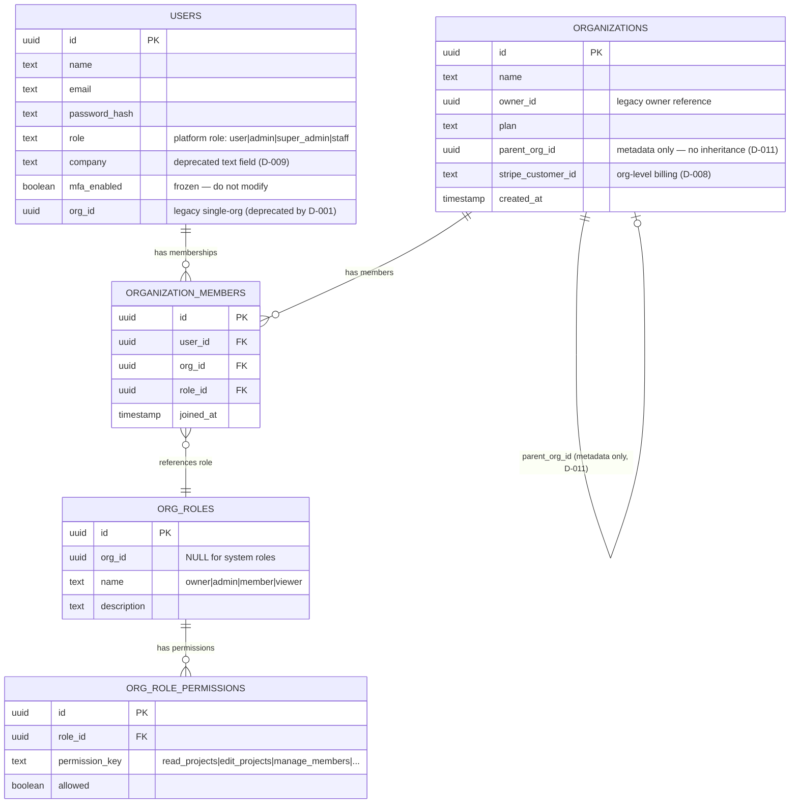
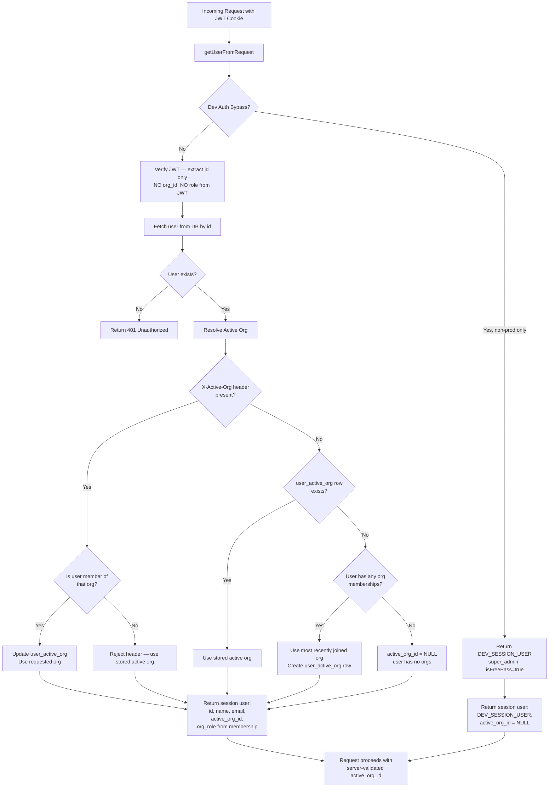
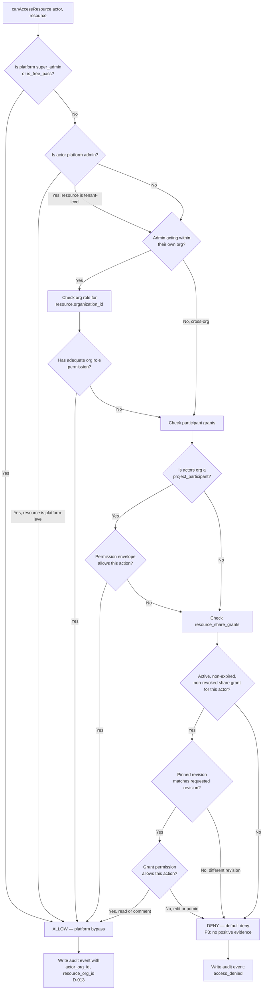
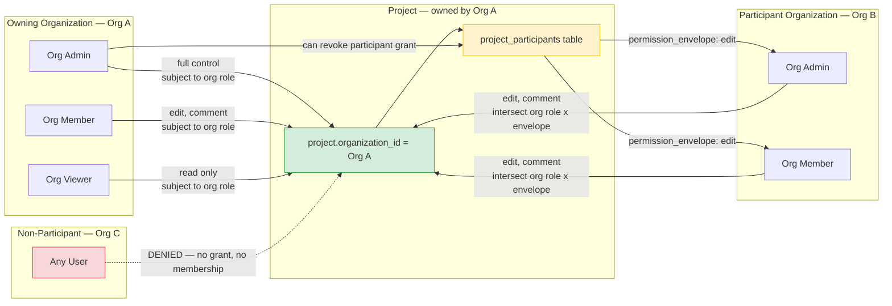
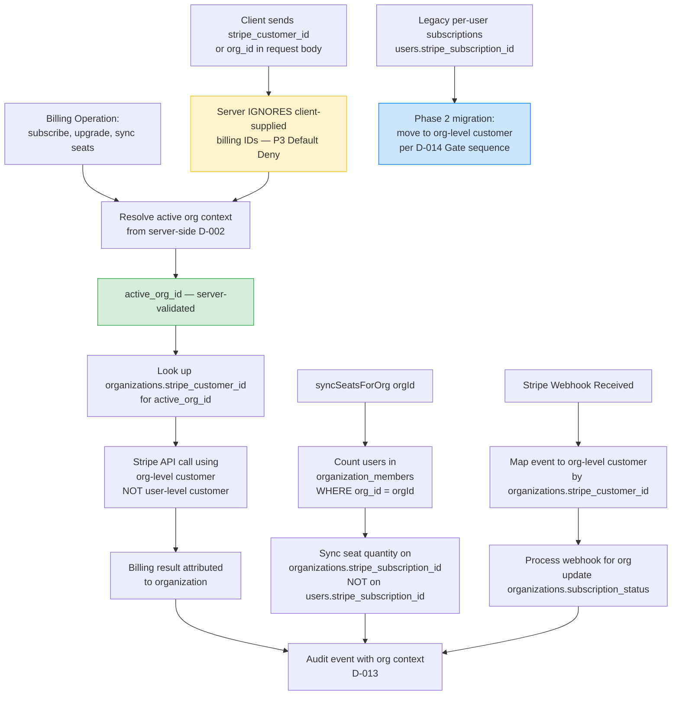

# Enterprise Multi-Tenant Authority — Canonical Authority Model

**Document Type:** Canonical Authority Model with Mermaid Diagrams
**Phase:** 0.5 — Architecture Decision Gate (Read-Only)
**Date:** 2025-07-11
**Branch:** `dev` @ `7b344aa1`
**Status:** Complete — 10 canonical diagrams
**Predecessor:** Phase 0 Audit & Architecture Design (commit `39a1f718`)
**Depends on:** ADR-001 through ADR-014

---

## Purpose

This document defines the canonical authority model for SolarPro's enterprise multi-tenant architecture. It translates the 14 architecture decisions (ADR-001 through ADR-014) into a set of 10 visual diagrams that define how identity, membership, authorization, ownership, sharing, storage, support, billing, background processing, and audit logging interact in the target-state system.

Each diagram is annotated with the governing principles it illustrates and the ADRs it depends on. The diagrams are specification-grade: they define the target-state behavior that Phase 1 implementation must conform to.

### Governing Principles

- **P1:** Organizations Own Business Data
- **P2:** Collaboration Does Not Change Ownership
- **P3:** Default Deny (no route trusts client-supplied org/ownership/billing IDs)
- **P4:** Permission-First Authorization
- **P5:** Platform Authority and Tenant Authority Are Separate
- **P6:** Revision-Bound Enterprise Records
- **P7:** Hybrid Isolation

---

## Diagram 1: Identity and Membership

**Depends on:** ADR-001 (Membership Cardinality), ADR-004 (Platform Roles vs Organization Roles)
**Illustrates:** P1, P5

This diagram shows the canonical identity model: a User has a single platform identity (with a platform role in `users.role`) and can belong to multiple Organizations through the `organization_members` junction table. Each membership carries an organization-scoped role from the `org_roles` table. The platform role namespace and the org role namespace are separate (P5).



**Key points:**
- A user can belong to multiple orgs (many-to-many, D-001).
- Platform roles (`users.role`) and org roles (`org_roles`) are separate namespaces (D-004, P5).
- `parent_org_id` is metadata only — no automatic inheritance (D-011).
- The legacy `users.org_id` single-membership column is deprecated by the `organization_members` junction table.
- MFA columns on `users` are frozen and must not be modified.

---

## Diagram 2: Active Organization Selection

**Depends on:** ADR-002 (Active Organization Context)
**Illustrates:** P3, P5

This diagram shows how the active organization context is resolved on every request. The JWT contains ONLY identity (id, name, email) — never org_id or role (verified in `lib/auth.ts`). The active org is resolved server-side from the `user_active_org` table. The client may send a header (`X-Active-Org`) to request a switch, but the server validates that the user is actually a member of that org before accepting it.



**Key points:**
- The JWT is never modified to include org context (D-002, verified in `lib/auth.ts`).
- The `X-Active-Org` header is a request, not a command — the server validates membership (P3).
- If the user has no org memberships, `active_org_id` is NULL.
- The dev auth bypass is non-production only (verified in `lib/dev-auth.ts`).

---

## Diagram 3: Authorization Decision Sequence

**Depends on:** ADR-003 (Database Isolation Strategy), ADR-004 (Platform Roles), ADR-005 (Project Collaboration), ADR-006 (Resource Share Grants)
**Illustrates:** P3, P4, P5

This diagram shows the canonical authorization decision sequence for every protected resource access. The centralized `canAccessResource()` function is the single entry point for authorization. It checks platform role first (super_admin bypass), then org role for the resource's owning org, then participant grants, then share grants. Default Deny: if no check passes, access is denied.



**Key points:**
- Super_admin and `is_free_pass` bypass all checks (verified in `lib/permissions.ts`).
- Org role permissions are checked for the resource's owning org, not the actor's active org (P1).
- Participant grants (D-005) are org-to-org, not user-to-user.
- Share grants (D-006) are revision-pinned — a different revision is denied.
- Share grants never allow edit or admin — only read or comment.
- Default Deny: any path that does not reach ALLOW is DENY (P3, P4).
- Every decision (allow or deny) is audited with org context (D-013).

---

## Diagram 4: Project Ownership and Participation

**Depends on:** ADR-005 (Project Collaboration Model)
**Illustrates:** P1, P2, P4

This diagram shows how a project is owned by one organization and can have explicit participant organizations. The owning org has full control (subject to org role permissions). Participant orgs have access limited by their permission envelope. Collaboration does not change ownership (P2) — the owning org can revoke a participant grant at any time.



**Key points:**
- The project's `organization_id` is set server-side from the active org context at creation time (P3).
- Owning org members access the project via their org role permissions (P4).
- Participant org members access via the intersection of their org role permissions AND the participant permission envelope.
- Non-participant orgs have NO access — Default Deny (P3).
- The owning org admin can revoke a participant grant at any time — collaboration does not change ownership (P2).
- The permission envelope is `read`, `comment`, or `edit` — never `admin` (admin is reserved for the owning org).

---

## Diagram 5: Resource Sharing

**Depends on:** ADR-006 (Resource Share Grants), ADR-007 (Files and Revisions)
**Illustrates:** P2, P4, P6

This diagram shows the revision-pinned resource share grant lifecycle. A grant is created for a specific revision, cannot be reshared, and optionally expires. The grantee can access ONLY the pinned revision — not future revisions.

```mermaid
flowchart TD
    GRANTER[Owning Org Admin\ncreates share grant] --> CREATE[POST /api/resources/type/id/share]
    CREATE --> PIN[Server pins revision_id\nto current revision\nclient cannot specify revision]
    PIN --> RECORD[Create resource_share_grants row:\nresource_type, resource_id,\nrevision_id, grantee_id,\npermission: read|comment,\nexpires_at optional, granted_by,\ngranted_by_org]
    RECORD --> NOTIFY[Audit event written\nD-013]
    
    GRANTEE[Grantee requests access] --> CHECK[canAccessResource\nDiagram 3 decision sequence]
    CHECK --> G1{Active, non-expired,\nnon-revoked grant?}
    G1 -->|No| DENY[DENY]
    G1 -->|Yes| G2{Requested revision\nmatches pinned revision_id?}
    G2 -->|No — different revision| DENY
    G2 -->|Yes — pinned revision| G3{Permission allows action?}
    G3 -->|read, action=read| ALLOW_VIEW[ALLOW — view pinned revision]
    G3 -->|comment, action=comment| ALLOW_COMMENT[ALLOW — comment on pinned revision]
    G3 -->|any, action=edit| DENY
    G3 -->|any, action=admin| DENY
    
    GRANTEE --> RESHARE[Grantee attempts to\ncreate new share grant]
    RESHARE --> R_CHECK{Is grantee the\nowning org admin?}
    R_CHECK -->|No| DENY_RESHARE[DENY — no reshare allowed\nD-006]
    R_CHECK -->|Yes| CREATE
    
    GRANTER --> REVOKE[DELETE /api/shares/grantId\ngranter or owning-org admin]
    REVOKE --> SET_REVOKED[Set revoked_at timestamp\nGrant is immediately denied]
    SET_REVOKED --> NOTIFY
    
    style PIN fill:#d4edda,stroke:#28a745
    style DENY fill:#f8d7da,stroke:#dc3545
    style DENY_RESHARE fill:#f8d7da,stroke:#dc3545
    style ALLOW_VIEW fill:#d4edda,stroke:#28a745
    style ALLOW_COMMENT fill:#d4edda,stroke:#28a745
```

**Key points:**
- The `revision_id` is pinned server-side at grant creation — the client cannot specify an arbitrary revision (P3).
- The grantee can access ONLY the pinned revision — a different revision is denied (P6).
- Resharing is prohibited — a grantee cannot create new grants (D-006, P4).
- Share grants never allow edit or admin — only read or comment.
- Revocation is immediate — the next access check sees `revoked_at` and denies.
- Optional `expires_at` provides temporal control for external reviewers.

---

## Diagram 6: File Revision Access

**Depends on:** ADR-007 (Files and Revisions), ADR-006 (Resource Share Grants)
**Illustrates:** P1, P6, P7

This diagram shows the file storage and revision access model. Files are stored in private, tenant-prefixed blob storage. Every file has DB-backed revision records. Revisions are immutable — a new upload creates a new revision, never overwriting the old. Access requires authorization + signed URL generation with a short TTL.

```mermaid
flowchart TD
    UPLOAD[File Upload Request] --> AUTH1[Authorization check:\nis actor member of owning org\nor has share grant?]
    AUTH1 -->|Denied| REJECT_UPLOAD[Reject — 403]
    AUTH1 -->|Allowed| PATH[Generate org-prefixed path:\norgs/{orgId}/{type}/{resId}/r{n}/{ts}-{name}]
    PATH --> STORE[Store in private blob storage\naccess: private — NOT public]
    STORE --> RECORD[Create file_records row:\norg_id, resource_type, resource_id,\nrevision_number, blob_path,\ncontent_hash, uploaded_by]
    RECORD --> SUPERSede[Mark previous revision\nsuperseded_by = new revision_id\nold blob RETAINED]
    SUPERSede --> AUDIT_F[Audit event with org context]
    
    ACCESS[File Access Request\nGET /api/files/{fileId}] --> AUTH2[Authorization check:\nDiagram 3 decision sequence]
    AUTH2 -->|Denied| REJECT_ACCESS[Reject — 403]
    AUTH2 -->|Allowed| SIGN[Generate signed URL\nTTL: 5 minutes]
    SIGN --> REDIRECT[Redirect to signed URL\nor proxy file content]
    
    REVISION_LIST[GET /api/files/{fileId}/revisions] --> AUTH3[Authorization check:\nowning org member or\nshare grant holder only]
    AUTH3 -->|Denied| REJECT_REV[Reject — 403]
    AUTH3 -->|Allowed| LIST[Return revision list:\nrevision_number, uploaded_at,\nuploaded_by, superseded_by]
    
    style STORE fill:#d4edda,stroke:#28a745
    style SUPERSede fill:#fff3cd,stroke:#ffc107
    style SIGN fill:#d4edda,stroke:#28a745
    style REJECT_UPLOAD fill:#f8d7da,stroke:#dc3545
    style REJECT_ACCESS fill:#f8d7da,stroke:#dc3545
    style REJECT_REV fill:#f8d7da,stroke:#dc3545
```

**Key points:**
- Storage paths are org-prefixed: `orgs/{orgId}/...` — tenant isolation at the storage layer (P7).
- Blob access is private, not public — eliminates T-07 (verified: current code uses `access: 'public'`).
- Revisions are immutable — old revisions are retained, marked `superseded_by` (P6).
- Signed URLs have a 5-minute TTL — minimizes exposure if a URL leaks.
- Content hashes enable future deduplication and integrity verification.
- The current public blob URLs (`app/api/survey/upload-photo/route.ts`, `lib/intake/utilityBillAttachment.ts`) are migrated to this model in Phase 2.

---

## Diagram 7: Support Access and Impersonation

**Depends on:** ADR-012 (Support Access and Impersonation)
**Illustrates:** P3, P4, P5

This diagram shows the break-glass impersonation flow. Impersonation is time-limited (max 30 minutes), reason-coded, tenant-aware (org-scoped admins cannot impersonate cross-tenant), revocable, and notified. Every action is audited with org context.

```mermaid
flowchart TD
    ADMIN[Platform Admin or\nOrg-Scoped Admin] --> INIT[POST /api/admin/impersonate\nbody: target_user_id, reason, duration_minutes]
    INIT --> V1{duration <= 30 min\nAND reason provided?}
    V1 -->|No| REJECT_INIT[Reject — 400\nreason and duration required]
    V1 -->|Yes| V2{Is admin org-scoped\nnot super_admin?}
    
    V2 -->|Yes, org-scoped| V3{Is target user in\nsame org as admin?}
    V3 -->|No| REJECT_CROSS[DENY — cross-tenant\nimpersonation prohibited\nT-05 mitigation]
    V3 -->|Yes| CREATE_SESSION
    
    V2 -->|No, platform super_admin| CREATE_SESSION[Create impersonation session:\nreason, duration, expires_at,\ntarget_id, admin_id, target_org_id]
    
    CREATE_SESSION --> JWT_IMP[Create session JWT with:\n_impersonated: true,\n_adminId, _impersonationReason,\n_impersonationExpiresAt hard expiry]
    JWT_IMP --> COOKIE[Set session cookie\n1-hour max, but session\nexpires at _impersonationExpiresAt]
    COOKIE --> NOTIFY[Send email notification\nto target user:\nYour account was accessed\nby support for: {reason}]
    NOTIFY --> AUDIT_IMP[Audit event:\nimpersonation_started\nadmin_id, target_id,\ntarget_org_id, reason, duration\nD-013]
    
    EVERY_REQ[Every subsequent request] --> MW[Middleware checks:\n1. _impersonationExpiresAt reached?\n2. Session revoked?]
    MW -->|Expired or revoked| TERMINATE[Terminate session\nClear cookie, return 401]
    MW -->|Active| PROCEED[Proceed as target user\nwith impersonation context]
    PROCEED --> AUDIT_ACTION[Every action audited with\n_impersonated: true, _adminId\nand target org context]
    
    REVOKE_REQ[Admin or another admin\nPOST /api/admin/impersonate/revoke] --> REVOKE_ACT[Set revoked_at, revoked_by\nSession terminated on next request]
    REVOKE_ACT --> AUDIT_REVOKE[Audit event: impersonation_revoked]
    
    style REJECT_CROSS fill:#f8d7da,stroke:#dc3545
    style TERMINATE fill:#f8d7da,stroke:#dc3545
    style NOTIFY fill:#cce5ff,stroke:#007bff
    style AUDIT_IMP fill:#d4edda,stroke:#28a745
```

**Key points:**
- Org-scoped admins can ONLY impersonate users within their own org — cross-tenant impersonation is prohibited (T-05 mitigation).
- Platform super_admin can impersonate any user — but with full auditing, reason, duration limit, and notification (P5).
- The session has a HARD expiry (`_impersonationExpiresAt`) checked on every request — even if the cookie is still valid.
- Revocation is real-time — the middleware checks a revocation flag on every request.
- The target user is notified by email — transparency and deterrence.
- The current mechanism (`app/api/admin/impersonate/route.ts`) has NO same-org validation — this is the critical gap being closed.

---

## Diagram 8: Billing Attribution

**Depends on:** ADR-008 (Billing Attribution)
**Illustrates:** P1, P3, P5

This diagram shows the org-level billing model. Billing is attributed to the organization, not to individual users. The active org context (D-002) determines which Stripe customer is charged. No route trusts a client-supplied `stripe_customer_id` or `org_id` for billing (P3).



**Key points:**
- Billing is always resolved from the server-side active org context — never from client input (P3).
- `syncSeatsForOrg()` operates on the org-level subscription, not the user-level subscription.
- Stripe webhooks are mapped to org-level customers, not user-level.
- Legacy per-user subscriptions (`users.stripe_subscription_id` from Migration 006) are migrated to org-level in Phase 2.
- The current model has billing on the owner's individual Stripe customer — this is the gap being closed.

---

## Diagram 9: Worker Authorization

**Depends on:** ADR-003 (Database Isolation), ADR-007 (Files and Revisions), ADR-013 (Audit Ledger)
**Illustrates:** P7, P1

This diagram shows how the background worker (`worker/main.ts`) resolves tenant context. Currently, the worker has NO tenant context (T-09) — it polls globally and resolves the owner via `getSurveyOwnerId()`. In the target state, the worker resolves the owning org from the resource's `organization_id` and uses it for org-scoped operations (storage access, audit context).

```mermaid
flowchart TD
    POLL[Worker polls for queued jobs\nworker/main.ts] --> CLAIM[claimNextQueuedJob\nCAS locking]
    CLAIM --> JOB[Job acquired:\nsurvey_id, project_id]
    JOB --> RESOLVE_OWNER[getSurveyOwnerId surveyId\nresolve owner user_id]
    RESOLVE_OWNER --> RESOLVE_ORG[NEW: Resolve owning org\nfrom projects.organization_id\nfor this survey]
    RESOLVE_ORG --> ORG_CONTEXT[org_id established for job]
    
    ORG_CONTEXT --> STORAGE[Access file storage\nusing org-prefixed paths\norgs/{orgId}/...\nD-007]
    ORG_CONTEXT --> AUDIT_W[Write audit events\nwith actor_organization_id = org_id\nresource_owner_organization_id = org_id\nD-013]
    ORG_CONTEXT --> GEOMETRY[Perform geometry reconstruction\njob-specific business logic\nunchanged]
    
    GEOMETRY --> COMPLETE[Job complete]
    COMPLETE --> RELEASE[releaseJobLock\nCAS unlock]
    RELEASE --> AUDIT_W
    
    NO_ORG{Resource has no\norganization_id?} -->|Legacy data| FALLBACK[Use D-009 backfill result\nor flag as needing migration]
    FALLBACK --> AUDIT_W
    
    style RESOLVE_ORG fill:#d4edda,stroke:#28a745
    style ORG_CONTEXT fill:#d4edda,stroke:#28a745
    style FALLBACK fill:#fff3cd,stroke:#ffc107
```

**Key points:**
- The worker resolves org context per job from the resource's `organization_id` — this is NEW (currently T-09: no tenant context).
- Org context is used for storage access (org-prefixed paths, D-007) and audit events (D-013).
- The worker's business logic (geometry reconstruction) is unchanged — only the org context resolution is added.
- Legacy data without `organization_id` is handled per the D-009 backfill result.
- The worker does NOT use user session context — it has its own service-level authorization (it operates on owned resources, not on behalf of a user).

---

## Diagram 10: Audit Event Flow

**Depends on:** ADR-013 (Audit Ledger Architecture)
**Illustrates:** P5, P6

This diagram shows the tenant-aware audit event flow. Audit events carry `actor_organization_id` and `resource_owner_organization_id`. The hash chain is partitioned per org — each org has its own chain. Platform-level events form a separate platform chain. Per-org chain verification is independent.

```mermaid
flowchart TD
    EVENT[Action occurs:\ndata access, auth, admin,\nsecurity, compliance] --> CONTEXT[Resolve org context:\nactor_organization_id from D-002\nresource_owner_organization_id\nfrom resource.organization_id]
    CONTEXT --> BUILD[Build AuditLogEntry:\ntimestamp, category, action,\nactor_id, actor_email, actor_role,\nactor_organization_id NEW,\nresource_owner_organization_id NEW,\ntarget_type, target_id, description,\nmetadata, ip_address, user_agent,\nrequest_path]
    BUILD --> CHAIN[Compute prev_hash:\nSELECT entry_hash FROM audit_log\nWHERE actor_organization_id = ${orgId}\nORDER BY timestamp DESC LIMIT 1\nper-org chain, NOT global]
    CHAIN --> HASH[Compute entry_hash:\nSHA-256 of all fields + prev_hash]
    HASH --> WRITE[Write to audit_log table]
    WRITE --> DONE[Audit event recorded\nwith per-org chain linkage]
    
    VERIFY[verifyAuditChain orgId] --> FETCH[Fetch all events\nWHERE actor_organization_id = ${orgId}\nORDER BY timestamp ASC]
    FETCH --> RECOMPUTE[Recompute each entry_hash\nfrom fields + prev_hash]
    RECOMPUTE --> COMPARE{Recomputed hash\nmatches stored hash?}
    COMPARE -->|All match| VALID[Chain VALID for org ${orgId}\nNo tampering detected]
    COMPARE -->|Mismatch at entry N| TAMPER[Tampering detected\nat entry N for org ${orgId}\nOther orgs unaffected]
    
    PLATFORM_EVENTS[Platform-level events\nactor_organization_id = NULL] --> PLATFORM_CHAIN[Platform chain:\nprev_hash links within\nNULL-org events only]
    
    QUERY[GET /api/audit/org/{orgId}] --> AUTH_A{Is requester org admin\nor platform super_admin?}
    AUTH_A -->|No| DENY_A[DENY — 403]
    AUTH_A -->|Yes| RETURN_EVENTS[Return only events\nWHERE actor_organization_id = ${orgId}\nOR resource_owner_organization_id = ${orgId}]
    
    style CHAIN fill:#d4edda,stroke:#28a745
    style VALID fill:#d4edda,stroke:#28a745
    style TAMPER fill:#f8d7da,stroke:#dc3545
    style DENY_A fill:#f8d7da,stroke:#dc3545
    style PLATFORM_CHAIN fill:#cce5ff,stroke:#007bff
```

**Key points:**
- Every audit event carries `actor_organization_id` and `resource_owner_organization_id` — NEW columns (D-013).
- The hash chain is per-org: `prev_hash` links to the previous event for the SAME org, not globally.
- Per-org chain verification is independent — tampering in Org A's chain does not affect Org B's chain (P5).
- Platform-level events (NULL org) form a separate platform chain.
- Org-scoped audit queries return only that org's events — cross-tenant audit access is denied for org-scoped admins.
- The current `audit_log` table (Migration 100) has NO org columns and a global chain — this is the gap being closed.

---

## Cross-Reference: Diagrams to ADRs

| Diagram | Title | Primary ADRs | Principles |
|---------|-------|-------------|------------|
| 1 | Identity and Membership | ADR-001, ADR-004 | P1, P5 |
| 2 | Active Organization Selection | ADR-002 | P3, P5 |
| 3 | Authorization Decision Sequence | ADR-003, ADR-004, ADR-005, ADR-006 | P3, P4, P5 |
| 4 | Project Ownership and Participation | ADR-005 | P1, P2, P4 |
| 5 | Resource Sharing | ADR-006, ADR-007 | P2, P4, P6 |
| 6 | File Revision Access | ADR-007, ADR-006 | P1, P6, P7 |
| 7 | Support Access and Impersonation | ADR-012 | P3, P4, P5 |
| 8 | Billing Attribution | ADR-008 | P1, P3, P5 |
| 9 | Worker Authorization | ADR-003, ADR-007, ADR-013 | P7, P1 |
| 10 | Audit Event Flow | ADR-013 | P5, P6 |

---

## Document Footer

**Diagram Count:** 10
**All Diagrams Status:** Complete — specification-grade
**Evidence Base:** All diagrams reflect verified current-state evidence from the SolarPro codebase and the 14 approved ADRs.
**Governing Principles Coverage:** P1 (Diagrams 1, 4, 6, 8, 9), P2 (Diagrams 4, 5), P3 (Diagrams 2, 3, 7, 8), P4 (Diagrams 3, 4, 5, 7), P5 (Diagrams 1, 2, 3, 7, 8, 10), P6 (Diagrams 5, 6, 10), P7 (Diagrams 6, 9).
