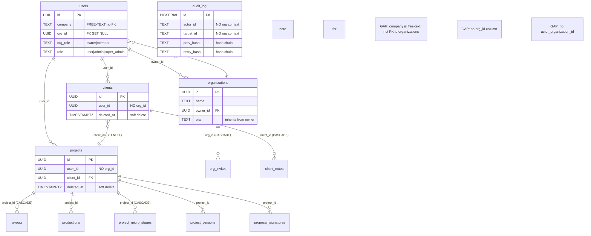

# Enterprise Multi-Tenant Authority — Phase 0 Data Inventory

> **Document type:** Per-table ownership and isolation inventory (read-only, no implementation)
> **Branch:** `dev` (commit `fedb27ac`)
> **Status:** SOC 2 readiness in progress — not certified. Security controls aligned with ISO 27001 principles.
> **Scope:** All 55 distinct database tables identified across 101 SQL migration files
> **Date:** 2025

---

## 0. Inventory Method

This inventory was produced by extracting all `CREATE TABLE` statements from the 101 SQL migration files in `lib/migrations/`, cataloguing each table's ownership fields (`user_id`, `project_id`, `org_id`, `client_id`, or none), its foreign key relationships, its delete behavior (`ON DELETE CASCADE`, `ON DELETE SET NULL`, soft delete via `deleted_at`), and its access-control location (which API routes query it and with what filter). Each table is then classified by migration risk level for the proposed multi-tenant migration.

### Classification Tags

- **Owner field** — the column that identifies who owns the row (e.g., `user_id`, `project_id`, `org_id`)
- **Isolation enforcement** — how access is restricted: `app-user-filter` (WHERE user_id), `app-admin-global` (no filter, admin only), `app-project-join` (join through project_id to user_id), `none` (no isolation)
- **Access-control location** — the API routes or lib functions that query the table
- **Delete behavior** — `CASCADE` (hard delete children), `SET NULL` (orphan), `soft-delete` (deleted_at), `manual`
- **Migration risk** — the risk level of adding `org_id` and tenant-scoping to this table:
  - **LOW** — table has clear `user_id` ownership, simple to backfill `org_id` from user's org
  - **MEDIUM** — table has `project_id` or `client_id` ownership, requires join to resolve org; or table is shared/global
  - **HIGH** — table has no ownership field, or ownership is ambiguous, or table is used by background worker
  - **CRITICAL** — table is central to auth/billing/audit and incorrect migration could cause data loss or security breach

---

## 1. Core Business Resources

These tables hold the primary business data that users create and manage: projects, clients, layouts, and productions.

### 1.1 projects

| Attribute | Value |
|-----------|-------|
| Migration | 001_initial_schema.sql |
| Owner field | `user_id UUID NOT NULL` |
| Isolation enforcement | `app-user-filter` (WHERE user_id = $1 AND deleted_at IS NULL) |
| Access-control location | `app/api/projects/*/route.ts`, `app/api/admin/projects/route.ts` (global, no filter) |
| Delete behavior | `soft-delete` (deleted_at TIMESTAMPTZ) |
| Migration risk | **LOW** |

**[VERIFIED]** Schema: `id`, `user_id`, `client_id` (FK to clients, ON DELETE SET NULL), `name`, `status`, `system_type`, `notes`, `address`, `system_size_kw`, `created_at`, `updated_at`, `deleted_at`. Indexes on `user_id`, `client_id`, `deleted_at`. The `user_id` is the clear ownership field. Backfilling `org_id` requires joining to `users` to get the owner's `org_id`. The admin route queries globally with no filter — this is the primary cross-tenant exposure surface.

### 1.2 clients

| Attribute | Value |
|-----------|-------|
| Migration | 001_initial_schema.sql |
| Owner field | `user_id UUID NOT NULL` |
| Isolation enforcement | `app-user-filter` (WHERE user_id = $1 AND deleted_at IS NULL) |
| Access-control location | `app/api/clients/route.ts` (user-scoped with plan-tier limits) |
| Delete behavior | `soft-delete` (deleted_at TIMESTAMPTZ) |
| Migration risk | **LOW** |

**[VERIFIED]** Schema: `id`, `user_id`, `name`, `email`, `phone`, `address`, `city`, `state`, `zip`, `lat`, `lng`, `utility_provider`, `monthly_kwh` (JSONB), `annual_kwh`, `average_monthly_kwh`, `average_monthly_bill`, `annual_bill`, `utility_rate`, `created_at`, `updated_at`, `deleted_at`. Indexes on `user_id`, `deleted_at`. Clear `user_id` ownership. Soft-deleted, not hard-deleted.

### 1.3 layouts

| Attribute | Value |
|-----------|-------|
| Migration | 001_initial_schema.sql |
| Owner field | `project_id UUID NOT NULL` (FK to projects, ON DELETE CASCADE) + `user_id UUID NOT NULL` |
| Isolation enforcement | `app-project-join` (join through project_id to projects.user_id) |
| Access-control location | `app/api/layouts/*/route.ts` |
| Delete behavior | `CASCADE` (when parent project is hard-deleted) |
| Migration risk | **MEDIUM** |

**[VERIFIED]** Schema: `id`, `project_id` (FK CASCADE), `user_id`, `system_type`, `panels` (JSONB), `roof_planes` (JSONB), ground/tilt/azimuth/spacing parameters, `bifacial_optimized`, `total_panels`, `system_size_kw`, `map_center` (JSONB), `map_zoom`. Has both `project_id` and `user_id` — the `user_id` is redundant but provides direct ownership. Migration requires adding `org_id` and ensuring it is consistent with the project's owner's org.

### 1.4 productions

| Attribute | Value |
|-----------|-------|
| Migration | 003_productions_enhancements.sql |
| Owner field | `project_id` (FK to projects) |
| Isolation enforcement | `app-project-join` |
| Access-control location | `app/api/productions/*/route.ts` |
| Delete behavior | `CASCADE` |
| Migration risk | **MEDIUM** |

**[VERIFIED]** Production data linked to projects. Requires join through `project_id` to resolve ownership. No direct `user_id` column — ownership is entirely derived from the parent project.

---

## 2. User and Organization Tables

These tables define the identity and organizational structure of the system.

### 2.1 users

| Attribute | Value |
|-----------|-------|
| Migration | 001_initial_schema.sql (base), 006 (subscriptions), 016 (org_id), 094 (password_changed_at), 100 (MFA) |
| Owner field | Self (the user IS the owner); `org_id` references organizations |
| Isolation enforcement | `app-admin-global` (admin can see all users); self (user can see own profile) |
| Access-control location | `app/api/auth/*/route.ts`, `app/api/admin/*/route.ts` |
| Delete behavior | Manual (no cascade; deleting a user cascades to their orgs) |
| Migration risk | **CRITICAL** |

**[VERIFIED]** The `users` table is the central identity table. It has `org_id` (FK to organizations, ON DELETE SET NULL) and `org_role` ('owner' | 'member'). Adding tenant scoping to user queries is critical because admin routes currently see all users globally. The `ON DELETE SET NULL` on `org_id` means deleting an org orphans the user (sets org_id to NULL). Migration risk is CRITICAL because incorrect changes could lock users out or expose user data across tenants.

### 2.2 organizations

| Attribute | Value |
|-----------|-------|
| Migration | 016_organizations.sql |
| Owner field | `owner_id UUID NOT NULL` (FK to users, ON DELETE CASCADE) |
| Isolation enforcement | `app-admin-global` (currently); owner can see own org |
| Access-control location | `app/api/organizations/route.ts`, `app/api/organizations/member/route.ts`, `app/api/organizations/invite/route.ts` |
| Delete behavior | `CASCADE` (deleting org cascades to org_invites; sets users.org_id to NULL) |
| Migration risk | **CRITICAL** |

**[VERIFIED]** Schema: `id`, `name`, `owner_id` (FK CASCADE), `plan` (default 'contractor'), `created_at`, `updated_at`. No `status` column (no active/suspended state). No `slug` or `domain`. This table will become the central tenant entity in the proposed architecture. Migration risk is CRITICAL because it is the tenant boundary — incorrect changes could merge or split organizations.

### 2.3 org_invites

| Attribute | Value |
|-----------|-------|
| Migration | 016_organizations.sql |
| Owner field | `org_id UUID NOT NULL` (FK to organizations, ON DELETE CASCADE) + `invited_by UUID` (FK to users) |
| Isolation enforcement | `app-admin-global` (currently); token-based access for invitee |
| Access-control location | `app/api/organizations/invite/route.ts` |
| Delete behavior | `CASCADE` (when parent org is deleted) |
| Migration risk | **MEDIUM** |

**[VERIFIED]** Schema: `id`, `org_id`, `invited_email`, `invited_by`, `token` (unique, 24-byte hex), `accepted_at`, `created_at`, `expires_at` (7 days). Indexes on `org_id`, `invited_email`, `token`. The invite lifecycle is straightforward but lacks role specification (all acceptances get `org_role = 'member'`).

---

## 3. Authentication and Security Tables

These tables support authentication, MFA, impersonation, and audit logging.

### 3.1 admin_activity_log

| Attribute | Value |
|-----------|-------|
| Migration | 008_admin_activity_log.sql |
| Owner field | `admin_id UUID NOT NULL` (FK to users, ON DELETE CASCADE); `target_user_id` (FK, ON DELETE SET NULL) |
| Isolation enforcement | `app-admin-global` (admin-only access) |
| Access-control location | `app/api/admin/*/route.ts` |
| Delete behavior | `CASCADE` (when admin is deleted) |
| Migration risk | **HIGH** |

**[VERIFIED]** Schema: `id`, `admin_id`, `action` (VARCHAR(100)), `target_user_id`, `target_company` (VARCHAR(255), free-text), `metadata` (JSONB), `created_at`. The `target_company` is free-text, not a foreign key to organizations. This table needs `actor_organization_id` and `target_organization_id` columns for tenant-aware logging. Migration risk is HIGH because it is an audit table — existing records cannot be easily backfilled with org context.

### 3.2 admin_impersonation_tokens

| Attribute | Value |
|-----------|-------|
| Migration | 008_admin_activity_log.sql |
| Owner field | `admin_id` (FK CASCADE), `target_id` (FK CASCADE) |
| Isolation enforcement | `app-admin-global` (admin-only) |
| Access-control location | Admin impersonation routes |
| Delete behavior | `CASCADE` (when admin or target is deleted) |
| Migration risk | **HIGH** |

**[VERIFIED]** Schema: `id`, `admin_id`, `target_id`, `token` (VARCHAR(128), unique), `used` (BOOLEAN), `expires_at` (5 minutes), `created_at`. This table enables cross-tenant impersonation — any admin can impersonate any user. Migration must add same-org validation.

### 3.3 audit_log

| Attribute | Value |
|-----------|-------|
| Migration | 100_compliance_audit_mfa_consent.sql |
| Owner field | `actor_id` (TEXT), `target_id` (TEXT) — no org context |
| Isolation enforcement | `app-admin-global` (admin-only) |
| Access-control location | Audit log query routes |
| Delete behavior | Manual (append-only, hash-chained) |
| Migration risk | **CRITICAL** |

**[VERIFIED]** Schema: `id` (BIGSERIAL), `timestamp`, `category`, `action`, `actor_id` (TEXT), `actor_email`, `actor_role`, `target_type`, `target_id` (TEXT), `description`, `metadata` (JSONB), `ip_address`, `user_agent`, `request_path`, `prev_hash`, `entry_hash`. Hash-chained (SHA-256). No `actor_organization_id` or `resource_owner_organization_id`. Migration risk is CRITICAL because the hash chain must not be broken by schema changes, and existing entries cannot be retroactively org-tagged without breaking the chain.

### 3.4 password_reset_tokens

| Attribute | Value |
|-----------|-------|
| Migration | 011_password_reset_tokens.sql |
| Owner field | User email or user_id |
| Isolation enforcement | Token-based (self-service) |
| Access-control location | `app/api/auth/reset-password/route.ts` |
| Delete behavior | `CASCADE` or expiry |
| Migration risk | **LOW** |

**[VERIFIED]** Password reset tokens are ephemeral and user-scoped. No org context needed for functionality, but audit logging of reset events should include org context.

### 3.5 mfa_recovery_codes

| Attribute | Value |
|-----------|-------|
| Migration | 100_compliance_audit_mfa_consent.sql |
| Owner field | `user_id` (FK to users) |
| Isolation enforcement | Self (user's own recovery codes) |
| Access-control location | MFA routes |
| Delete behavior | `CASCADE` |
| Migration risk | **LOW** |

**[VERIFIED]** Recovery codes are user-scoped. No org context needed for functionality.

### 3.6 portal_otp_tokens

| Attribute | Value |
|-----------|-------|
| Migration | 032_portal_otp_tokens.sql |
| Owner field | Project/client context (homeowner portal) |
| Isolation enforcement | Token-based (OTP) |
| Access-control location | Portal auth routes |
| Delete behavior | Expiry-based |
| Migration risk | **MEDIUM** |

**[VERIFIED]** OTP tokens for the homeowner portal. These are scoped to a project/homeowner, not to an org. In the multi-tenant model, the project's org should be derivable from the token's project context.

---

## 4. Survey and Geometry Tables

These tables hold site survey data, geometry reconstruction jobs, and related artifacts.

### 4.1 site_survey_geometry_reconstruction_jobs

| Attribute | Value |
|-----------|-------|
| Migration | 073_photo_vision_jobs.sql, 074, 075, 076, 084, 085 |
| Owner field | `survey_id` / project context; `locked_by` (worker ID) |
| Isolation enforcement | `app-project-join` + worker polling (no tenant filter) |
| Access-control location | Survey routes, `worker/main.ts` |
| Delete behavior | Manual |
| Migration risk | **HIGH** |

**[VERIFIED]** Geometry reconstruction jobs are polled by the background worker without tenant filtering. The worker uses `claimNextQueuedJob()` with an atomic CAS on `locked_by IS NULL`. Migration 085 added worker ownership tracking. The job's tenant context must be derived from the survey/project owner. Migration risk is HIGH because the worker operates outside the application's auth context.

### 4.2 site_survey_geometry_reconstruction_artifacts

| Attribute | Value |
|-----------|-------|
| Migration | 077_geometry_reconstruction_artifacts.sql |
| Owner field | `job_id` (FK to reconstruction jobs) |
| Isolation enforcement | `app-project-join` (through job → survey → project → user) |
| Access-control location | Worker writes, survey routes read |
| Delete behavior | `CASCADE` or manual (deleteArtifactsByJob) |
| Migration risk | **MEDIUM** |

**[VERIFIED]** Artifacts are written by the worker and read by survey routes. Ownership is derived through the job → survey → project chain.

### 4.3 unified_geometry_artifacts

| Attribute | Value |
|-----------|-------|
| Migration | 079_unified_geometry_foundation.sql, 080 (backfill), 081, 082 |
| Owner field | `project_id` / `survey_id` |
| Isolation enforcement | `app-project-join` |
| Access-control location | Geometry routes, worker |
| Delete behavior | Manual (deleteUnifiedArtifactsByPipeline) |
| Migration risk | **MEDIUM** |

**[VERIFIED]** Unified geometry artifacts consolidate geometry data across pipeline stages. Ownership derived from project.

### 4.4 canonical_building_model

| Attribute | Value |
|-----------|-------|
| Migration | 087_canonical_building_model.sql |
| Owner field | `project_id` |
| Isolation enforcement | `app-project-join` |
| Access-control location | Geometry/building model routes |
| Delete behavior | `CASCADE` |
| Migration risk | **MEDIUM** |

**[VERIFIED]** Building model data linked to a project.

### 4.5 site_survey_depth_contradiction_reports

| Attribute | Value |
|-----------|-------|
| Migration | 086_depth_contradiction_reports.sql |
| Owner field | `project_id` / `survey_id` |
| Isolation enforcement | `app-project-join` |
| Access-control location | Survey quality routes |
| Delete behavior | `CASCADE` |
| Migration risk | **MEDIUM** |

**[VERIFIED]** Depth contradiction reports for survey quality assurance.

### 4.6 site_survey_files_gps

| Attribute | Value |
|-----------|-------|
| Migration | 099_site_survey_files_gps.sql |
| Owner field | `project_id` / survey context |
| Isolation enforcement | `app-project-join` |
| Access-control location | Survey file routes |
| Delete behavior | Manual |
| Migration risk | **MEDIUM** |

**[VERIFIED]** GPS data for survey files.

---

## 5. Engineering Tables

### 5.1 eagleview_orders

| Attribute | Value |
|-----------|-------|
| Migration | 095_eagleview_orders.sql |
| Owner field | `project_id` + `user_id` |
| Isolation enforcement | `app-project-join` / `app-user-filter` |
| Access-control location | EagleView order routes |
| Delete behavior | Manual |
| Migration risk | **MEDIUM** |

**[VERIFIED]** EagleView aerial imagery orders linked to projects and users.

### 5.2 nearmap_ai_cache

| Attribute | Value |
|-----------|-------|
| Migration | 102_nearmap_ai_cache.sql |
| Owner field | Address/location-based (cache key) |
| Isolation enforcement | `none` (shared cache) |
| Access-control location | Nearmap AI routes |
| Delete behavior | Manual / TTL-based |
| Migration risk | **HIGH** |

**[VERIFIED]** AI cache for Nearmap data. This is a shared cache keyed by address/location, not by user or org. In a multi-tenant model, this cache could leak information across tenants if one tenant's query populates the cache and another tenant's query hits it. Migration risk is HIGH because the cache has no tenant scoping and could expose one tenant's property data to another.

---

## 6. Equipment Tables

### 6.1 user_equipment_panels / user_equipment_inverters / user_equipment_batteries / user_equipment_mounting

| Attribute | Value |
|-----------|-------|
| Migration | 005_user_equipment_library.sql |
| Owner field | `user_id UUID NOT NULL` |
| Isolation enforcement | `app-user-filter` (WHERE user_id = $1) |
| Access-control location | Equipment library routes |
| Delete behavior | Manual |
| Migration risk | **LOW** |

**[VERIFIED]** User equipment libraries are clearly `user_id`-scoped. Backfilling `org_id` from the user's org is straightforward. In the multi-tenant model, these could become org-shared equipment libraries (all org members see the org's equipment library).

### 6.2 manufacturer_assets

| Attribute | Value |
|-----------|-------|
| Migration | 103_manufacturer_assets.sql, 104 (seed) |
| Owner field | `none` (global reference data) |
| Isolation enforcement | `none` (shared across all users) |
| Access-control location | Equipment reference routes |
| Delete behavior | Manual |
| Migration risk | **LOW** |

**[VERIFIED]** Manufacturer assets are global reference data (panels, inverters, etc. from manufacturers). These are shared across all tenants — they are not tenant-scoped. Migration risk is LOW because they should remain global.

---

## 7. Proposal and Contract Tables

### 7.1 proposal_signatures

| Attribute | Value |
|-----------|-------|
| Migration | 040_proposal_signatures_table.sql |
| Owner field | `project_id` / proposal context |
| Isolation enforcement | `app-project-join` |
| Access-control location | Proposal routes |
| Delete behavior | `CASCADE` |
| Migration risk | **MEDIUM** |

**[VERIFIED]** Proposal signatures linked to projects. Ownership derived through project.

### 7.2 client_notes

| Attribute | Value |
|-----------|-------|
| Migration | 034_client_notes.sql |
| Owner field | `client_id` (FK CASCADE) + `user_id` |
| Isolation enforcement | `app-user-filter` / join through client |
| Access-control location | Client notes routes |
| Delete behavior | `CASCADE` (when client is deleted) |
| Migration risk | **MEDIUM** |

**[VERIFIED]** Notes on clients, with both `client_id` and `user_id`. The `user_id` identifies who wrote the note.

---

## 8. Network, Leads, and Opportunities Tables

These tables support the lead/opportunity management system.

### 8.1 network_opportunities

| Attribute | Value |
|-----------|-------|
| Migration | 045_opportunities.sql, 047, 054, 062, 088 |
| Owner field | `none` (marketplace/shared) |
| Isolation enforcement | `none` (shared marketplace) |
| Access-control location | Network/lead routes |
| Delete behavior | Manual |
| Migration risk | **HIGH** |

**[VERIFIED]** Network opportunities are a shared marketplace — leads that can be claimed by contractors. They are not owned by a specific user or org until claimed. Migration risk is HIGH because the marketplace model inherently crosses tenant boundaries — one tenant's claimed lead is visible to the marketplace.

### 8.2 opportunity_claims

| Attribute | Value |
|-----------|-------|
| Migration | 046_opportunity_claims.sql |
| Owner field | `user_id` (the claiming contractor) |
| Isolation enforcement | `app-user-filter` |
| Access-control location | Opportunity claim routes |
| Delete behavior | `CASCADE` |
| Migration risk | **MEDIUM** |

**[VERIFIED]** When a contractor claims an opportunity, a claim record is created with their `user_id`. The claimed opportunity becomes their lead. Migration requires `org_id` on the claim.

### 8.3 opportunity_assignments

| Attribute | Value |
|-----------|-------|
| Migration | 051_opportunity_assignments.sql, 067 (repair) |
| Owner field | `assigned_to` (user_id) |
| Isolation enforcement | `app-user-filter` |
| Access-control location | Assignment routes |
| Delete behavior | `CASCADE` |
| Migration risk | **MEDIUM** |

**[VERIFIED]** Opportunity assignments link opportunities to users.

### 8.4 opportunity_screening_queue

| Attribute | Value |
|-----------|-------|
| Migration | 049_opportunity_screening_queue.sql, 063 (repair) |
| Owner field | `none` (shared queue) |
| Isolation enforcement | `none` (shared) |
| Access-control location | Screening routes |
| Delete behavior | Manual |
| Migration risk | **HIGH** |

**[VERIFIED]** Screening queue is a shared work queue for processing opportunities. Not tenant-scoped.

### 8.5 opportunity_intelligence

| Attribute | Value |
|-----------|-------|
| Migration | 050_opportunity_intelligence.sql, 064, 070 |
| Owner field | `none` (shared intelligence) |
| Isolation enforcement | `none` (shared) |
| Access-control location | Intelligence routes |
| Delete behavior | Manual |
| Migration risk | **HIGH** |

**[VERIFIED]** Opportunity intelligence is shared data enrichment. Not tenant-scoped.

### 8.6 acquisition_campaigns

| Attribute | Value |
|-----------|-------|
| Migration | 059_acquisition_campaigns.sql, 060 (seed) |
| Owner field | `none` (global campaigns) |
| Isolation enforcement | `none` (shared) |
| Access-control location | Campaign routes |
| Delete behavior | Manual |
| Migration risk | **MEDIUM** |

**[VERIFIED]** Acquisition campaigns are global marketing campaigns. May need org scoping if campaigns become per-org.

### 8.7 campaign_analytics

| Attribute | Value |
|-----------|-------|
| Migration | 052_campaign_analytics.sql |
| Owner field | `campaign_id` |
| Isolation enforcement | Join through campaign |
| Access-control location | Analytics routes |
| Delete behavior | `CASCADE` |
| Migration risk | **MEDIUM** |

### 8.8 intake_events / intake_funnels

| Attribute | Value |
|-----------|-------|
| Migration | 055_intake_events.sql, 058_intake_funnels.sql, 066, 071, 089 |
| Owner field | `funnel_id` / `none` (public intake) |
| Isolation enforcement | `none` (public-facing intake) |
| Access-control location | Intake routes |
| Delete behavior | Manual |
| Migration risk | **HIGH** |

**[VERIFIED]** Intake events come from public-facing funnels (homeowner-facing lead capture). They are not tenant-scoped at intake time — they become tenant-scoped when claimed. Migration risk is HIGH because the intake funnel is public and crosses tenant boundaries by design.

### 8.9 enrichment_queue

| Attribute | Value |
|-----------|-------|
| Migration | 056_enrichment_queue.sql |
| Owner field | `none` (shared queue) |
| Isolation enforcement | `none` (shared) |
| Access-control location | Enrichment routes/worker |
| Delete behavior | Manual |
| Migration risk | **HIGH** |

### 8.10 webhook_ingestion_log

| Attribute | Value |
|-----------|-------|
| Migration | 057_webhook_ingestion_log.sql |
| Owner field | `none` (system-level) |
| Isolation enforcement | `none` (system log) |
| Access-control location | Webhook routes |
| Delete behavior | Manual |
| Migration risk | **MEDIUM** |

### 8.11 network_events

| Attribute | Value |
|-----------|-------|
| Migration | 053_network_events.sql, 065 (repair) |
| Owner field | `none` (shared) |
| Isolation enforcement | `none` (shared) |
| Access-control location | Network event routes |
| Delete behavior | Manual |
| Migration risk | **MEDIUM** |

### 8.12 intelligence_observations

| Attribute | Value |
|-----------|-------|
| Migration | 061_intelligence_observations.sql |
| Owner field | `none` (shared) |
| Isolation enforcement | `none` (shared) |
| Access-control location | Intelligence routes |
| Delete behavior | Manual |
| Migration risk | **MEDIUM** |

### 8.13 opportunity_sources

| Attribute | Value |
|-----------|-------|
| Migration | 048_opportunity_sources.sql, 069 (repair) |
| Owner field | `none` (shared reference) |
| Isolation enforcement | `none` (shared) |
| Access-control location | Source routes |
| Delete behavior | Manual |
| Migration risk | **LOW** |

### 8.14 installer_prospects

| Attribute | Value |
|-----------|-------|
| Migration | 092_installer_prospects.sql, 093 (seed) |
| Owner field | `none` (shared prospect list) |
| Isolation enforcement | `none` (shared) |
| Access-control location | Prospect routes |
| Delete behavior | Manual |
| Migration risk | **MEDIUM** |

---

## 9. Miscellaneous Tables

### 9.1 productions (enhanced)

| Attribute | Value |
|-----------|-------|
| Migration | 003_productions_enhancements.sql |
| Owner field | `project_id` |
| Isolation enforcement | `app-project-join` |
| Access-control location | Production routes |
| Delete behavior | `CASCADE` |
| Migration risk | **MEDIUM** |

### 9.2 site_aliases

| Attribute | Value |
|-----------|-------|
| Migration | 018_site_aliases.sql, 042 (unique constraint) |
| Owner field | `user_id` |
| Isolation enforcement | `app-user-filter` |
| Access-control location | Site alias routes |
| Delete behavior | Manual |
| Migration risk | **LOW** |

### 9.3 project_micro_stages

| Attribute | Value |
|-----------|-------|
| Migration | 027_project_micro_stages.sql |
| Owner field | `project_id` (FK CASCADE) |
| Isolation enforcement | `app-project-join` |
| Access-control location | Project stage routes |
| Delete behavior | `CASCADE` |
| Migration risk | **MEDIUM** |

### 9.4 project_versions

| Attribute | Value |
|-----------|-------|
| Migration | (referenced in migrations) |
| Owner field | `project_id` |
| Isolation enforcement | `app-project-join` |
| Access-control location | Version routes |
| Delete behavior | `CASCADE` |
| Migration risk | **MEDIUM** |

### 9.5 crew_members

| Attribute | Value |
|-----------|-------|
| Migration | 041_crew_members.sql |
| Owner field | `user_id` (same as parent crew) |
| Isolation enforcement | `app-user-filter` |
| Access-control location | Crew routes |
| Delete behavior | `CASCADE` |
| Migration risk | **LOW** |

**[VERIFIED]** Crew members are owned by the same `user_id` as the parent crew. Roles are soft enum (free text): `lead_installer`, `installer`, `apprentice`, `electrician`, etc.

### 9.6 contractor_profiles

| Attribute | Value |
|-----------|-------|
| Migration | 044_contractor_profiles.sql, 068 (repair) |
| Owner field | `user_id` |
| Isolation enforcement | `app-user-filter` |
| Access-control location | Contractor profile routes |
| Delete behavior | `CASCADE` |
| Migration risk | **LOW** |

### 9.7 member_certifications

| Attribute | Value |
|-----------|-------|
| Migration | 091_subcontractors_and_cert_vault.sql |
| Owner field | `member_id` / `user_id` |
| Isolation enforcement | `app-user-filter` |
| Access-control location | Certification routes |
| Delete behavior | `CASCADE` |
| Migration risk | **LOW** |

### 9.8 solardog_conversations

| Attribute | Value |
|-----------|-------|
| Migration | 023_solardog_conversations.sql |
| Owner field | `user_id` |
| Isolation enforcement | `app-user-filter` |
| Access-control location | Solardog AI routes |
| Delete behavior | `CASCADE` |
| Migration risk | **LOW** |

### 9.9 solarpro_knowledge_items

| Attribute | Value |
|-----------|-------|
| Migration | 024_knowledge_base.sql, 025 (seed) |
| Owner field | `none` (shared knowledge base) |
| Isolation enforcement | `none` (shared) |
| Access-control location | Knowledge base routes |
| Delete behavior | Manual |
| Migration risk | **LOW** |

**[VERIFIED]** Knowledge base items are global reference data, shared across all users. Should remain global in the multi-tenant model.

### 9.10 pricing_config

| Attribute | Value |
|-----------|-------|
| Migration | 004_pricing_config.sql |
| Owner field | `none` (global config) |
| Isolation enforcement | `none` (shared) |
| Access-control location | Pricing routes |
| Delete behavior | Manual |
| Migration risk | **LOW** |

### 9.11 distributor_prices

| Attribute | Value |
|-----------|-------|
| Migration | 015_distributor_prices.sql |
| Owner field | `none` (global reference) |
| Isolation enforcement | `none` (shared) |
| Access-control location | Distributor price routes |
| Delete behavior | Manual |
| Migration risk | **LOW** |

### 9.12 layouts (electrical)

| Attribute | Value |
|-----------|-------|
| Migration | 096_layout_design_electrical.sql |
| Owner field | `project_id` |
| Isolation enforcement | `app-project-join` |
| Access-control location | Layout design routes |
| Delete behavior | `CASCADE` |
| Migration risk | **MEDIUM** |

### 9.13 geometry_promotion_records

| Attribute | Value |
|-----------|-------|
| Migration | (referenced in migrations) |
| Owner field | `project_id` / `job_id` |
| Isolation enforcement | `app-project-join` |
| Access-control location | Geometry routes |
| Delete behavior | Manual |
| Migration risk | **MEDIUM** |

### 9.14 photo_vision_jobs

| Attribute | Value |
|-----------|-------|
| Migration | 073_photo_vision_jobs.sql, 074, 075, 076 |
| Owner field | `project_id` / survey context |
| Isolation enforcement | `app-project-join` |
| Access-control location | Photo vision routes, worker |
| Delete behavior | Manual |
| Migration risk | **MEDIUM** |

### 9.15 tour_tracking

| Attribute | Value |
|-----------|-------|
| Migration | 028_tour_tracking.sql |
| Owner field | `user_id` |
| Isolation enforcement | `app-user-filter` |
| Access-control location | Tour routes |
| Delete behavior | Manual |
| Migration risk | **LOW** |

### 9.16 notification_prefs

| Attribute | Value |
|-----------|-------|
| Migration | 036_notification_prefs.sql |
| Owner field | `user_id` |
| Isolation enforcement | `app-user-filter` |
| Access-control location | Notification routes |
| Delete behavior | Manual |
| Migration risk | **LOW** |

### 9.17 digital_signatures

| Attribute | Value |
|-----------|-------|
| Migration | 020_digital_signatures.sql |
| Owner field | `project_id` / proposal context |
| Isolation enforcement | `app-project-join` |
| Access-control location | Signature routes |
| Delete behavior | `CASCADE` |
| Migration risk | **MEDIUM** |

### 9.18 tos_acceptance

| Attribute | Value |
|-----------|-------|
| Migration | 010_tos_acceptance.sql |
| Owner field | `user_id` |
| Isolation enforcement | `app-user-filter` |
| Access-control location | TOS routes |
| Delete behavior | Manual |
| Migration risk | **LOW** |

### 9.19 projects_selected_equipment

| Attribute | Value |
|-----------|-------|
| Migration | 101_projects_selected_equipment.sql |
| Owner field | `project_id` |
| Isolation enforcement | `app-project-join` |
| Access-control location | Project equipment routes |
| Delete behavior | `CASCADE` |
| Migration risk | **MEDIUM** |

---

## 10. Storage Paths

### 10.1 Vercel Blob — Survey Photos

| Attribute | Value |
|-----------|-------|
| Path pattern | `surveys/{projectId}/{jti}/{category}/{timestamp}.{ext}` |
| Org prefix | **None** |
| Access mode | `public` (world-readable URL) |
| Upload location | `app/api/survey/upload-photo/route.ts` |
| Migration risk | **HIGH** |

### 10.2 Vercel Blob — Utility Bill Attachments

| Attribute | Value |
|-----------|-------|
| Path pattern | `intake/utility-bills/{funnel}/{eventId}/{timestamp}-{uuid}-{name}.{ext}` |
| Org prefix | **None** |
| Access mode | `public` (world-readable URL) |
| Upload location | `lib/intake/utilityBillAttachment.ts` |
| Migration risk | **HIGH** |

---

## 11. Migration Risk Summary

| Risk Level | Count | Tables |
|------------|-------|--------|
| **CRITICAL** | 3 | `users`, `organizations`, `audit_log` |
| **HIGH** | 10 | `admin_activity_log`, `admin_impersonation_tokens`, `site_survey_geometry_reconstruction_jobs`, `nearmap_ai_cache`, `network_opportunities`, `opportunity_screening_queue`, `opportunity_intelligence`, `intake_events`, `enrichment_queue`, storage paths (survey photos, utility bills) |
| **MEDIUM** | 25 | `layouts`, `productions`, `org_invites`, `portal_otp_tokens`, `site_survey_geometry_reconstruction_artifacts`, `unified_geometry_artifacts`, `canonical_building_model`, `site_survey_depth_contradiction_reports`, `site_survey_files_gps`, `eagleview_orders`, `proposal_signatures`, `client_notes`, `opportunity_claims`, `opportunity_assignments`, `acquisition_campaigns`, `campaign_analytics`, `intake_funnels`, `webhook_ingestion_log`, `network_events`, `intelligence_observations`, `installer_prospects`, `project_micro_stages`, `project_versions`, `layouts_electrical`, `projects_selected_equipment`, `photo_vision_jobs`, `digital_signatures`, `geometry_promotion_records` |
| **LOW** | 17 | `projects`, `clients`, `password_reset_tokens`, `mfa_recovery_codes`, `user_equipment_panels`, `user_equipment_inverters`, `user_equipment_batteries`, `user_equipment_mounting`, `manufacturer_assets`, `crew_members`, `contractor_profiles`, `member_certifications`, `solardog_conversations`, `solarpro_knowledge_items`, `pricing_config`, `distributor_prices`, `site_aliases`, `tour_tracking`, `notification_prefs`, `tos_acceptance`, `opportunity_sources` |

---

## 12. Table Ownership Model Diagram

The following Mermaid diagram shows the current ownership model with the gaps highlighted:

**Key observations from the diagram:**

1. The `users.company` field is free-text with no foreign key to `organizations` — the two "company" concepts are structurally disconnected.
2. No business resource table (`projects`, `clients`, `layouts`, etc.) has an `org_id` column — all ownership is `user_id`-based.
3. The `audit_log` table has no organization context for either the actor or the target.
4. The `organizations` table is connected to `users` but not to any business resource — it affects only billing, not data access.

---

## 13. Tables Without Any Ownership Field (Shared/Global)

The following tables have no `user_id`, `project_id`, or `org_id` ownership field. They are shared/global data:

| Table | Purpose | Multi-Tenant Strategy |
|-------|---------|----------------------|
| `manufacturer_assets` | Equipment reference data | Remain global (shared catalog) |
| `pricing_config` | Global pricing configuration | Remain global or move to per-org |
| `distributor_prices` | Distributor price reference | Remain global |
| `solarpro_knowledge_items` | Knowledge base | Remain global (shared knowledge) |
| `network_opportunities` | Shared lead marketplace | Cross-tenant by design; needs claim-based scoping |
| `opportunity_screening_queue` | Shared screening queue | System-level; needs org scoping on claims |
| `opportunity_intelligence` | Shared intelligence data | System-level; needs org scoping on consumption |
| `opportunity_sources` | Lead source reference | Remain global |
| `acquisition_campaigns` | Marketing campaigns | May become per-org |
| `intake_events` | Public intake submissions | Cross-tenant by design (public funnels) |
| `intake_funnels` | Funnel configuration | May become per-org |
| `enrichment_queue` | Shared enrichment queue | System-level |
| `webhook_ingestion_log` | System webhook log | System-level |
| `network_events` | Network event log | System-level |
| `intelligence_observations` | Intelligence data | System-level |
| `nearmap_ai_cache` | AI cache (address-keyed) | Needs tenant scoping to prevent cross-tenant cache hits |
| `installer_prospects` | Shared prospect list | May become per-org |

---

*End of Data Inventory document. This document is read-only and proposes no code changes. All table classifications are grounded in verified schema evidence from the migration files on the `dev` branch.*
