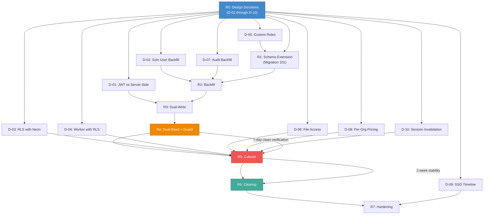

# Enterprise Multi-Tenant Authority — Phase 0 Implementation Roadmap

> **Status:** Read-only documentation. No code changes proposed or implemented.
> **Branch:** `dev` (commit `fedb27ac`)
> **Compliance posture:** SOC 2 readiness in progress — not certified. Security controls aligned with ISO 27001 principles.
> **Scope:** This document provides the phased implementation roadmap for the proposed multi-tenant authority architecture. It defines milestones, dependencies, timelines, team composition, risk gates, and success criteria for each phase. It is a planning document only — no code, schema, or migration changes are to be created without explicit stakeholder approval. No migration (including Migration 101) shall be created without Raymond's approval.

---

## 0. Roadmap Overview

### 0.1 Purpose

**[PROPOSED]** This roadmap translates the architecture design (`ENTERPRISE-MULTI-TENANT-AUTHORITY-ARCHITECTURE.md`) and migration plan (`ENTERPRISE-MULTI-TENANT-MIGRATION-PLAN.md`) into an actionable, phased implementation schedule. Each phase has defined entry conditions, deliverables, exit criteria, and risk gates. The roadmap is designed to be executed sequentially, with each phase building on the previous one.

### 0.2 Guiding Constraints

**[PROPOSED]** The following constraints govern the implementation:

1. **No downtime** — The application remains available throughout the migration. All changes are additive or dual-write/dual-read.
2. **No data loss** — Existing data is preserved. Backfill scripts are reversible. Validation checks run before and after each phase.
3. **No production code without approval** — Every phase requires stakeholder sign-off before execution. Migration scripts require Raymond's explicit approval.
4. **MFA Phase 3 is closed** — MFA artifacts, evidence, and tests are not modified. The multi-tenant authority work is orthogonal to MFA.
5. **Dev branch only** — All work is on `dev`. No `master` branch operations.
6. **Feature-flagged** — All new behavior is behind feature flags. Rollback is possible at any phase.

### 0.3 Roadmap Phases

**[PROPOSED]** The implementation is organized into 8 phases, mapped to the 6 migration phases plus pre-implementation and post-implementation phases:

| Phase | Name | Duration | Migration Phase | Key Deliverable |
|-------|------|----------|-----------------|-----------------|
| R0 | Design Decisions & Stakeholder Alignment | 1-2 weeks | — | 10 open decisions resolved |
| R1 | Schema Extension | 1-2 days | Migration Phase 1 | Migration 101 schema (additive) |
| R2 | Backfill | 3-5 days | Migration Phase 2 | org_id populated on all resources |
| R3 | Dual-Write | 3-5 days | Migration Phase 3 | All new writes include org_id |
| R4 | Dual-Read with Verification | 5-10 days | Migration Phase 4 | Authorization guard + verification |
| R5 | Cutover | 3-5 days | Migration Phase 5 | RLS, storage, JWT, full enforcement |
| R6 | Cleanup | 2-3 days + 2-week stability | Migration Phase 6 | Legacy columns removed |
| R7 | Post-Implementation Hardening | Ongoing | — | SSO, per-org pricing, monitoring |

---

## 1. Roadmap Visualization

```mermaid
gantt
    title Enterprise Multi-Tenant Authority Implementation Roadmap
    dateFormat YYYY-MM-DD
    axisFormat %b %d

    section Pre-Implementation
    R0: Design Decisions & Alignment      :r0, 2025-01-06, 14d

    section Schema & Backfill
    R1: Schema Extension (Migration 101)   :r1, after r0, 2d
    R2: Backfill org_id on all resources   :r2, after r1, 5d

    section Dual-Write & Dual-Read
    R3: Dual-Write (new writes set org_id) :r3, after r2, 5d
    R4: Dual-Read + Authorization Guard    :r4, after r3, 10d
    R4a: Verification & Discrepancy Fix    :r4a, after r4, 5d

    section Cutover & Enforcement
    R5: Cutover (RLS + Storage + JWT)      :r5, after r4a, 5d
    R6: Cleanup (remove legacy)            :r6, after r5, 3d
    R6a: Stability Period (2 weeks)        :r6a, after r6, 14d

    section Post-Implementation
    R7: Hardening (SSO, Pricing, Monitor)  :r7, after r6a, 30d
```

---

## 2. Phase R0: Design Decisions and Stakeholder Alignment

### 2.1 Objective

**[PROPOSED]** Resolve all 10 open design decisions (D-01 through D-10) from the architecture document. No implementation begins until every decision has a documented resolution approved by stakeholders.

### 2.2 Open Design Decisions to Resolve

| ID | Decision | Required Input From | Impact if Unresolved |
|----|----------|---------------------|----------------------|
| D-01 | Active org in JWT vs. server-side resolution | Auth pipeline owner, performance team | Blocks R3 (dual-write) — auth token format must be decided before writes |
| D-02 | Backfill strategy for solo users | Product, Raymond | Blocks R2 (backfill) — cannot backfill without a strategy |
| D-03 | RLS with Neon serverless pooling | Database/infra team, Neon support | Blocks R5 (cutover) — RLS approach must be validated |
| D-04 | Background worker with RLS | Worker team, infra | Blocks R5 (cutover) — worker must handle RLS |
| D-05 | Custom org roles in initial release | Product, design | Blocks R1 (schema) — roles table design depends on this |
| D-06 | File access: signed URLs vs. auth-gated | Infra, security | Blocks R5 (cutover) — storage access pattern |
| D-07 | Historical audit log backfill | Compliance, Raymond | Blocks R2 (backfill) — audit backfill strategy |
| D-08 | Per-org pricing in initial release | Product, billing | Blocks R5 (cutover) — billing model |
| D-09 | SSO/SAML/OIDC support timeline | Product, enterprise sales | Blocks R7 (hardening) — SSO is post-implementation |
| D-10 | Session invalidation on org removal | Security, auth pipeline | Blocks R5 (cutover) — session model |

### 2.3 Deliverables

1. Design decision document with resolved options for all 10 decisions.
2. Updated architecture document reflecting resolved decisions.
3. Updated migration plan with confirmed schema and backfill strategy.
4. Stakeholder sign-off (Raymond, product, engineering, security).

### 2.4 Entry Conditions

- All 7 Phase 0 documents reviewed and approved by stakeholders.
- Threat model accepted as the security baseline.
- Authorization test matrix accepted as the acceptance criteria.

### 2.5 Exit Criteria

- All 10 design decisions have a documented, approved resolution.
- The architecture and migration plan documents are updated.
- Stakeholder sign-off is recorded.

### 2.6 Risk Gate

**[PROPOSED]** If any design decision cannot be resolved within 2 weeks, escalate to Raymond. Do not proceed to R1 with unresolved decisions that affect the schema (D-01, D-02, D-05, D-07). Decisions affecting only post-implementation phases (D-08, D-09) may be deferred.

---

## 3. Phase R1: Schema Extension

### 3.1 Objective

**[PROPOSED]** Create the additive schema changes that establish the multi-tenant data model. This phase creates Migration 101 (or the next approved migration number) with all new tables and columns. No existing data is modified.

### 3.2 Deliverables

1. Migration 101 SQL file (additive only — new tables, new nullable columns, new indexes).
2. Updated data inventory reflecting new schema.
3. Schema validation script (verify all new objects exist).
4. Feature flags defined: `MT_SCHEMA_EXT` (schema exists), `MT_DUAL_WRITE` (off by default), `MT_DUAL_READ` (off by default).

### 3.3 Schema Changes (from Migration Plan Phase 1)

- `organization_members` junction table (replaces single `users.org_id`).
- `org_roles` and `org_permissions` tables (if D-05 = custom roles) or system role definitions.
- `resource_shares` table for cross-tenant collaboration.
- `org_id` column (nullable) on all business resource tables (projects, clients, layouts, productions, equipment, proposals, etc.).
- `actor_organization_id` and `resource_owner_organization_id` columns on `audit_log`.
- `file_revisions` table.
- `org_id` column on job queue tables.

### 3.4 Entry Conditions

- R0 complete — all schema-affecting design decisions resolved.
- Stakeholder approval for the schema design.
- Raymond's explicit approval for creating Migration 101.

### 3.5 Exit Criteria

- Migration 101 applies cleanly to staging and production databases.
- All new tables and columns exist.
- Existing data is unchanged.
- Schema validation script passes.

### 3.6 Risk Gate

**[PROPOSED]** Verify that the migration is purely additive. Run `pg_dump --schema-only` before and after to confirm no existing objects are modified. If any existing object is altered, halt and review.

---

## 4. Phase R2: Backfill

### 4.1 Objective

**[PROPOSED]** Populate `org_id` on all existing business resources based on their owning user's organization membership. Handle the three ambiguity cases (user has org_id, user has company free-text, user has neither).

### 4.2 Deliverables

1. Backfill script that assigns `org_id` to all resources based on the owning user's org.
2. Ambiguity resolution report (how many users fall into each case).
3. Solo-org creation script (if D-02 = auto-create solo org).
4. Validation report (percentage of resources with `org_id`, discrepancy count).
5. Organization members backfill (populate `organization_members` junction table from `users.org_id`).

### 4.3 Ambiguity Handling (from Migration Plan Phase 2)

- **Case 1 (user has org_id):** Straightforward — set `resource.org_id = user.org_id`.
- **Case 2 (user has no org_id but has company free-text):** Match company text to existing org name or create a new org. Manual review for ambiguous matches.
- **Case 3 (user has no org_id and no company):** Apply D-02 resolution (auto-create solo org, leave NULL, or default org).

### 4.4 Entry Conditions

- R1 complete — schema extended with `org_id` columns.
- D-02 and D-07 resolved (backfill and audit log strategies).
- Backfill script tested on staging with a production data snapshot.

### 4.5 Exit Criteria

- 100% of resources owned by users with `org_id` have `resource.org_id` populated.
- Ambiguity cases are resolved per D-02.
- `organization_members` junction table is populated for all users with `org_id`.
- Validation report shows zero discrepancies.
- Audit log entries from this point forward include org context (dual-write for audit starts here).

### 4.6 Risk Gate

**[PROPOSED]** Run the validation report. If any resource has an `org_id` that does not match its owning user's org, halt and investigate. The backfill must be idempotent (re-running produces the same result). The backfill script must be reversible (can set all `org_id` back to NULL if needed).

---

## 5. Phase R3: Dual-Write

### 5.1 Objective

**[PROPOSED]** Modify all resource creation and update routes to write `org_id` alongside the existing `user_id`. The application writes both the old pattern (user_id only) and the new pattern (user_id + org_id). This is behind the `MT_DUAL_WRITE` feature flag.

### 5.2 Deliverables

1. Modified route handlers for all resource creation/update endpoints.
2. `resolveOrgContext()` helper function that resolves the caller's org from the session.
3. Audit log dual-write (every event includes org context).
4. Feature flag `MT_DUAL_WRITE` enabled in staging.

### 5.3 Application Changes (from Migration Plan Phase 3)

- Every `INSERT INTO projects` (and all resource tables) includes `org_id = resolveOrgContext(request)`.
- Every `UPDATE` on a resource preserves `org_id` (does not change it).
- Audit log entries include `actor_organization_id` and `resource_owner_organization_id`.
- The `resolveOrgContext()` function resolves the caller's org from the JWT (if D-01 = JWT) or from the user's membership (if D-01 = server-side).

### 5.4 Entry Conditions

- R2 complete — all existing resources have `org_id`.
- D-01 resolved (JWT vs. server-side org resolution).
- Modified routes tested in staging with `MT_DUAL_WRITE` on.

### 5.5 Exit Criteria

- All new resources created after this phase have `org_id` populated.
- Dual-write is verified: new resources have both `user_id` and `org_id`.
- Audit log entries have org context.
- No errors or data inconsistencies in staging.

### 5.6 Risk Gate

**[PROPOSED]** Monitor staging for 48 hours with `MT_DUAL_WRITE` on. Verify that no resource is created with `org_id = NULL` (unless the user has no org, per D-02). If any resource is created without `org_id`, identify the route that missed the dual-write and fix it before proceeding.

---

## 6. Phase R4: Dual-Read with Verification

### 6.1 Objective

**[PROPOSED]** Implement the centralized authorization guard and begin dual-reading (filtering by `org_id` in addition to `user_id`). Run verification to confirm that org-scoped queries return the same results as user-scoped queries. This is the most complex and highest-risk phase.

### 6.2 Deliverables

1. Centralized authorization guard (`lib/authz.ts` or equivalent).
2. Modified route handlers that use the guard for resource loading.
3. Verification job that compares org-scoped vs. user-scoped query results.
4. Discrepancy report and resolution log.
5. Authorization test matrix (from `ENTERPRISE-MULTI-TENANT-AUTHORIZATION-TEST-MATRIX.md`) implemented as automated tests.
6. Feature flag `MT_DUAL_READ` enabled in staging (shadow mode — results compared but not enforced).

### 6.3 Application Changes (from Migration Plan Phase 4)

- The guard resolves the caller's org, loads the resource, checks `resource.org_id === caller.org_id`, and allows or denies.
- Admin routes are scoped to the admin's org (customer admin) or all orgs (platform super_admin).
- The verification job runs in shadow mode: for each query, it runs both the old (user_id) and new (org_id) filters and compares results.
- Discrepancies are logged and investigated.

### 6.4 Entry Conditions

- R3 complete — dual-write is active and verified.
- Authorization guard implemented and unit-tested.
- Verification job implemented.
- Test matrix tests implemented.

### 6.5 Exit Criteria

- Verification job reports zero discrepancies between org-scoped and user-scoped queries for 7 consecutive days.
- All test matrix tests pass in staging.
- Admin route scoping is verified (customer admin sees only own org, platform super_admin sees all).
- The guard is applied to all resource-loading routes.

### 6.6 Risk Gate

**[PROPOSED]** This is the highest-risk phase. The verification job must run for at least 7 days with zero discrepancies. If discrepancies are found, investigate and fix before proceeding. Do not proceed to R5 (cutover) until the verification is clean. If discrepancies persist, consider extending the dual-read period or adjusting the backfill.

---

## 7. Phase R5: Cutover

### 7.1 Objective

**[PROPOSED]** Switch from dual-mode to full org-scoped enforcement. Enable RLS as defense-in-depth. Migrate storage to org-prefixed paths. Extend JWT with org context (if D-01 = JWT). Enable session invalidation on org removal (D-10).

### 7.2 Deliverables

1. RLS policies on all tenant-scoped tables (if D-03 = RLS).
2. Storage migration to org-prefixed paths (if D-06 requires path changes).
3. JWT payload extended with org context (if D-01 = JWT).
4. Session invalidation mechanism (per D-10).
5. Feature flags `MT_DUAL_WRITE` and `MT_DUAL_READ` removed — org-scoped is the only mode.
6. Production deployment with full enforcement.

### 7.3 Changes (from Migration Plan Phase 5)

- **RLS:** Create policies on all tenant-scoped tables. Configure connection pooling to set `app.current_org_id` per request. Test with the worker (D-04).
- **Storage:** Migrate existing files to org-prefixed paths. Update upload routes. Implement signed URLs or auth-gated endpoints (D-06).
- **JWT:** If D-01 = JWT, add `org_id` to the JWT payload. Token refresh on org switch. If D-01 = server-side, no JWT change.
- **Session:** Implement D-10 resolution (revocation list, short TTL, or server-side check).
- **Enforcement:** Remove feature flags. Org-scoped queries are the only mode. The guard denies cross-tenant access.

### 7.4 Entry Conditions

- R4 complete — verification is clean for 7 days.
- RLS tested in staging (D-03 resolved).
- Storage migration tested in staging.
- JWT extension tested (if applicable).
- Session invalidation tested (D-10).
- All test matrix tests pass.
- Stakeholder approval for cutover.
- Rollback plan verified.

### 7.5 Exit Criteria

- RLS is active in production.
- Storage paths are org-prefixed.
- JWT carries org context (if applicable).
- Session invalidation works on org removal.
- All test matrix tests pass in production.
- No cross-tenant data access is possible (verified by adversarial tests).
- Audit log entries have org context for all events.

### 7.6 Risk Gate

**[PROPOSED]** This is the point of no return for dual-mode. Before cutover, verify:
1. A complete database backup is taken.
2. The rollback plan is tested (can disable RLS, revert storage paths, revert JWT).
3. A canary deployment (10% of traffic) is monitored for 24 hours.
4. If any canary issues arise, halt and fix before full rollout.
5. Full rollout is gradual (10% → 50% → 100%) with monitoring at each step.

---

## 8. Phase R6: Cleanup

### 8.1 Objective

**[PROPOSED]** Remove legacy columns, dual-write code, and feature flags that are no longer needed. This is the final cleanup after a stability period confirms the new system is functioning correctly.

### 8.2 Deliverables

1. Legacy column removal migration (drop `users.org_id` single-column if replaced by junction table, drop dual-write code paths).
2. Feature flag removal.
3. Updated documentation reflecting the final state.
4. Post-cleanup validation (all tests pass, no references to legacy patterns).

### 8.3 Changes (from Migration Plan Phase 6)

- Remove `users.company` free-text column if fully replaced by org membership (after confirming no code references it).
- Remove dual-write code paths (only org-scoped writes remain).
- Remove feature flags (`MT_SCHEMA_EXT`, `MT_DUAL_WRITE`, `MT_DUAL_READ`).
- Remove shadow verification job (no longer needed).
- Update all documentation to reflect the final architecture.

### 8.4 Entry Conditions

- R5 complete — full enforcement is active.
- 2-week stability period with zero incidents.
- No discrepancies or errors reported.
- Stakeholder approval for cleanup.

### 8.5 Exit Criteria

- Legacy columns and code removed.
- All tests pass.
- Documentation updated.
- The system is fully multi-tenant with no legacy patterns.

### 8.6 Risk Gate

**[PROPOSED]** The 2-week stability period is mandatory. Do not shorten it. If any incidents occur during the stability period, extend it. The cleanup migration is destructive (drops columns) — ensure a backup exists and the rollback plan covers it. Note: rollback after cleanup is more difficult (data in dropped columns is lost). Verify no code references the dropped columns before executing.

---

## 9. Phase R7: Post-Implementation Hardening

### 9.1 Objective

**[PROPOSED]** Implement features deferred from the initial multi-tenant rollout: SSO/SAML/OIDC, per-org pricing, enhanced monitoring, and compliance reporting. These are not blocking the core multi-tenant authority but are important for enterprise adoption.

### 9.2 Deliverables

1. SSO/SAML integration (if D-09 = include) — corporate IdP integration, SAML assertion processing, org mapping.
2. Per-org pricing (if D-08 = per-org overrides) — custom pricing per org, managed by platform super_admin.
3. Enhanced monitoring — cross-tenant access attempt alerts, audit log anomaly detection, org-level usage dashboards.
4. Compliance reporting — per-org audit log export, SOC 2 evidence collection, ISO 27001 control mapping.
5. Advanced collaboration — multi-resource share grants, share grant templates, collaboration workspaces.

### 9.3 Entry Conditions

- R6 complete — the system is fully multi-tenant and stable.
- D-08 and D-09 resolved.
- Enterprise customer demand for SSO and custom pricing.

### 9.4 Exit Criteria

- SSO is available for enterprise customers (if applicable).
- Per-org pricing is configurable (if applicable).
- Monitoring and compliance reporting are operational.

### 9.5 Risk Gate

**[PROPOSED]** SSO integration is a significant feature with its own security implications. Ensure the SSO login flow is thoroughly tested, including org mapping, user provisioning, and session management. Per-org pricing changes the billing model — test thoroughly with Stripe test mode before production.

---

## 10. Team Composition and Responsibilities

**[PROPOSED]** The implementation requires a cross-functional team. The following roles are recommended:

| Role | Responsibility | Phases |
|------|---------------|--------|
| **Tech Lead** | Overall architecture, code review, risk gates | All |
| **Backend Engineer 1** | Authorization guard, route modifications, dual-write/dual-read | R3, R4, R5 |
| **Backend Engineer 2** | Backfill scripts, migration scripts, verification job | R1, R2, R4 |
| **Database/Infra Engineer** | RLS policies, Neon pooling, storage migration, worker changes | R1, R5 |
| **Frontend Engineer** | Org switcher UI, permission-based UI gating, share grant UI | R4, R5 |
| **Security Engineer** | Threat model validation, adversarial test execution, audit review | R4, R5, R7 |
| **QA Engineer** | Test matrix implementation, staging validation, regression testing | R2, R4, R5, R6 |
| **Product Manager** | Design decisions, stakeholder alignment, feature prioritization | R0, R7 |
| **DevOps** | Feature flag management, deployment, monitoring, rollback | R3, R5, R6 |

### 10.1 Effort Estimate

**[PROPOSED]** The total implementation effort is estimated at 17-30 working days for the core phases (R1-R6), plus the R0 design phase (1-2 weeks) and the R7 hardening phase (ongoing). With a team of 4-5 engineers, the core phases can be completed in 4-6 weeks of calendar time, assuming no blocking issues.

| Phase | Engineer-Days | Calendar Duration |
|-------|---------------|-------------------|
| R0 | 10 (cross-functional) | 1-2 weeks |
| R1 | 4 | 1-2 days |
| R2 | 10 | 3-5 days |
| R3 | 15 | 3-5 days |
| R4 | 30 | 5-10 days + 7-day verification |
| R5 | 15 | 3-5 days |
| R6 | 6 + 14-day stability | 2-3 days + 2 weeks |
| R7 | Ongoing | 2-4 weeks (initial) |

---

## 11. Dependency Map

**[PROPOSED]** The following diagram shows the dependencies between phases, design decisions, and deliverables:



---

## 12. Milestones and Success Criteria

**[PROPOSED]** Each phase has a milestone with measurable success criteria:

| Milestone | Phase | Success Criteria | Measurement |
|-----------|-------|-----------------|-------------|
| M0: Design Approved | R0 | All 10 design decisions resolved and signed off | Decision document count = 10 |
| M1: Schema Extended | R1 | Migration 101 applied, all new objects exist | Schema validation script passes |
| M2: Backfill Complete | R2 | 100% of resources have org_id | Validation report: 0 missing org_id |
| M3: Dual-Write Active | R3 | All new writes include org_id | Staging monitoring: 0 NULL org_id on new resources |
| M4: Guard Verified | R4 | 7 days zero discrepancies, all tests pass | Verification job + test matrix |
| M5: Full Enforcement | R5 | RLS active, storage migrated, cross-tenant denied | Adversarial test suite passes in production |
| M6: Legacy Removed | R6 | No legacy columns/code, 2 weeks stable | Code grep: 0 legacy references |
| M7: Enterprise Ready | R7 | SSO available, per-org pricing, compliance reporting | Enterprise feature acceptance tests |

---

## 13. Risk Register

**[PROPOSED]** The following risks are tracked throughout the implementation:

| Risk ID | Risk | Phase | Likelihood | Impact | Mitigation |
|---------|------|-------|-----------|--------|------------|
| RR-01 | Backfill assigns wrong org_id to resources | R2 | MEDIUM | HIGH | Validation report, idempotent script, reversible |
| RR-02 | Dual-read discrepancies indicate data inconsistency | R4 | MEDIUM | HIGH | 7-day verification, fix before cutover |
| RR-03 | RLS breaks with Neon connection pooling | R5 | MEDIUM | HIGH | Test in staging, D-03 validation, fallback to app-only |
| RR-04 | Storage migration loses files | R5 | LOW | CRITICAL | Copy not move, verify integrity, keep old URLs |
| RR-05 | JWT org context causes session issues | R5 | LOW | MEDIUM | Token refresh mechanism, test thoroughly |
| RR-06 | Worker writes to wrong org after RLS | R5 | MEDIUM | HIGH | D-04 validation, per-job org context, worker tests |
| RR-07 | Performance degradation from org_id filtering | R4, R5 | MEDIUM | MEDIUM | Index on org_id, query performance testing |
| RR-08 | Feature flag misconfiguration | R3-R5 | LOW | HIGH | Flag audit, staging verification, gradual rollout |
| RR-09 | Rollback failure after cutover | R5 | LOW | CRITICAL | Tested rollback plan, database backup, canary deployment |
| RR-10 | Design decision delay blocks implementation | R0 | MEDIUM | MEDIUM | 2-week deadline, escalation to Raymond |
| RR-11 | Test matrix gaps miss a vulnerability | R4, R5 | LOW | HIGH | Exhaustive route sweep, external security review |
| RR-12 | Audit log hash chain breaks during migration | R2 | LOW | HIGH | Hash chain verification, dual-write audit entries |

---

## 14. Monitoring and Observability

**[PROPOSED]** The following monitoring is recommended during and after implementation:

### 14.1 During Migration (R2-R5)

- **Discrepancy rate:** The verification job reports the percentage of queries where org-scoped and user-scoped results differ. Target: 0%.
- **NULL org_id rate:** Monitor for resources created with `org_id = NULL`. Target: 0% (except solo users per D-02).
- **Feature flag audit:** Log every feature flag change with actor and timestamp.
- **Backfill progress:** Track the number of resources backfilled per hour.

### 14.2 Post-Cutover (R5-R7)

- **Cross-tenant access attempts:** Alert on any 403 with `reason = 'cross_tenant'`. These may indicate reconnaissance or bugs.
- **Audit log completeness:** Verify every event has `actor_organization_id`. Alert on missing fields.
- **RLS policy violations:** Monitor for queries that bypass RLS (if bypass role is used, audit-log every instance).
- **Storage access:** Monitor file download patterns for anomalous cross-org access.
- **Session invalidation:** Monitor for sessions invalidated due to org removal.
- **Permission denials:** Track 403 rates per endpoint and per org to identify potential misconfigurations.

---

## 15. Compliance Alignment

**[PROPOSED]** The implementation supports the following compliance objectives:

### 15.1 SOC 2 Readiness

| SOC 2 Control | How Addressed | Phase |
|---------------|--------------|-------|
| CC6.1 (Logical access) | Org-scoped access, centralized guard, permission-first roles | R4, R5 |
| CC6.2 (Authentication) | JWT with org context, session invalidation, MFA retained | R5 |
| CC6.3 (Authorization) | Default-deny, permission matrix, share grants | R4, R5 |
| CC7.1 (System monitoring) | Cross-tenant access alerts, audit log monitoring | R5, R7 |
| CC7.2 (Anomaly detection) | Audit log anomaly detection, discrepancy monitoring | R4, R7 |
| CC8.1 (Change management) | Feature flags, phased migration, rollback plans | All |

**Note:** SOC 2 readiness in progress — not certified. The multi-tenant architecture supports SOC 2 controls but certification requires a formal audit.

### 15.2 ISO 27001 Alignment

| ISO 27001 Control | How Addressed | Phase |
|-------------------|--------------|-------|
| A.9.1 (Access control policy) | Default-deny, permission-first model | R4, R5 |
| A.9.2 (User access management) | Org membership lifecycle, audit-logged changes | R4, R5 |
| A.9.3 (User responsibilities) | Role-based permissions, no shared credentials | R4 |
| A.9.4 (System and application access control) | Centralized guard, RLS, scoped admin | R4, R5 |
| A.12.4 (Logging and monitoring) | Tenant-aware audit log, hash chain, per-org export | R2, R5, R7 |
| A.12.6 (Technical vulnerability management) | Threat model, adversarial tests, security review | R4, R5 |

**Note:** Security controls aligned with ISO 27001 principles. Formal ISO 27001 certification is a separate initiative.

---

## 16. Communication Plan

**[PROPOSED]** The following communication cadence is recommended:

| Audience | Communication | Frequency |
|----------|--------------|-----------|
| Raymond (stakeholder) | Phase status, risk gate results, decision requests | Per phase |
| Engineering team | Daily standup, design decision discussions | Daily |
| Product | Design decision input, feature prioritization | Per decision |
| Security | Threat model updates, adversarial test results | Per phase |
| All stakeholders | Phase completion report, migration status | Per phase |
| Customers (if needed) | Org migration notice, new feature announcement | Before R5 (cutover) |

---

## 17. Rollback Strategy Summary

**[PROPOSED]** Each phase has a defined rollback strategy (detailed in the Migration Plan):

| Phase | Rollback | Difficulty |
|-------|----------|-----------|
| R0 | N/A (documentation only) | N/A |
| R1 | Drop new tables/columns (additive, safe) | Easy |
| R2 | Set org_id back to NULL (idempotent) | Easy |
| R3 | Disable MT_DUAL_WRITE flag (reverts to user_id-only writes) | Easy |
| R4 | Disable MT_DUAL_READ flag (reverts to user_id-only reads) | Easy |
| R5 | Disable RLS, revert storage paths, revert JWT — requires testing | Difficult |
| R6 | Cannot rollback (columns dropped) — requires backup restore | Very difficult |
| R7 | Disable new features (SSO, pricing) | Easy |

**Critical note:** R5 (cutover) is the point of maximum risk. The rollback must be tested before cutover. R6 (cleanup) is irreversible without a backup restore. Ensure a verified backup exists before R6.

---

## 18. Success Definition

**[PROPOSED]** The implementation is considered successful when:

1. **Tenant isolation is enforced:** No cross-tenant data access is possible, verified by the full test matrix (121 tests).
2. **Authorization is centralized:** Every resource access goes through the authorization guard. No route bypasses it.
3. **Audit logging is tenant-aware:** Every event includes `actor_organization_id` and `resource_owner_organization_id`. Per-org audit queries work.
4. **Database isolation is defense-in-depth:** RLS policies are active on all tenant-scoped tables. A missed filter does not leak cross-tenant data.
5. **Storage is org-scoped:** File paths include org prefixes. Access is controlled (signed URLs or auth-gated).
6. **Admin access is scoped:** Customer admins see only their org's data. Platform super_admin retains global access with audit logging.
7. **Collaboration is explicit:** Cross-tenant sharing requires explicit share grants with permissions, expiry, and revocation.
8. **Billing is per-org:** The org pays, members inherit. Seat management is org-level.
9. **No legacy patterns remain:** The cleanup phase has removed all dual-write/dual-read code and legacy columns.
10. **Compliance objectives are supported:** Per-org audit exports, SOC 2 readiness, and ISO 27001 alignment are documented and verifiable.

---

## 19. Open Items Requiring Stakeholder Input

**[OPEN-DECISION]** The following items require stakeholder input before or during implementation:

1. **Raymond's approval** for creating Migration 101 (and any subsequent migration).
2. **Resolution of all 10 design decisions** (D-01 through D-10) before R1.
3. **Customer communication plan** — whether and when to notify customers about the org migration.
4. **External security review** — whether to engage a third-party security firm to review the implementation before cutover.
5. **Compliance audit timeline** — when to pursue formal SOC 2 certification after the multi-tenant architecture is live.
6. **SSO priority** — which enterprise customers need SSO first and their IdP details (D-09).
7. **Per-org pricing model** — the business rules for custom pricing (D-08).

---

*End of Implementation Roadmap document. This document is read-only and proposes no code changes. No migration (including Migration 101) shall be created without Raymond's explicit approval. The roadmap is a planning document — actual timelines and team composition should be confirmed with stakeholders before execution.*
