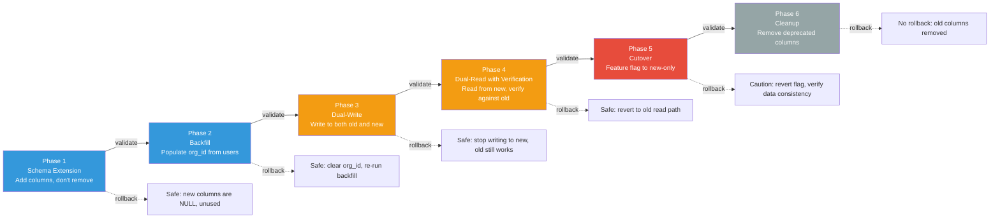

# Enterprise Multi-Tenant Authority — Phase 0 Migration Plan

> **Document type:** Migration strategy and plan (read-only, no implementation)
> **Branch:** `dev` (commit `fedb27ac`)
> **Status:** SOC 2 readiness in progress — not certified. Security controls aligned with ISO 27001 principles.
> **Scope:** Migration strategy for transitioning from the current per-user authority model to the proposed org-based multi-tenant model
> **Date:** 2025
> **Important:** This plan does NOT create any migrations or modify any code. It is a design document only. No migration (including Migration 101) shall be created without Raymond's explicit approval.

---

## 0. Migration Philosophy

The migration from the current per-user authority model to the proposed org-based multi-tenant model must satisfy these constraints:

1. **Zero data loss** — no existing data may be lost or corrupted during migration.
2. **Zero downtime** — the application must remain available throughout the migration. This requires a phased approach with dual-read/dual-write periods.
3. **Reversible** — each phase must be independently reversible. If a phase fails, the system can roll back to the previous state without data loss.
4. **Auditable** — each migration step is logged and verifiable. Backfill results are validated before proceeding.
5. **Non-destructive** — existing columns are not removed until all code paths use the new columns. Old columns are deprecated, not deleted.

The migration is organized into six phases, each with a clear entry condition, execution steps, validation criteria, and rollback procedure. Feature flags control the transition between old and new behavior, allowing gradual rollout and instant rollback.

---

## 1. Migration Phases Overview



---

## 2. Phase 1: Schema Extension

### 2.1 Objective

Add new columns and tables required for the multi-tenant model without removing or modifying any existing columns. All new columns are nullable and default to NULL, ensuring the application continues to work unchanged.

### 2.2 Schema Changes

**[PROPOSED]** The following schema changes are additive only — no existing column is modified or removed:

#### 2.2.1 Organizations Table Extensions

```sql
-- Add status, slug, billing_email, deleted_at to organizations
ALTER TABLE organizations ADD COLUMN IF NOT EXISTS slug TEXT;
ALTER TABLE organizations ADD COLUMN IF NOT EXISTS status TEXT NOT NULL DEFAULT 'active';
ALTER TABLE organizations ADD COLUMN IF NOT EXISTS billing_email TEXT;
ALTER TABLE organizations ADD COLUMN IF NOT EXISTS deleted_at TIMESTAMPTZ;
CREATE UNIQUE INDEX IF NOT EXISTS idx_organizations_slug ON organizations(slug) WHERE slug IS NOT NULL;
```

#### 2.2.2 Organization Members Junction Table

```sql
CREATE TABLE IF NOT EXISTS organization_members (
  id              UUID PRIMARY KEY DEFAULT gen_random_uuid(),
  org_id          UUID NOT NULL REFERENCES organizations(id) ON DELETE CASCADE,
  user_id         UUID NOT NULL REFERENCES users(id) ON DELETE CASCADE,
  role_id         UUID,  -- references org_roles, nullable during transition
  status          TEXT NOT NULL DEFAULT 'active',
  joined_at       TIMESTAMPTZ NOT NULL DEFAULT now(),
  removed_at      TIMESTAMPTZ,
  removed_by      UUID REFERENCES users(id),
  created_at      TIMESTAMPTZ NOT NULL DEFAULT now(),
  UNIQUE(org_id, user_id)
);
CREATE INDEX IF NOT EXISTS idx_org_members_org ON organization_members(org_id);
CREATE INDEX IF NOT EXISTS idx_org_members_user ON organization_members(user_id);
```

#### 2.2.3 Org Roles and Permissions Tables

```sql
CREATE TABLE IF NOT EXISTS org_roles (
  id              UUID PRIMARY KEY DEFAULT gen_random_uuid(),
  org_id          UUID REFERENCES organizations(id) ON DELETE CASCADE,
  name            TEXT NOT NULL,
  description     TEXT,
  is_system       BOOLEAN NOT NULL DEFAULT FALSE,
  created_at      TIMESTAMPTZ NOT NULL DEFAULT now()
);

CREATE TABLE IF NOT EXISTS org_role_permissions (
  role_id         UUID NOT NULL REFERENCES org_roles(id) ON DELETE CASCADE,
  permission      TEXT NOT NULL,
  PRIMARY KEY(role_id, permission)
);
```

#### 2.2.4 Resource Shares Table

```sql
CREATE TABLE IF NOT EXISTS resource_shares (
  id              UUID PRIMARY KEY DEFAULT gen_random_uuid(),
  resource_type   TEXT NOT NULL,
  resource_id     UUID NOT NULL,
  source_org_id   UUID NOT NULL REFERENCES organizations(id) ON DELETE CASCADE,
  target_org_id   UUID NOT NULL REFERENCES organizations(id) ON DELETE CASCADE,
  permissions     TEXT[] NOT NULL,
  granted_by      UUID NOT NULL REFERENCES users(id),
  expires_at      TIMESTAMPTZ,
  revoked_at      TIMESTAMPTZ,
  revoked_by      UUID REFERENCES users(id),
  created_at      TIMESTAMPTZ NOT NULL DEFAULT now()
);
CREATE INDEX IF NOT EXISTS idx_resource_shares_target ON resource_shares(target_org_id, resource_type, resource_id);
```

#### 2.2.5 org_id on Business Resource Tables

```sql
-- Add org_id to all business resource tables (nullable, no NOT NULL yet)
ALTER TABLE projects ADD COLUMN IF NOT EXISTS org_id UUID REFERENCES organizations(id);
ALTER TABLE clients ADD COLUMN IF NOT EXISTS org_id UUID REFERENCES organizations(id);
ALTER TABLE layouts ADD COLUMN IF NOT EXISTS org_id UUID REFERENCES organizations(id);
ALTER TABLE productions ADD COLUMN IF NOT EXISTS org_id UUID REFERENCES organizations(id);
ALTER TABLE user_equipment_panels ADD COLUMN IF NOT EXISTS org_id UUID REFERENCES organizations(id);
ALTER TABLE user_equipment_inverters ADD COLUMN IF NOT EXISTS org_id UUID REFERENCES organizations(id);
ALTER TABLE user_equipment_batteries ADD COLUMN IF NOT EXISTS org_id UUID REFERENCES organizations(id);
ALTER TABLE user_equipment_mounting ADD COLUMN IF NOT EXISTS org_id UUID REFERENCES organizations(id);
ALTER TABLE site_aliases ADD COLUMN IF NOT EXISTS org_id UUID REFERENCES organizations(id);
ALTER TABLE proposal_signatures ADD COLUMN IF NOT EXISTS org_id UUID REFERENCES organizations(id);
ALTER TABLE client_notes ADD COLUMN IF NOT EXISTS org_id UUID REFERENCES organizations(id);
ALTER TABLE crew_members ADD COLUMN IF NOT EXISTS org_id UUID REFERENCES organizations(id);
ALTER TABLE contractor_profiles ADD COLUMN IF NOT EXISTS org_id UUID REFERENCES organizations(id);
ALTER TABLE project_micro_stages ADD COLUMN IF NOT EXISTS org_id UUID REFERENCES organizations(id);
ALTER TABLE project_versions ADD COLUMN IF NOT EXISTS org_id UUID REFERENCES organizations(id);
ALTER TABLE eagleview_orders ADD COLUMN IF NOT EXISTS org_id UUID REFERENCES organizations(id);
ALTER TABLE solardog_conversations ADD COLUMN IF NOT EXISTS org_id UUID REFERENCES organizations(id);
-- ... and all other business resource tables

-- Add indexes for org_id filtering
CREATE INDEX IF NOT EXISTS idx_projects_org_id ON projects(org_id) WHERE org_id IS NOT NULL;
CREATE INDEX IF NOT EXISTS idx_clients_org_id ON clients(org_id) WHERE org_id IS NOT NULL;
-- ... for all tables
```

#### 2.2.6 Audit Log Extensions

```sql
ALTER TABLE audit_log ADD COLUMN IF NOT EXISTS actor_organization_id UUID;
ALTER TABLE audit_log ADD COLUMN IF NOT EXISTS resource_owner_organization_id UUID;
CREATE INDEX IF NOT EXISTS idx_audit_log_actor_org ON audit_log(actor_organization_id);
CREATE INDEX IF NOT EXISTS idx_audit_log_resource_org ON audit_log(resource_owner_organization_id);
```

#### 2.2.7 File Revisions Table

```sql
CREATE TABLE IF NOT EXISTS file_revisions (
  id              UUID PRIMARY KEY DEFAULT gen_random_uuid(),
  org_id          UUID NOT NULL REFERENCES organizations(id) ON DELETE CASCADE,
  resource_type   TEXT NOT NULL,
  resource_id     UUID NOT NULL,
  file_path       TEXT NOT NULL,
  version         INTEGER NOT NULL,
  uploaded_by     UUID REFERENCES users(id),
  created_at      TIMESTAMPTZ NOT NULL DEFAULT now(),
  UNIQUE(resource_type, resource_id, version)
);
```

### 2.3 Entry Condition

- All stakeholders have approved the schema design.
- A maintenance window is scheduled (though no downtime is required — all changes are additive).

### 2.4 Validation

- All new columns are NULL by default.
- All existing queries continue to work unchanged (no column removed or renamed).
- Application starts and serves requests normally after migration.
- `SELECT count(*) FROM projects WHERE org_id IS NULL` returns the total project count (all rows have NULL org_id initially).

### 2.5 Rollback

**Safe rollback:** Drop the new columns and tables. No data loss because all new columns are NULL and no application code uses them yet.

---

## 3. Phase 2: Backfill

### 3.1 Objective

Populate `org_id` on all existing business resources by joining to the creating user's `org_id`. Also populate the `organization_members` junction table from the existing `users.org_id` / `users.org_role` data.

### 3.2 Ambiguity Handling

**[OPEN-DECISION]** The backfill must handle these ambiguous cases:

#### Case 1: User has org_id — straightforward

For users with a non-NULL `org_id`, backfill is straightforward:

```sql
UPDATE projects SET org_id = u.org_id
FROM users u WHERE projects.user_id = u.id AND u.org_id IS NOT NULL AND projects.org_id IS NULL;
```

#### Case 2: User has no org_id but has a company free-text

For users with `org_id IS NULL` but `company IS NOT NULL`, the migration must decide whether to create a solo organization. **[PROPOSED]** The recommended approach is to create a solo organization for each such user, with the user as owner:

```sql
-- Create solo orgs for users without org_id but with a company name
INSERT INTO organizations (name, owner_id, plan, slug)
SELECT DISTINCT ON (u.id)
  COALESCE(u.company, u.name || ' (Solo)'),
  u.id,
  COALESCE(u.plan, 'contractor'),
  slugify(COALESCE(u.company, u.name || '-solo'))
FROM users u
WHERE u.org_id IS NULL AND u.company IS NOT NULL
ON CONFLICT DO NOTHING;

-- Set org_id on these users
UPDATE users u SET org_id = o.id
FROM organizations o
WHERE o.owner_id = u.id AND u.org_id IS NULL;
```

#### Case 3: User has no org_id and no company

For users with both `org_id IS NULL` and `company IS NULL`, create a solo org with a generated name:

```sql
INSERT INTO organizations (name, owner_id, plan, slug)
SELECT u.name || ' (Personal)', u.id, COALESCE(u.plan, 'contractor'), slugify(u.name || '-personal')
FROM users u
WHERE u.org_id IS NULL AND (u.company IS NULL OR u.company = '')
ON CONFLICT DO NOTHING;
```

**[OPEN-DECISION]** Should solo users be forced into organizations, or should the system support "orgless" users? The proposed architecture assumes all users belong to an org. Forcing solo orgs is simpler but may surprise users who currently operate without an org.

### 3.3 Organization Members Backfill

```sql
-- Populate organization_members from existing users.org_id / users.org_role
INSERT INTO organization_members (org_id, user_id, status, joined_at)
SELECT org_id, id, 'active', created_at
FROM users
WHERE org_id IS NOT NULL
ON CONFLICT (org_id, user_id) DO NOTHING;
```

### 3.4 Role Backfill

**[PROPOSED]** Create system roles for each organization and assign existing members:

```sql
-- Create system roles for each org (owner, admin, member, viewer)
-- For each org, create 4 system roles with appropriate permissions
-- Then assign roles to organization_members based on users.org_role:
--   org_role = 'owner' → owner role
--   org_role = 'member' → member role
```

### 3.5 Backfill Validation

**[PROPOSED]** After backfill, validate:

1. **Coverage check** — every business resource has a non-NULL `org_id`:
   ```sql
   SELECT 'projects' as t, count(*) FROM projects WHERE org_id IS NULL
   UNION ALL
   SELECT 'clients', count(*) FROM clients WHERE org_id IS NULL
   -- ... for all tables
   ```
   Expected: all counts are 0 (or only for explicitly exempted tables).

2. **Consistency check** — the resource's `org_id` matches the creating user's `org_id`:
   ```sql
   SELECT count(*) FROM projects p JOIN users u ON p.user_id = u.id
   WHERE p.org_id != u.org_id;
   ```
   Expected: 0 (or only for cases where the user's org changed after resource creation).

3. **Membership check** — every user with `org_id` has a corresponding `organization_members` row:
   ```sql
   SELECT count(*) FROM users u
   WHERE u.org_id IS NOT NULL AND NOT EXISTS (
     SELECT 1 FROM organization_members m WHERE m.user_id = u.id AND m.org_id = u.org_id
   );
   ```
   Expected: 0.

4. **Org count check** — the number of organizations matches expectations (existing orgs + newly created solo orgs).

### 3.6 Entry Condition

- Phase 1 is complete and validated.
- Backfill script is written, tested on a staging copy of the database, and reviewed.

### 3.7 Rollback

**Safe rollback:** Set `org_id` to NULL on all resources and truncate `organization_members`. Re-run backfill if needed. No data loss because the original `user_id` ownership is unchanged.

---

## 4. Phase 3: Dual-Write

### 4.1 Objective

Modify the application to write `org_id` on all new resource creations, while continuing to write the old `user_id` ownership. Both old and new columns are populated for every new resource. Existing read paths continue to use `user_id` filtering.

### 4.2 Application Changes

**[PROPOSED]** Every resource creation route is modified to:

1. Resolve the creating user's `org_id` (from `users.org_id` or `organization_members`).
2. Set `org_id` on the new resource in addition to `user_id`.
3. Continue to set `user_id` as before (no change to old behavior).

**[PROPOSED]** Feature flag: `MULTI_TENANT_DUAL_WRITE=true` controls whether `org_id` is written. If the flag is off, the application behaves as before (no `org_id` write). If the flag is on, both `user_id` and `org_id` are written.

### 4.3 Audit Log Dual-Write

**[PROPOSED]** The audit log is modified to populate `actor_organization_id` and `resource_owner_organization_id` for new entries, while continuing to populate all existing columns.

### 4.4 Entry Condition

- Phase 2 is complete and validated (all existing resources have `org_id`).
- Application code changes are deployed behind the `MULTI_TENANT_DUAL_WRITE` feature flag.

### 4.5 Validation

- New resources created after the flag is enabled have both `user_id` and `org_id` populated.
- `SELECT count(*) FROM projects WHERE org_id IS NULL AND created_at > $flagEnabledTime` returns 0.
- Existing read paths (using `user_id` filtering) continue to work correctly.

### 4.6 Rollback

**Safe rollback:** Set `MULTI_TENANT_DUAL_WRITE=false`. The application stops writing `org_id`. Resources created during the dual-write period retain their `org_id` (no data loss). Backfill can re-populate any resources that were created without `org_id` during the rollback period.

---

## 5. Phase 4: Dual-Read with Verification

### 5.1 Objective

Switch read paths to use `org_id` filtering instead of `user_id` filtering, while continuing to verify that the results match the old `user_id`-filtered results. Discrepancies are logged and investigated.

### 5.2 Application Changes

**[PROPOSED]** The centralized authorization guard is introduced. Every API route calls `authorize()` to resolve the tenant context and check permissions. The guard returns the `activeOrgId`, which is used in queries:

```sql
-- Old: SELECT * FROM projects WHERE user_id = $userId AND deleted_at IS NULL
-- New: SELECT * FROM projects WHERE org_id = $orgId AND deleted_at IS NULL
```

**[PROPOSED]** Feature flag: `MULTI_TENANT_DUAL_READ=true` controls whether reads use `org_id` filtering. When enabled:

1. The route calls `authorize()` to get `orgId`.
2. The route queries with `WHERE org_id = $orgId`.
3. A background verification job compares old and new query results and logs discrepancies.

### 5.3 Verification Process

**[PROPOSED]** For each resource type, a verification job runs:

```sql
-- Compare old and new query results
SELECT
  (SELECT array_agg(id ORDER BY id) FROM projects WHERE user_id = $userId AND deleted_at IS NULL) as old_result,
  (SELECT array_agg(id ORDER BY id) FROM projects WHERE org_id = $orgId AND deleted_at IS NULL) as new_result
```

If `old_result != new_result`, a discrepancy is logged. Discrepancies are investigated before proceeding to Phase 5.

**[PROPOSED]** Common discrepancy causes:
- A user's `org_id` was changed after resources were created (backfill used the original org, but the user is now in a different org).
- Resources created by a user who was later removed from the org (the resource's `org_id` still points to the old org).
- Solo users who were merged into an org after backfill.

### 5.4 Admin Route Changes

**[PROPOSED]** Admin routes switch from global queries to org-scoped queries:

```sql
-- Old: SELECT * FROM projects (admin sees all)
-- New: SELECT * FROM projects WHERE org_id = $adminOrgId (admin sees own org)
```

Platform super_admin routes retain global access but are moved to separate `/api/platform/*` endpoints with enhanced audit logging.

### 5.5 Entry Condition

- Phase 3 is complete and validated.
- Discrepancy rate from verification is below an agreed threshold (e.g., < 0.1%).
- All discrepancies are resolved or documented as expected.

### 5.6 Rollback

**Safe rollback:** Set `MULTI_TENANT_DUAL_READ=false`. Reads revert to `user_id` filtering. No data loss — both `user_id` and `org_id` columns remain populated.

---

## 6. Phase 5: Cutover

### 6.1 Objective

Switch all behavior to the new multi-tenant model. Remove the `user_id`-based filtering from read paths (org_id is now the primary filter). Enable RLS policies. Enable the centralized authorization guard as the sole authorization mechanism.

### 6.2 RLS Activation

**[PROPOSED]** Enable Row Level Security on all business resource tables:

```sql
ALTER TABLE projects ENABLE ROW LEVEL SECURITY;
ALTER TABLE projects FORCE ROW LEVEL SECURITY;
CREATE POLICY tenant_isolation_projects ON projects
  USING (org_id = current_setting('app.current_org_id', true)::uuid);
```

**[PROPOSED]** The application sets `app.current_org_id` at the start of each request:

```sql
SET LOCAL app.current_org_id = $activeOrgId;
```

**[OPEN-DECISION]** See D-03 and D-04 in the architecture document regarding Neon serverless connection pooling and worker RLS handling.

### 6.3 Storage Migration

**[PROPOSED]** New file uploads use the org-prefixed path: `orgs/{orgId}/surveys/{projectId}/...`. Existing files are migrated by copying to the new path and updating references:

```sql
-- For each existing file, copy to new path and update the URL in the database
-- This is a batch job that runs over time
```

**[OPEN-DECISION]** Should existing files be migrated immediately (batch copy) or lazily (copy on first access)? Immediate migration is cleaner but takes time. Lazy migration is faster but leaves old paths active longer.

### 6.4 JWT Extension

**[PROPOSED]** The JWT payload is extended to include `active_org_id`:

```typescript
const payload = {
  id: user.id,
  name: user.name,
  email: user.email,
  company: user.company,
  active_org_id: user.activeOrgId,  // NEW
};
```

**[PROPOSED]** Existing JWTs without `active_org_id` are handled gracefully — the middleware resolves the org from the database (falling back to the user's first org membership). Users are issued new JWTs with `active_org_id` on next login or token refresh.

### 6.5 Entry Condition

- Phase 4 is complete with all discrepancies resolved.
- RLS policies are tested in staging.
- Storage migration plan is tested.
- JWT extension is deployed and backward-compatible.

### 6.6 Rollback

**Caution rollback:** Set `MULTI_TENANT_DUAL_READ=false` and disable RLS. The application reverts to `user_id` filtering. Data consistency must be verified — if any resources were modified during the cutover period, their `org_id` and `user_id` must be consistent. RLS policies can be disabled without data loss.

---

## 7. Phase 6: Cleanup

### 7.1 Objective

Remove deprecated columns and code paths. Enforce NOT NULL constraints on `org_id`. Remove old `user_id`-based filtering code.

### 7.2 Schema Changes

**[PROPOSED]** Enforce NOT NULL on `org_id`:

```sql
-- After verifying all rows have org_id
ALTER TABLE projects ALTER COLUMN org_id SET NOT NULL;
ALTER TABLE clients ALTER COLUMN org_id SET NOT NULL;
-- ... for all business resource tables
```

**[PROPOSED]** Remove deprecated columns (after confirming no code references them):

```sql
-- users.org_id and users.org_role are superseded by organization_members
-- These are kept for a transition period, then removed
-- ALTER TABLE users DROP COLUMN org_id;  -- FINAL STEP, after all code uses organization_members
-- ALTER TABLE users DROP COLUMN org_role;
```

### 7.3 Code Cleanup

**[PROPOSED]** Remove:
- Old `user_id`-based filtering code paths.
- Feature flags (`MULTI_TENANT_DUAL_WRITE`, `MULTI_TENANT_DUAL_READ`).
- Backfill scripts.
- Verification jobs.

### 7.4 Entry Condition

- Phase 5 has been stable in production for an agreed period (e.g., 2 weeks).
- No rollback has been needed.
- All code paths use the new multi-tenant model.

### 7.5 Rollback

**No rollback** — this phase removes deprecated code and columns. Rollback would require re-adding columns and code paths, which is not practical. This is why Phase 6 is only executed after an extended stability period.

---

## 8. Feature Flag Strategy

```mermaid
graph TB
    subgraph "Feature Flags"
        F1[MULTI_TENANT_SCHEMA_READY<br/>Phase 1 complete]
        F2[MULTI_TENANT_BACKFILL_DONE<br/>Phase 2 complete]
        F3[MULTI_TENANT_DUAL_WRITE<br/>Phase 3 active]
        F4[MULTI_TENANT_DUAL_READ<br/>Phase 4 active]
        F5[MULTI_TENANT_CUTOVER<br/>Phase 5 active]
        F6[MULTI_TENANT_CLEANUP<br/>Phase 6 active]
    end

    subgraph "Application Behavior"
        B1[Old behavior only<br/>user_id filtering]
        B2[Old behavior + new columns exist<br/>but unused]
        B3[Dual-write<br/>user_id + org_id on create]
        B4[Dual-read<br/>org_id read, user_id verify]
        B5[New behavior<br/>org_id only, RLS active]
        B6[Clean state<br/>deprecated code removed]
    end

    F1 --> B2
    F2 --> B2
    F3 --> B3
    F4 --> B4
    F5 --> B5
    F6 --> B6

    B1 -->|default| B2

    style B1 fill:#95a5a6,color:#fff
    style B3 fill:#f39c12,color:#fff
    style B4 fill:#f39c12,color:#fff
    style B5 fill:#27ae60,color:#fff
    style B6 fill:#27ae60,color:#fff
```



**[PROPOSED]** Feature flags are managed via environment variables, allowing instant rollback by changing the flag value and redeploying. Each flag is independent, so the system can be in any phase. The flags are checked in order, with the highest active flag determining the behavior.

---

## 9. Per-Table Migration Risk and Strategy

### 9.1 CRITICAL Tables

| Table | Migration Strategy | Backfill Method | Risk |
|-------|-------------------|-----------------|------|
| `users` | Add `active_org_id` column (preference). Migrate `org_id`/`org_role` to `organization_members`. Keep old columns during transition. | `organization_members` populated from `users.org_id` + `users.org_role` | Incorrect migration could lock users out or orphan memberships |
| `organizations` | Add `status`, `slug`, `billing_email`, `deleted_at`. Create solo orgs for orgless users. | New orgs created for orgless users; existing orgs extended | Solo org creation may surprise users |
| `audit_log` | Add `actor_organization_id` and `resource_owner_organization_id`. New entries populated; old entries left NULL. | New entries only; old entries optionally backfilled via JOIN | Hash chain must not break; historical entries lack org context |

### 9.2 HIGH Tables

| Table | Migration Strategy | Backfill Method | Risk |
|-------|-------------------|-----------------|------|
| `admin_activity_log` | Add `actor_organization_id`, `target_organization_id`. | Backfill from `admin_id` → `users.org_id` | Free-text `target_company` cannot be reliably mapped to org |
| `admin_impersonation_tokens` | Add same-org validation in application code. | No backfill needed (ephemeral tokens) | Existing tokens are 5-min TTL, no historical concern |
| `site_survey_geometry_reconstruction_jobs` | Add `org_id` to job table. Worker resolves org from project. | Backfill from `survey_id` → project → `user_id` → `users.org_id` | Worker uses shared DATABASE_URL; RLS bypass needed |
| `nearmap_ai_cache` | Add `org_id` to cache key or decide to keep shared. | N/A (cache is rebuilt on miss) | Open decision: shared vs. per-org cache |
| `network_opportunities` | Keep as shared marketplace. Add `org_id` on claim. | N/A (shared by design) | Marketplace is cross-tenant by design |
| `intake_events` | Keep as public-facing. Resolve org on claim. | N/A (public intake) | Public funnels are cross-tenant by design |
| Storage paths | Migrate to `orgs/{orgId}/...` prefix. Copy existing files. | Batch copy or lazy migration | File URLs change; references must be updated |

### 9.3 MEDIUM Tables

| Table | Migration Strategy | Backfill Method |
|-------|-------------------|-----------------|
| `layouts` | Add `org_id`. Backfill from `project_id` → `projects.org_id`. | Join through project |
| `productions` | Add `org_id`. Backfill from `project_id`. | Join through project |
| `proposal_signatures` | Add `org_id`. Backfill from `project_id`. | Join through project |
| `client_notes` | Add `org_id`. Backfill from `client_id` → `clients.org_id`. | Join through client |
| All other `project_id`-owned tables | Add `org_id`. Backfill via project join. | Join through project |

### 9.4 LOW Tables

| Table | Migration Strategy | Backfill Method |
|-------|-------------------|-----------------|
| `projects` | Add `org_id`. Backfill from `user_id` → `users.org_id`. | Direct join to user |
| `clients` | Add `org_id`. Backfill from `user_id` → `users.org_id`. | Direct join to user |
| `user_equipment_*` | Add `org_id`. Backfill from `user_id`. | Direct join to user |
| `crew_members` | Add `org_id`. Backfill from `user_id`. | Direct join to user |
| All other `user_id`-owned tables | Add `org_id`. Backfill from `user_id`. | Direct join to user |

---

## 10. Data Consistency Validation

### 10.1 Pre-Cutover Validation

**[PROPOSED]** Before Phase 5 (cutover), run these validation checks:

1. **org_id coverage** — all business resources have non-NULL `org_id`.
2. **org_id consistency** — resource `org_id` matches creating user's `org_id` (or the org at creation time).
3. **membership completeness** — all users with `org_id` have `organization_members` rows.
4. **role assignment** — all `organization_members` rows have `role_id`.
5. **audit log org context** — all new audit entries have `actor_organization_id` populated.
6. **discrepancy rate** — dual-read verification shows < 0.1% discrepancy between old and new query results.

### 10.2 Post-Cutover Validation

**[PROPOSED]** After Phase 5, run these validation checks:

1. **RLS enforcement** — verify that queries without `app.current_org_id` return 0 rows.
2. **Cross-tenant isolation** — verify that User A in Org 1 cannot access Org 2's resources.
3. **Admin scoping** — verify that a customer admin in Org 1 cannot see Org 2's data via admin routes.
4. **Platform super_admin** — verify that platform super_admin can access all orgs with audit logging.
5. **Storage isolation** — verify that new file uploads use org-prefixed paths.
6. **Share grants** — verify that cross-org share grants work and are revocable.

---

## 11. Rollback Procedures Summary

| Phase | Rollback Safety | Procedure |
|-------|----------------|-----------|
| Phase 1 (Schema Extension) | **Safe** | Drop new columns/tables. No data loss. |
| Phase 2 (Backfill) | **Safe** | Set `org_id` to NULL, truncate `organization_members`. Re-run backfill. |
| Phase 3 (Dual-Write) | **Safe** | Set `MULTI_TENANT_DUAL_WRITE=false`. Stop writing `org_id`. Old behavior continues. |
| Phase 4 (Dual-Read) | **Safe** | Set `MULTI_TENANT_DUAL_READ=false`. Revert to `user_id` filtering. |
| Phase 5 (Cutover) | **Caution** | Set `MULTI_TENANT_DUAL_READ=false`, disable RLS. Verify data consistency. May need manual intervention for resources modified during cutover. |
| Phase 6 (Cleanup) | **No rollback** | Deprecated columns/code removed. Rollback not practical. Only execute after extended stability. |

---

## 12. Migration Timeline Estimate

**[PROPOSED]** The following timeline is a rough estimate for planning purposes. Actual timelines depend on team size, testing thoroughness, and stakeholder availability for design decisions.

| Phase | Estimated Duration | Key Dependency |
|-------|-------------------|----------------|
| Phase 1 (Schema Extension) | 1-2 days | Stakeholder approval of schema design |
| Phase 2 (Backfill) | 3-5 days | Backfill script development, staging test, validation |
| Phase 3 (Dual-Write) | 3-5 days | Application code changes for all resource creation routes |
| Phase 4 (Dual-Read) | 5-10 days | Authorization guard implementation, verification job, discrepancy resolution |
| Phase 5 (Cutover) | 3-5 days | RLS testing, storage migration, JWT extension, production deployment |
| Phase 6 (Cleanup) | 2-3 days | Extended stability period (2 weeks) before execution |
| **Total** | **17-30 days** (plus 2-week stability period) | |

---

*End of Migration Plan document. This document is read-only and proposes no code changes or migrations. No migration (including Migration 101) shall be created without Raymond's explicit approval.*
