# Enterprise Multi-Tenant Authority — Phase 0 Threat Model

> **Document type:** Security threat model (read-only, no implementation)
> **Branch:** `dev` (commit `fedb27ac`)
> **Status:** SOC 2 readiness in progress — not certified. Security controls aligned with ISO 27001 principles.
> **Scope:** Threats arising from the current authority, tenancy, and isolation model, with recommended tests and residual risk
> **Date:** 2025

---

## 0. Threat Model Method

This threat model was constructed by analyzing the current-state audit findings (F-01 through F-25) and the data inventory, then systematically identifying attack surfaces where the current architecture could be exploited. Each threat is documented with: the attack surface, the exposure (what an attacker can do), severity, likelihood, current controls (if any), recommended tests (adversarial/negative tests), and residual risk after the proposed architecture is implemented.

### Severity Scale

- **CRITICAL** — Cross-tenant data exposure or privilege escalation with no current controls
- **HIGH** — Cross-tenant data exposure or privilege escalation with partial controls
- **MEDIUM** — Data exposure within a tenant or escalation with some controls
- **LOW** — Minor exposure with existing controls providing reasonable mitigation

### Likelihood Scale

- **HIGH** — Easily exploitable with common knowledge (UUID enumeration, standard API calls)
- **MEDIUM** — Requires specific knowledge or conditions (admin access, specific route knowledge)
- **LOW** — Requires unlikely conditions or insider access

---

## 1. Threat Summary Matrix

| ID | Threat | Severity | Likelihood | Current Controls |
|----|--------|----------|------------|------------------|
| T-01 | IDOR via UUID enumeration | CRITICAL | HIGH | Partial (user_id filter on some routes) |
| T-02 | Admin route global data exposure | CRITICAL | HIGH | requireAdminApi (role check only) |
| T-03 | No RLS — SQL injection or missed filter = full data exposure | CRITICAL | MEDIUM | Application-level filtering |
| T-04 | JWT has no tenant context — token replay across tenants | HIGH | MEDIUM | 30-day TTL, httpOnly cookie |
| T-05 | Impersonation cross-tenant access | CRITICAL | MEDIUM | 5-min TTL, one-time token, audit log |
| T-06 | Dev auth bypass in production (misconfiguration) | HIGH | LOW | VERCEL_ENV guard, explicit opt-in |
| T-07 | Public blob URLs leaked cross-tenant | HIGH | MEDIUM | URL obscurity (UUID/jti in path) |
| T-08 | Audit log lacks org context — compliance gap | HIGH | HIGH | Hash chain (integrity only) |
| T-09 | Background worker processes all tenants without isolation | HIGH | MEDIUM | Worker ID, CAS locking |
| T-10 | Role constraint conflict — undefined roles stored | MEDIUM | MEDIUM | None (free-text role column) |
| T-11 | Free pass grants global access without tenant scoping | MEDIUM | MEDIUM | Admin-grant only |
| T-12 | Member removal has no audit trail | MEDIUM | MEDIUM | None |
| T-13 | ON DELETE SET NULL orphans users and resources | MEDIUM | LOW | None |
| T-14 | No SSO/SAML — password-based auth for enterprise | MEDIUM | HIGH | bcrypt hashing, MFA for admins |
| T-15 | Cache/shared data leaks across tenants (nearmap_ai_cache) | MEDIUM | MEDIUM | None (shared cache) |
| T-16 | Webhook authentication is not tenant-scoped | MEDIUM | LOW | Signature verification |
| T-17 | No active company context — no server-side tenant resolution | HIGH | MEDIUM | None |
| T-18 | Member removal leaves resources accessible | HIGH | MEDIUM | None |
| T-19 | Soft-delete inconsistency — child records remain visible | MEDIUM | MEDIUM | deleted_at on parent only |
| T-20 | Pricing is global — no per-org billing isolation | LOW | HIGH | None (global pricing) |

---

## 2. Detailed Threat Documentation

### T-01: IDOR via UUID Enumeration

| Field | Value |
|-------|-------|
| **Attack surface** | Any API route that loads a resource by ID without verifying ownership |
| **Exposure** | An authenticated user can access another user's resources by guessing or obtaining UUIDs |
| **Severity** | CRITICAL |
| **Likelihood** | HIGH |
| **Current controls** | Some routes filter by `WHERE user_id = $authenticatedUserId`, but not all routes perform ownership checks. Ad-hoc checks exist in some routes (e.g., `app/api/projects/transition/route.ts`) but the pattern is not centralized. |
| **Recommended tests** | 1. Create project as User A, obtain project UUID. 2. As User B (different org), call `GET /api/projects/{A_project_UUID}`. 3. Assert 403/404, not 200 with data. 4. Repeat for clients, layouts, proposals, survey data, equipment. 5. Test all 280 routes systematically. |
| **Residual risk** | LOW after proposed architecture — centralized authorization guard with default-deny and org-scoped ownership checks on every resource load. |

**[VERIFIED]** The current authorization model relies on `WHERE user_id = $1` filtering in route handlers. Routes that load a resource by ID (e.g., `GET /api/projects/[id]`) without an ownership check are vulnerable to IDOR. The pattern is inconsistent — some routes check ownership, others do not. An attacker who obtains a valid UUID (from URL parameters, shared links, logs, or API responses) can access resources they do not own.

### T-02: Admin Route Global Data Exposure

| Field | Value |
|-------|-------|
| **Attack surface** | All 70 route files calling `requireAdminApi()` |
| **Exposure** | Any admin or super_admin can see all data across all organizations |
| **Severity** | CRITICAL |
| **Likelihood** | HIGH |
| **Current controls** | `requireAdminApi()` checks role is admin/super_admin. No org-scoping. |
| **Recommended tests** | 1. Create Admin User A in Org 1. 2. Create projects in Org 2 (owned by Org 2 user). 3. As Admin A, call `GET /api/admin/projects`. 4. Assert Org 2 projects are visible (this is the vulnerability). 5. After fix: assert only Org 1 projects visible (or platform-level super_admin sees all). |
| **Residual risk** | LOW after proposed architecture — org-scoped admin access. Platform super_admin (SolarPro staff) retains global access with audit logging. |

**[VERIFIED]** `app/api/admin/projects/route.ts` queries projects globally with no organization filter. `requireAdminApi()` is called in 70 route files. Any admin can see all projects, clients, and users across all organizations. In a multi-tenant context, this is a critical cross-tenant data exposure — a customer admin in Org A can see Org B's data.

### T-03: No RLS — SQL Injection or Missed Filter = Full Data Exposure

| Field | Value |
|-------|-------|
| **Attack surface** | Any SQL query in the application |
| **Exposure** | A SQL injection vulnerability or a missed WHERE filter returns all tenant data |
| **Severity** | CRITICAL |
| **Likelihood** | MEDIUM |
| **Current controls** | Application-level parameterized queries (Neon serverless uses tagged template literals which parameterize). No RLS as defense-in-depth. |
| **Recommended tests** | 1. Audit all SQL queries for parameterization. 2. Simulate a missed WHERE filter (remove user_id filter from a query) and verify the database returns all rows. 3. After RLS implementation: repeat with missed filter and assert RLS blocks cross-tenant rows. |
| **Residual risk** | LOW after proposed architecture — hybrid app + RLS approach where RLS provides defense-in-depth even if the application misses a filter. |

**[VERIFIED]** Zero RLS policies exist on any table. The database is a flat shared schema. If any query misses a `WHERE user_id` or `WHERE org_id` filter (whether due to a bug, a SQL injection, or a new route that forgets the filter), the database returns all rows from all tenants. RLS would provide a defense-in-depth layer that blocks cross-tenant rows even when the application fails to filter.

### T-04: JWT Has No Tenant Context — Token Replay Across Tenants

| Field | Value |
|-------|-------|
| **Attack surface** | JWT-based session (30-day TTL) |
| **Exposure** | A user who changes organizations (or is added to a new org) retains the same JWT. The JWT has no org context, so tenant resolution depends on a database lookup at request time. If the user is moved to a different org, their existing session immediately reflects the new org without token refresh. |
| **Severity** | HIGH |
| **Likelihood** | MEDIUM |
| **Current controls** | Role and subscription are read from DB at request time (not cached in JWT). 30-day TTL. httpOnly cookie. |
| **Recommended tests** | 1. User A is in Org 1. Obtain JWT. 2. Move User A to Org 2 (change org_id). 3. Use the same JWT to access resources. 4. Assert behavior: which org's resources are visible? 5. Test stale JWT after org removal. |
| **Residual risk** | MEDIUM after proposed architecture — if JWT carries org context, token refresh is needed on org change. If org is resolved server-side from DB, the risk is reduced but the JWT still has no org claim for offline validation. |

**[VERIFIED]** The JWT payload is `{id, name, email, company}` — no `org_id`. Tenant context is resolved at request time by querying the user's `org_id` from the database. This means the JWT is valid across organizational contexts — if a user is moved between orgs, the same token works for both without refresh. This is not a direct cross-tenant exposure (the user's org is always read from DB), but it means the JWT cannot be used for offline tenant validation and a compromised token grants access to whatever org the user currently belongs to.

### T-05: Impersonation Cross-Tenant Access

| Field | Value |
|-------|-------|
| **Attack surface** | `admin_impersonation_tokens` table, admin impersonation flow |
| **Exposure** | Any admin can impersonate any user in any organization, gaining full access to that user's data |
| **Severity** | CRITICAL |
| **Likelihood** | MEDIUM |
| **Current controls** | 5-minute TTL, one-time use, `admin_activity_log` records the action, `admin_id` and `target_id` tracked. |
| **Recommended tests** | 1. Admin A in Org 1 creates impersonation token for User B in Org 2. 2. Use the token to get User B's JWT. 3. Access User B's resources. 4. Assert this succeeds (vulnerability). 5. After fix: assert admin can only impersonate users in same org (platform super_admin excepted). 6. Verify audit log records the impersonation with org context. |
| **Residual risk** | LOW after proposed architecture — org-scoped impersonation with same-org validation. Platform super_admin retains cross-org impersonation with explicit audit logging and step-up MFA. |

**[VERIFIED]** The `admin_impersonation_tokens` table allows any admin to create a token targeting any user. There is no check that the admin and target are in the same organization. An admin in Org A can impersonate a user in Org B and access Org B's data. The 5-minute TTL and one-time use limit the window of exposure, but the access is full and cross-tenant.

### T-06: Dev Auth Bypass in Production (Misconfiguration)

| Field | Value |
|-------|-------|
| **Attack surface** | `lib/dev-auth.ts` — development auth bypass |
| **Exposure** | If `DEV_AUTH_BYPASS=true` is accidentally set in the production environment, any request with `X-Dev-Auth: bypass` header gets super_admin access |
| **Severity** | HIGH |
| **Likelihood** | LOW |
| **Current controls** | `VERCEL_ENV === 'production'` hard block, explicit opt-in required (`DEV_AUTH_BYPASS=true`), header required (`X-Dev-Auth: bypass`), `[DEV_AUTH_ACTIVE]` log code. |
| **Recommended tests** | 1. Set `VERCEL_ENV=production` and `DEV_AUTH_BYPASS=true`. 2. Send request with `X-Dev-Auth: bypass`. 3. Assert bypass is NOT active (401/403). 4. Set `VERCEL_ENV=preview` and `DEV_AUTH_BYPASS=true`. 5. Send request with header. 6. Assert bypass IS active (super_admin). 7. Remove header and assert bypass is NOT active. |
| **Residual risk** | LOW — the guard is robust (VERCEL_ENV check, not NODE_ENV). Risk is misconfiguration of Vercel environment variables. Regular audit of env vars recommended. |

**[VERIFIED]** The dev auth bypass is guarded by `VERCEL_ENV !== 'production'` AND `DEV_AUTH_BYPASS === 'true'` AND `X-Dev-Auth: bypass` header. The production hard-block is explicit: `if (process.env.VERCEL_ENV === 'production') return false`. The v47.59 fix specifically addressed the unreliability of `NODE_ENV` on Vercel. The risk is low but exists if environment variables are misconfigured (e.g., `DEV_AUTH_BYPASS=true` is set in the production environment scope).

### T-07: Public Blob URLs Leaked Cross-Tenant

| Field | Value |
|-------|-------|
| **Attack surface** | Vercel Blob storage — survey photos and utility bill attachments |
| **Exposure** | File URLs are public (`access: 'public'`). If a URL is leaked, anyone can access the file regardless of tenant. |
| **Severity** | HIGH |
| **Likelihood** | MEDIUM |
| **Current controls** | URL obscurity (UUID/jti in path makes guessing impractical). No access control on URLs. |
| **Recommended tests** | 1. Upload a survey photo as User A. 2. Obtain the blob URL. 3. As User B (different org, unauthenticated), access the URL. 4. Assert the file is accessible (vulnerability). 5. After fix: assert the URL requires authentication or is a signed URL with expiry. |
| **Residual risk** | LOW after proposed architecture — org-prefixed storage paths and signed/expiring URLs or auth-gated access. |

**[VERIFIED]** Both blob upload locations use `access: 'public'`. The survey photo path is `surveys/{projectId}/{jti}/{category}/{timestamp}.{ext}` and the utility bill path is `intake/utility-bills/{funnel}/{eventId}/{timestamp}-{uuid}-{name}.{ext}`. Neither has an org prefix. The URLs are world-readable — anyone who obtains the URL can access the file. The security model relies on URL obscurity (the UUID/jti in the path is not guessable), but leaked URLs (via logs, error messages, shared links, browser history) expose the file permanently.

### T-08: Audit Log Lacks Org Context — Compliance Gap

| Field | Value |
|-------|-------|
| **Attack surface** | `audit_log` table |
| **Exposure** | Cannot query audit events by organization. Cannot produce per-org audit reports for SOC 2 / ISO 27001 compliance. Cannot determine which org was affected by a security event. |
| **Severity** | HIGH |
| **Likelihood** | HIGH (the gap is certain — it is a structural deficiency, not an attack) |
| **Current controls** | Hash chain provides tamper-evidence (integrity). `actor_id` and `target_id` allow join-based resolution but not historical accuracy. |
| **Recommended tests** | 1. Perform an action as User A in Org 1. 2. Query `audit_log` for the event. 3. Assert there is no `actor_organization_id` column. 4. Attempt to filter audit log by org — assert it requires a JOIN to users table. 5. After fix: assert `actor_organization_id` and `resource_owner_organization_id` are populated. |
| **Residual risk** | LOW after proposed architecture — audit log includes org context for every event. Existing entries cannot be retroactively tagged (open decision: whether to backfill via join or leave historical entries untagged). |

**[VERIFIED]** The `audit_log` table (migration 100) has `actor_id`, `actor_email`, `actor_role`, `target_type`, `target_id` but no `actor_organization_id` or `resource_owner_organization_id`. The hash chain (`prev_hash`/`entry_hash`) provides integrity but not tenant scoping. For SOC 2 CC7.2 and ISO 27001 A.12.4 compliance, per-organization audit queries are essential. The current schema cannot support this without a runtime JOIN to the `users` table, which may not reflect the org at the time of the event (if the user has since changed orgs).

### T-09: Background Worker Processes All Tenants Without Isolation

| Field | Value |
|-------|-------|
| **Attack surface** | `worker/main.ts` — geometry reconstruction pipeline |
| **Exposure** | The worker polls all jobs from all tenants. A bug in the worker could write artifacts to the wrong tenant's project. The worker has no auth context. |
| **Severity** | HIGH |
| **Likelihood** | MEDIUM |
| **Current controls** | Atomic CAS locking (`locked_by`), worker ID tracking, `getSurveyOwnerId()` for ownership lookup. |
| **Recommended tests** | 1. Queue a job for User A's project. 2. Queue a job for User B's project. 3. Verify the worker processes both without tenant filtering. 4. Simulate a bug where artifacts are written to the wrong project. 5. After fix: assert the worker carries tenant context and validates org ownership before writing. |
| **Residual risk** | MEDIUM after proposed architecture — worker carries tenant context in the job payload and validates org ownership before writing. However, the worker uses a shared `DATABASE_URL`, so RLS cannot be applied at the worker level without per-tenant credentials. |

**[VERIFIED]** The worker polls jobs using `claimNextQueuedJob()` which has no org filter. The worker processes jobs from all users. The `getSurveyOwnerId()` function resolves the owner at the user level, not the org level. The worker authenticates with the single `DATABASE_URL` — no per-tenant credentials. A bug in the worker's artifact-writing logic could write to any project in any tenant.

### T-10: Role Constraint Conflict — Undefined Roles Stored

| Field | Value |
|-------|-------|
| **Attack surface** | `users.role` column (TEXT, no CHECK constraint) |
| **Exposure** | Any role string can be stored. The middleware references `staff`, `crew_member`, `homeowner`, `sales` but the DB comment says `'user' | 'admin'`. Inconsistent role handling could lead to privilege escalation if an unexpected role string bypasses a check. |
| **Severity** | MEDIUM |
| **Likelihood** | MEDIUM |
| **Current controls** | None at the DB level. Application-level checks use specific role strings. |
| **Recommended tests** | 1. Insert a user with `role = 'super_admin'` (should work — no constraint). 2. Insert a user with `role = 'unknown_role'`. 3. Test `hasPlatformAccess()` with the unknown role — assert it does not grant admin access. 4. Test `requireAdminApi()` with the unknown role — assert it rejects. 5. Test middleware timeout lookup with unknown role — assert it uses default. |
| **Residual risk** | LOW after proposed architecture — roles are replaced by a permission-first model with explicit permission grants. Role strings become display labels, not authorization keys. |

**[VERIFIED]** The `users.role` column is TEXT with no CHECK constraint. The migration 006 comment says `'user' | 'admin'` but the application uses `super_admin`, `staff`, `crew_member`, `homeowner`, `sales`. The middleware (`middleware.ts`) references all these roles for session timeout configuration. The MFA module (`lib/mfa.ts`) checks for `admin`, `super_admin`, `staff` in `MFA_REQUIRED_ROLES`. The lack of a DB constraint means any string can be stored, creating the potential for inconsistent role handling.

### T-11: Free Pass Grants Global Access Without Tenant Scoping

| Field | Value |
|-------|-------|
| **Attack surface** | `is_free_pass` flag on users, `hasPlatformAccess()` |
| **Exposure** | A user with `is_free_pass = true` gets full platform access. If the user is also an admin, they get global access to all tenants. The free pass itself does not grant cross-tenant access (user_id filtering still applies), but it bypasses billing/plan checks. |
| **Severity** | MEDIUM |
| **Likelihood** | MEDIUM |
| **Current controls** | Admin-grant only (admins set `is_free_pass`). |
| **Recommended tests** | 1. Admin grants free pass to User A. 2. User A accesses premium features without subscription. 3. Assert User A can only see their own resources (not cross-tenant). 4. After fix: assert free pass is org-scoped (only applies within the user's org). |
| **Residual risk** | LOW after proposed architecture — free pass becomes an org-level setting managed by platform super_admin, with audit logging. |

### T-12: Member Removal Has No Audit Trail

| Field | Value |
|-------|-------|
| **Attack surface** | Organization membership management |
| **Exposure** | When a member is removed from an org, there is no audit trail of the removal. The member's `org_id` is set to NULL, but there is no record of who removed them, when, or why. |
| **Severity** | MEDIUM |
| **Likelihood** | MEDIUM |
| **Current controls** | None found. No `removed_at` or membership status column. No removal API route found in the 8 org_id-referencing files. |
| **Recommended tests** | 1. Add User B to Org 1. 2. Remove User B from Org 1. 3. Query audit log for the removal event. 4. Assert no audit entry exists (vulnerability). 5. After fix: assert removal is logged with actor, target, org, timestamp. |
| **Residual risk** | LOW after proposed architecture — membership changes are audit-logged with full context. |

**[MISSING]** No evidence of a member removal API route with audit logging was found. The `users.org_id` can be set to NULL, but there is no dedicated removal endpoint in the 8 files that reference `org_id`. This means member removal may be done via direct database manipulation or an unlogged admin action, leaving no audit trail.

### T-13: ON DELETE SET NULL Orphans Users and Resources

| Field | Value |
|-------|-------|
| **Attack surface** | `users.org_id` foreign key with `ON DELETE SET NULL` |
| **Exposure** | When an organization is deleted, all member users have their `org_id` set to NULL. Their resources (projects, clients, etc.) remain but are now organizationless. This creates orphaned data that cannot be scoped to any org. |
| **Severity** | MEDIUM |
| **Likelihood** | LOW |
| **Current controls** | None. The cascade behavior is defined by the FK constraint. |
| **Recommended tests** | 1. Create Org 1 with owner and members. 2. Create projects for all members. 3. Delete Org 1. 4. Assert users' `org_id` is NULL. 5. Assert projects still exist but have no org context. 6. After fix: assert org deletion requires resource migration or archival first. |
| **Residual risk** | LOW after proposed architecture — org deletion is a controlled process that requires resource migration or explicit archival. No silent orphaning. |

**[VERIFIED]** `users.org_id` uses `ON DELETE SET NULL` (migration 016). Deleting an organization sets all members' `org_id` to NULL. The users and their resources remain in the database but are no longer associated with any organization. This creates orphaned data that cannot be tenant-scoped. The proposed architecture's "no silent orphaning" principle addresses this.

### T-14: No SSO/SAML — Password-Based Auth for Enterprise

| Field | Value |
|-------|-------|
| **Attack surface** | Authentication system (`lib/auth.ts`) |
| **Exposure** | Enterprise customers require SSO/SAML/OIDC integration with their corporate identity provider. The current email/password-only model does not support this, creating a barrier to enterprise adoption and increasing password-based attack surface. |
| **Severity** | MEDIUM |
| **Likelihood** | HIGH (the gap is certain for enterprise customers) |
| **Current controls** | bcrypt password hashing, MFA for admin/staff roles, password reset flow. |
| **Recommended tests** | 1. Verify no OAuth/SAML/OIDC provider configuration exists. 2. Verify login flow only accepts email/password. 3. Assert no SSO callback route exists. |
| **Residual risk** | MEDIUM — SSO/SAML is a future enhancement, not part of the multi-tenant authority migration. Documented as an open design decision. |

### T-15: Cache/Shared Data Leaks Across Tenants (nearmap_ai_cache)

| Field | Value |
|-------|-------|
| **Attack surface** | `nearmap_ai_cache` table (address-keyed shared cache) |
| **Exposure** | If Tenant A queries Nearmap AI for an address, the result is cached. Tenant B querying the same address hits the cache and receives Tenant A's cached result, potentially including property data that Tenant B should not see. |
| **Severity** | MEDIUM |
| **Likelihood** | MEDIUM |
| **Current controls** | None (shared cache, no tenant key). |
| **Recommended tests** | 1. Tenant A queries Nearmap AI for address X. 2. Verify cache entry is created. 3. Tenant B queries the same address X. 4. Assert Tenant B receives the cached result (vulnerability). 5. After fix: assert cache key includes org_id, or assert public property data is acceptable to share. |
| **Residual risk** | MEDIUM — if the cached data is public property information (address, roof geometry from aerial imagery), sharing across tenants may be acceptable. Open design decision: whether Nearmap data is tenant-private or shareable. |

### T-16: Webhook Authentication Is Not Tenant-Scoped

| Field | Value |
|-------|-------|
| **Attack surface** | Webhook endpoints (Stripe, intake, etc.) |
| **Exposure** | Webhooks are authenticated at the integration level (Stripe signature, etc.), not at the tenant level. A webhook from Stripe for Org A's subscription could theoretically be processed in Org B's context if the routing logic has a bug. |
| **Severity** | MEDIUM |
| **Likelihood** | LOW |
| **Current controls** | Signature verification (Stripe), `webhook_ingestion_log` for tracking. |
| **Recommended tests** | 1. Send a Stripe webhook for Org A's subscription. 2. Verify it is processed in Org A's context. 3. Attempt to send a webhook with a forged org context. 4. Assert it is rejected. |
| **Residual risk** | LOW after proposed architecture — webhook processing resolves tenant from the webhook payload (e.g., Stripe customer ID → org) and validates. |

### T-17: No Active Company Context — No Server-Side Tenant Resolution

| Field | Value |
|-------|-------|
| **Attack surface** | Request pipeline, middleware |
| **Exposure** | There is no server-side tenant resolution. The middleware does not extract an org context. The JWT does not carry org context. Tenant context (if any) is resolved ad-hoc in individual route handlers by querying the user's `org_id`. This creates inconsistency and the risk of routes that do not resolve tenant context at all. |
| **Severity** | HIGH |
| **Likelihood** | MEDIUM |
| **Current controls** | None at the middleware level. Individual routes may query `org_id` from the user record. |
| **Recommended tests** | 1. Send a request with a valid JWT. 2. Inspect the middleware behavior — assert no org context is extracted. 3. Inspect route handler behavior — assert org context is resolved ad-hoc (or not at all). 4. After fix: assert middleware resolves org context and passes it to all route handlers via a shared context object. |
| **Residual risk** | LOW after proposed architecture — server-side tenant resolution in the request pipeline, org context passed to all handlers. |

### T-18: Member Removal Leaves Resources Accessible

| Field | Value |
|-------|-------|
| **Attack surface** | Organization membership lifecycle |
| **Exposure** | When a member is removed from an org, their `org_id` is set to NULL. But if resources have been created with the member's `user_id`, and the proposed architecture adds `org_id` to resources, the removed member's resources may still be associated with the org (if `org_id` was backfilled) or may become orphaned. The member may retain access via their JWT until it expires. |
| **Severity** | HIGH |
| **Likelihood** | MEDIUM |
| **Current controls** | None. No immediate session invalidation on org removal. |
| **Recommended tests** | 1. Member creates projects in Org 1. 2. Owner removes member from Org 1. 3. Member uses existing JWT to access resources. 4. Assert member can still access (vulnerability — JWT is valid for 30 days). 5. After fix: assert session is invalidated on org removal, and resources are either migrated to the org or archived. |
| **Residual risk** | MEDIUM after proposed architecture — session invalidation on org removal is an open design decision (token revocation list vs. short TTL vs. server-side session check). Resource ownership transfer is also an open decision. |

### T-19: Soft-Delete Inconsistency — Child Records Remain Visible

| Field | Value |
|-------|-------|
| **Attack surface** | `deleted_at` soft-delete on `projects` and `clients` |
| **Exposure** | When a project is soft-deleted (`deleted_at` set), its child records (layouts, productions, micro_stages, etc.) do not have `deleted_at` and are not cascade-deleted (soft delete does not trigger `ON DELETE CASCADE`). Queries that join through a soft-deleted project may still return child records if the join does not check `deleted_at`. |
| **Severity** | MEDIUM |
| **Likelihood** | MEDIUM |
| **Current controls** | Queries filter `WHERE deleted_at IS NULL` on the parent table. |
| **Recommended tests** | 1. Create a project with layouts. 2. Soft-delete the project. 3. Query layouts directly (not through project join). 4. Assert layouts are still visible (vulnerability — no deleted_at on layouts). 5. Query through project join with `deleted_at IS NULL` — assert layouts are filtered out. |
| **Residual risk** | LOW after proposed architecture — soft-delete is standardized across all resource tables, or child records are cascade-soft-deleted. |

### T-20: Pricing Is Global — No Per-Org Billing Isolation

| Field | Value |
|-------|-------|
| **Attack surface** | `lib/companyPricing.ts`, `lib/stripe.ts` |
| **Exposure** | All organizations see the same pricing. There is no per-org pricing, custom contracts, or tiered pricing. This is a business limitation, not a security threat, but it affects the billing authority model. |
| **Severity** | LOW |
| **Likelihood** | HIGH (the limitation is certain) |
| **Current controls** | None (global pricing). |
| **Recommended tests** | 1. Verify `lib/companyPricing.ts` contains hardcoded global pricing. 2. Assert no per-org pricing override mechanism exists. 3. After enhancement: assert per-org pricing can be configured. |
| **Residual risk** | LOW — per-org pricing is a future business enhancement, not a security requirement. |

---

## 3. Threat Relationship Diagram

The following Mermaid diagram shows how the threats relate to the architectural gaps:

```mermaid
graph TB
    subgraph "Root Cause: No Tenant Boundary"
        G1[F-01: JWT has no org context]
        G2[F-03: Organizations barely wired]
        G3[F-04: Zero RLS policies]
        G4[F-06: Admin access is global]
        G5[F-07: No resource-level authz]
        G6[F-08: Storage has no org prefix]
        G9[F-09: Audit log has no org context]
    end

    subgraph "CRITICAL Threats"
        T01[T-01: IDOR via UUID]
        T02[T-02: Admin global exposure]
        T03[T-03: No RLS defense-in-depth]
        T05[T-05: Impersonation cross-tenant]
    end

    subgraph "HIGH Threats"
        T04[T-04: JWT token replay]
        T07[T-07: Public blob URLs]
        T08[T-08: Audit log compliance gap]
        T09[T-09: Worker no isolation]
        T17[T-17: No server-side tenant resolution]
        T18[T-18: Member removal access retained]
    end

    subgraph "MEDIUM Threats"
        T06[T-06: Dev auth misconfig]
        T10[T-10: Role constraint conflict]
        T11[T-11: Free pass no scoping]
        T12[T-12: Member removal no audit]
        T13[T-13: SET NULL orphans]
        T15[T-15: Cache cross-tenant]
        T19[T-19: Soft-delete inconsistency]
    end

    subgraph "LOW Threats"
        T14[T-14: No SSO/SAML]
        T16[T-16: Webhook not tenant-scoped]
        T20[T-20: Global pricing]
    end

    G1 --> T04
    G1 --> T17
    G2 --> T17
    G2 --> T18
    G3 --> T03
    G4 --> T02
    G4 --> T05
    G5 --> T01
    G6 --> T07
    G9 --> T08

    T01 --> T03
    T02 --> T05
    T17 --> T01
    T17 --> T02
    T18 --> T12
    T13 --> T18

    style T01 fill:#ff6b6b,color:#fff
    style T02 fill:#ff6b6b,color:#fff
    style T03 fill:#ff6b6b,color:#fff
    style T05 fill:#ff6b6b,color:#fff
    style T04 fill:#ffa502,color:#fff
    style T07 fill:#ffa502,color:#fff
    style T08 fill:#ffa502,color:#fff
    style T09 fill:#ffa502,color:#fff
    style T17 fill:#ffa502,color:#fff
    style T18 fill:#ffa502,color:#fff
```

---

## 4. Priority Remediation Order

Based on severity and likelihood, the recommended remediation priority (for the proposed architecture, not immediate fixes) is:

1. **T-05 (Impersonation cross-tenant)** — CRITICAL, MEDIUM likelihood. Org-scoped impersonation validation.
2. **T-02 (Admin route global exposure)** — CRITICAL, HIGH likelihood. Org-scoped admin access.
3. **T-01 (IDOR via UUID)** — CRITICAL, HIGH likelihood. Centralized authorization guard.
4. **T-08 (Audit log compliance gap)** — HIGH, HIGH likelihood. Add org context to audit log.
5. **T-03 (No RLS)** — CRITICAL, MEDIUM likelihood. Hybrid app + RLS defense-in-depth.
6. **T-18 (Member removal access retained)** — HIGH, MEDIUM likelihood. Session invalidation on org removal.
7. **T-17 (No server-side tenant resolution)** — HIGH, MEDIUM likelihood. Middleware-level tenant context.
8. **T-07 (Public blob URLs)** — HIGH, MEDIUM likelihood. Org-prefixed storage, signed URLs.
9. **T-09 (Worker no isolation)** — HIGH, MEDIUM likelihood. Tenant context in worker job payload.
10. **T-04 (JWT token replay)** — HIGH, MEDIUM likelihood. Org context in JWT or server-side resolution.

---

*End of Threat Model document. This document is read-only and proposes no code changes. All threats are grounded in verified evidence from the current-state audit and data inventory.*
